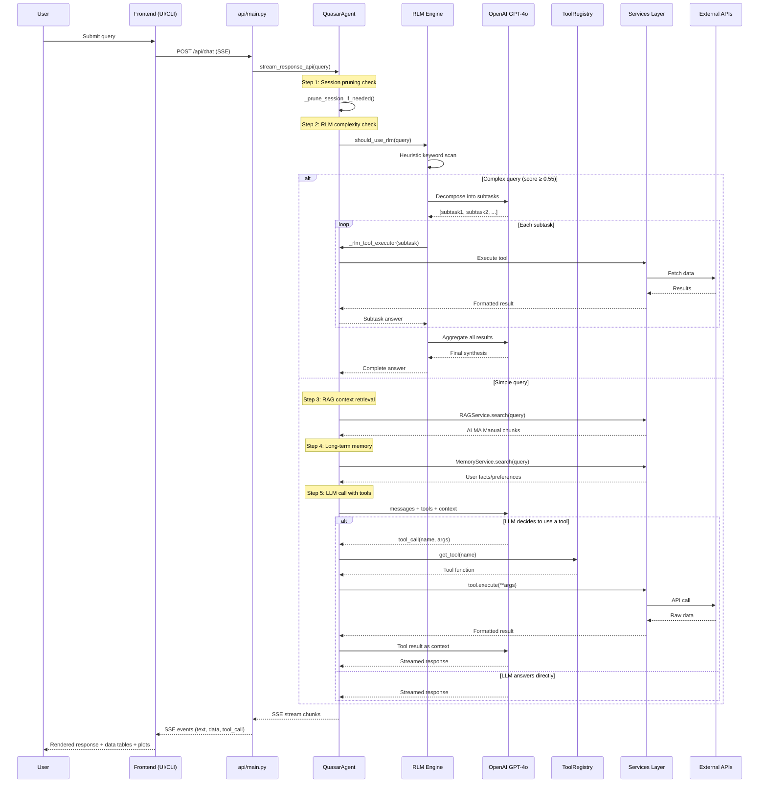
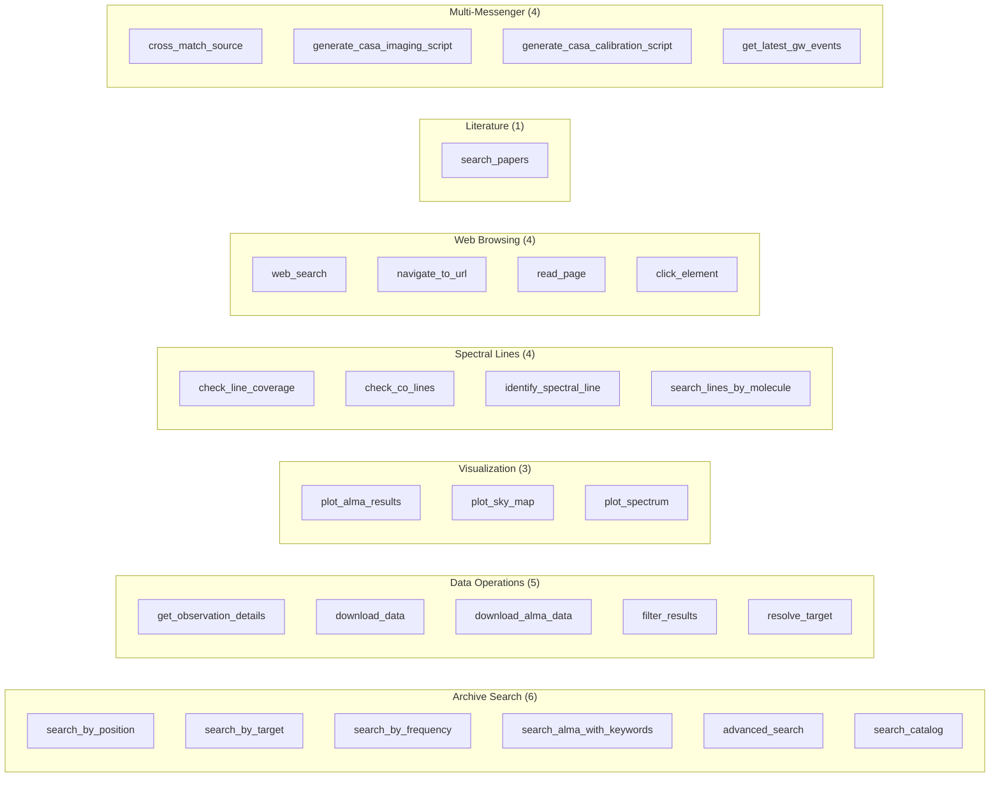
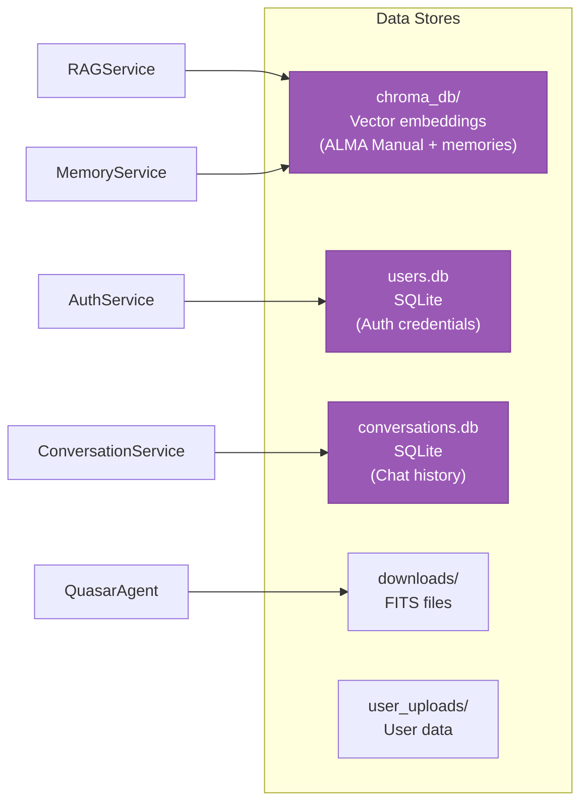
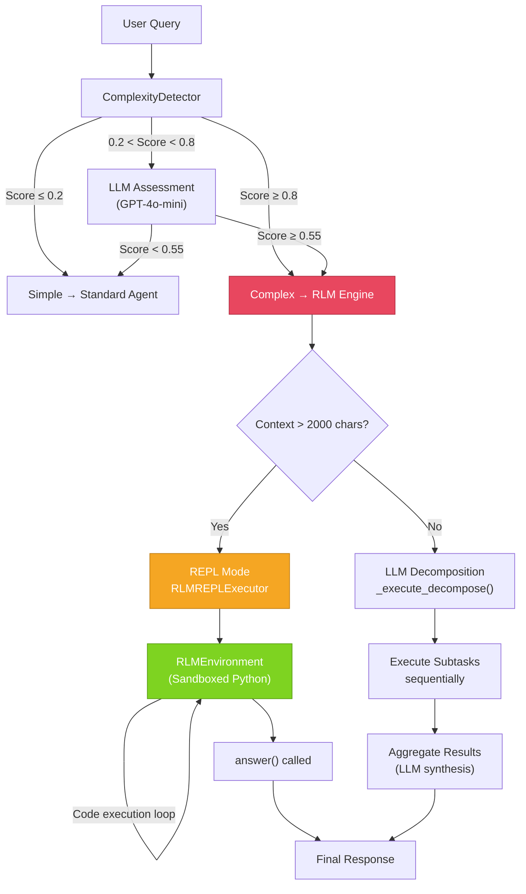

# Quasar Architecture

> **Quasar v3.0** — AI-Powered Radio Astronomy Research Assistant
> This document maps every module, how they connect, and the data flows through the system.

---

## System Overview

```mermaid
graph TB
    subgraph Entry["Entry Points"]
        CLI["cli.py<br/>Terminal REPL"]
        WebUI["ui/app.py<br/>Streamlit Web UI"]
        NextUI["ui-pro/<br/>Next.js Chat UI"]
        TG["telegram.py<br/>Telegram Bot"]
    end

    subgraph Core["Core — Orchestration"]
        Agent["agent.py<br/>QuasarAgent"]
        RLM["rlm.py<br/>RecursiveLanguageModel"]
        RLMEnv["rlm_environment.py<br/>REPL Sandbox"]
        Memory["memory.py<br/>ConversationMemory"]
        Tools["tools.py<br/>ToolRegistry"]
        Prompts["prompts.py<br/>LLM Prompts"]
    end

    subgraph Services["Services — Business Logic"]
        Search["search.py<br/>SearchService"]
        ADS["ads_service.py<br/>ADSService"]
        RAG["rag_service.py<br/>RAGService"]
        MemSvc["memory_service.py<br/>MemoryService"]
        Browser["browser.py<br/>BrowserService"]
        Plotting["plotting.py<br/>PlottingService"]
        Splat["splatalogue.py<br/>SplatalogueTool"]
        MultiArch["multi_archive.py<br/>MultiArchiveMatcher"]
        CASA_Gen["casa_generator.py<br/>CASAScriptGenerator"]
        GCN["gcn_monitor.py<br/>GCNAlertMonitor"]
        Auth["auth.py<br/>AuthService"]
        ConvSvc["conversation_service.py<br/>ConversationService"]
        Analysis["analysis.py<br/>RadioAnalysisService"]
        DataProc["data_processor.py<br/>DataProcessor"]
        CodeGen["code_generator.py<br/>CodeGenerator"]
        VisSvc["visualization_service.py<br/>VisualizationService"]
    end

    subgraph Integrations["Integrations — External API Clients"]
        ALminer["alminer_client.py<br/>ALminerClient"]
        ADSClient["ads_client.py<br/>ADSClient"]
        TAP["tap.py<br/>NRAOTapClient"]
        CASAInt["casa.py<br/>CASA Integration"]
        CARTA["carta.py<br/>CARTA Integration"]
        DL["datalink.py<br/>DataLinkClient"]
    end

    subgraph External["External Services"]
        OpenAI["OpenAI API<br/>GPT-4o / GPT-4o-mini"]
        ALMA_Archive["ALMA Science Archive<br/>NRAO"]
        NASA_ADS["NASA ADS<br/>Paper Search"]
        Mem0["mem0<br/>Long-Term Memory"]
        ChromaDB["ChromaDB<br/>Vector Store"]
        SIMBAD["SIMBAD/NED/MAST<br/>Catalogs"]
        Splatalogue_DB["Splatalogue<br/>Line Database"]
        DuckDuckGo["DuckDuckGo<br/>Web Search"]
    end

    %% Entry → Core
    CLI --> Agent
    WebUI --> Agent
    NextUI -->|"SSE /api/chat"| Agent
    TG -->|"Webhook"| Agent

    %% Core internal
    Agent --> Memory
    Agent --> Tools
    Agent --> Prompts
    Agent --> RLM
    RLM --> RLMEnv
    RLM --> Prompts

    %% Core → Services
    Agent --> Search
    Agent --> ADS
    Agent --> RAG
    Agent --> MemSvc
    Agent --> Browser
    Agent --> Plotting
    Agent --> Splat
    Agent --> MultiArch
    Agent --> CASA_Gen
    Agent --> GCN
    Agent --> Analysis

    %% Services → Integrations
    Search --> ALminer
    ADS --> ADSClient

    %% Services/Integrations → External
    Agent --> OpenAI
    RLM --> OpenAI
    ALminer --> ALMA_Archive
    ADSClient --> NASA_ADS
    TAP --> ALMA_Archive
    Agent --> Mem0
    RAG --> ChromaDB
    MemSvc --> ChromaDB
    MultiArch --> SIMBAD
    Splat --> Splatalogue_DB
    Browser --> DuckDuckGo

    classDef entry fill:#4A90D9,stroke:#2C5F8A,color:#fff
    classDef core fill:#E8475F,stroke:#B33044,color:#fff
    classDef service fill:#F5A623,stroke:#C17D12,color:#fff
    classDef integration fill:#7ED321,stroke:#5CA018,color:#fff
    classDef external fill:#9B59B6,stroke:#7D3C98,color:#fff

    class CLI,WebUI,NextUI,TG entry
    class Agent,RLM,RLMEnv,Memory,Tools,Prompts core
    class Search,ADS,RAG,MemSvc,Browser,Plotting,Splat,MultiArch,CASA_Gen,GCN,Auth,ConvSvc,Analysis,DataProc,CodeGen,VisSvc service
    class ALminer,ADSClient,TAP,CASAInt,CARTA,DL integration
    class OpenAI,ALMA_Archive,NASA_ADS,Mem0,ChromaDB,SIMBAD,Splatalogue_DB,DuckDuckGo external
```



---

## Layered Architecture

Quasar follows a strict **4-layer** design. Each layer only calls the layer below it.

```mermaid
graph LR
    subgraph L1["Layer 1: Entry Points"]
        direction TB
        A1["Streamlit UI"]
        A2["Next.js UI-Pro"]
        A3["CLI"]
        A4["Telegram Bot"]
    end

    subgraph L2["Layer 2: Core Orchestration"]
        direction TB
        B1["QuasarAgent"]
        B2["RLM Engine"]
        B3["ToolRegistry"]
        B4["ConversationMemory"]
    end

    subgraph L3["Layer 3: Services"]
        direction TB
        C1["SearchService"]
        C2["ADSService"]
        C3["RAGService"]
        C4["BrowserService"]
        C5["PlottingService"]
        C6["+ 11 more services"]
    end

    subgraph L4["Layer 4: Integrations"]
        direction TB
        D1["ALminerClient"]
        D2["ADSClient"]
        D3["NRAOTapClient"]
        D4["CASA / CARTA"]
    end

    L1 --> L2
    L2 --> L3
    L3 --> L4

    style L1 fill:#4A90D9,stroke:#2C5F8A,color:#fff
    style L2 fill:#E8475F,stroke:#B33044,color:#fff
    style L3 fill:#F5A623,stroke:#C17D12,color:#fff
    style L4 fill:#7ED321,stroke:#5CA018,color:#fff
```



---

## Query Processing Flow (Main Pipeline)



---

## Agent Initialization — What Connects to What

```mermaid
graph TD
    Agent["QuasarAgent.__init__()"]

    Agent --> M1["ConversationMemory"]
    Agent --> M2["ToolRegistry"]
    Agent --> M3["SearchService"]
    Agent --> M4["RadioAnalysisService"]
    Agent --> M5["RAGService → ChromaDB"]
    Agent --> M6["MemoryService → ChromaDB"]
    Agent --> M7["ADSService → NASA ADS API"]
    Agent --> M8["BrowserService → Playwright"]
    Agent --> M9["PlottingService → Matplotlib"]
    Agent --> M10["SplatalogueTool → Splatalogue API"]
    Agent --> M11["MultiArchiveMatcher → SIMBAD/NED/MAST"]
    Agent --> M12["CASAScriptGenerator"]
    Agent --> M13["GCNAlertMonitor → GWOSC"]
    Agent --> M14["RecursiveLanguageModel"]
    Agent --> M15["mem0 Long-Term Memory"]

    M3 --> I1["ALminerClient → ALMA Archive"]
    M14 --> M16["RLMREPLExecutor → Python Sandbox"]
    M14 --> M17["ComplexityDetector → GPT-4o-mini"]

    style Agent fill:#E8475F,stroke:#B33044,color:#fff
    style M1 fill:#F5A623,stroke:#C17D12,color:#fff
    style M2 fill:#F5A623,stroke:#C17D12,color:#fff
    style M14 fill:#E8475F,stroke:#B33044,color:#fff
```



---

## Registered Tools (27 total)



---

## Data Storage



---

## RLM (Recursive Language Model) Pipeline



---

## File Index

| File | Layer | One-Line Purpose |
|------|-------|-----------------|
| `quasar.py` | Entry | Main entrypoint, initializes agent & launches UI |
| **core/** | | |
| `agent.py` | Core | Central orchestrator — routes queries, manages tools, streams responses |
| `rlm.py` | Core | Recursive Language Model — decomposes complex multi-hop queries |
| `rlm_environment.py` | Core | Sandboxed Python REPL for RLM context processing |
| `memory.py` | Core | Short-term conversation memory with topic detection |
| `tools.py` | Core | Tool/function registry for OpenAI function calling |
| `prompts.py` | Core | All LLM prompt templates (intent, entity, response, RLM) |
| `cli.py` | Entry | Rich terminal interface for interactive use |
| **services/** | | |
| `search.py` | Service | Facade over ALminerClient for all archive searches |
| `ads_service.py` | Service | NASA ADS paper search with NLP query building |
| `rag_service.py` | Service | RAG via ChromaDB — ingests PDFs, semantic search |
| `memory_service.py` | Service | Long-term user memory using ChromaDB vectors |
| `browser.py` | Service | Headless Chromium web browsing via Playwright |
| `plotting.py` | Service | Publication-quality plots (ApJ/MNRAS style) |
| `splatalogue.py` | Service | Molecular spectral line identification |
| `multi_archive.py` | Service | Cross-match sources across SIMBAD/NED/MAST/VizieR |
| `casa_generator.py` | Service | Generate CASA imaging & calibration scripts |
| `gcn_monitor.py` | Service | GW event monitoring via GWOSC catalog |
| `auth.py` | Service | User registration/login with PBKDF2 hashing |
| `conversation_service.py` | Service | Persistent chat history in SQLite |
| `analysis.py` | Service | UV coverage analysis, imaging parameters |
| `data_processor.py` | Service | FITS file processing and format conversion |
| `code_generator.py` | Service | Python/CASA script generation for analysis |
| `visualization_service.py` | Service | Advanced visualization pipelines |
| `paper_search.py` | Service | Alternative paper search utilities |
| **integrations/** | | |
| `alminer_client.py` | Integration | ALminer library wrapper for ALMA archive |
| `ads_client.py` | Integration | Direct NASA ADS API client |
| `tap.py` | Integration | TAP/VO protocol client for VLA/VLBA/ALMA |
| `tap_astroquery.py` | Integration | Astroquery-based TAP alternative |
| `casa.py` | Integration | CASA software integration for calibration |
| `carta.py` | Integration | CARTA visualization tool integration |
| `datalink.py` | Integration | DataLink protocol client for data access |
| **config/** | | |
| `settings.py` | Config | Centralized configuration (API keys, paths, limits) |
| **utils/** | | |
| `formatters.py` | Utils | Output formatting, unit conversion, coordinates |

---


## Configuration & Environment

```
.env
├── OPENAI_API_KEY          → GPT-4o / GPT-4o-mini
├── NASA_ADS_API_KEY        → NASA ADS paper search
├── TELEGRAM_BOT_TOKEN      → Telegram channel
├── MEM0_API_KEY            → mem0 long-term memory (optional)
└── CHROMA_PERSIST_DIR      → ChromaDB vector store path

config/settings.py
├── Environment             → dev / test / production
├── APIConfig               → Keys and endpoints
├── PathConfig              → Data, cache, download directories
├── SearchConfig            → Max results, timeouts
├── ProcessingConfig        → CASA pipeline parameters
├── UIConfig                → Streamlit settings
├── PerformanceConfig       → Workers, cache TTL, memory limits
└── FeatureFlags            → Enable/disable features
```

---

*Generated: 2026-02-24 | Quasar v3.0*
