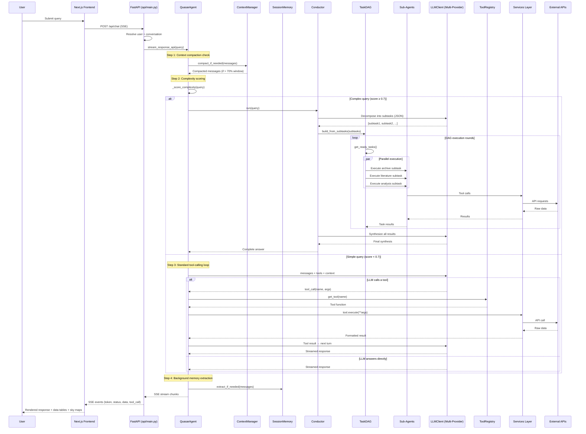
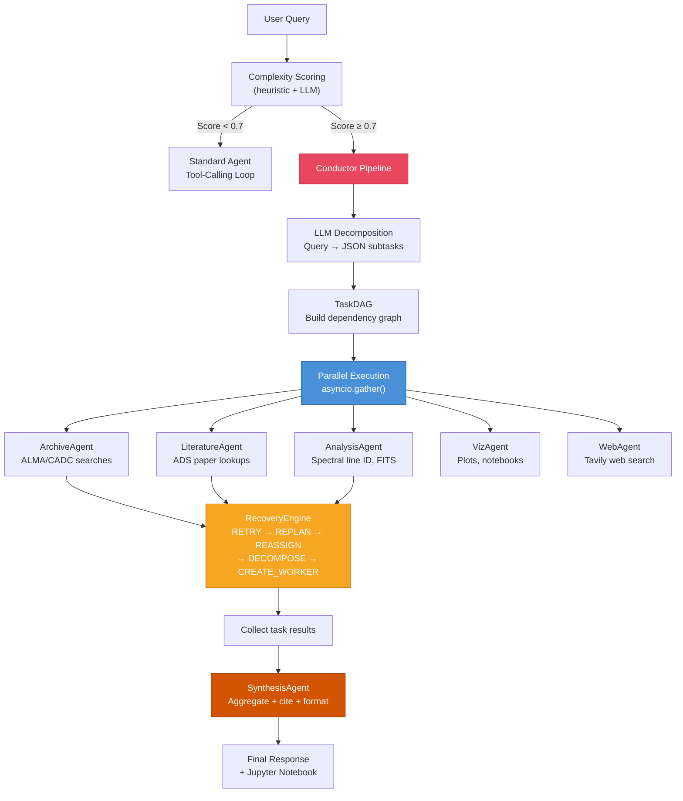
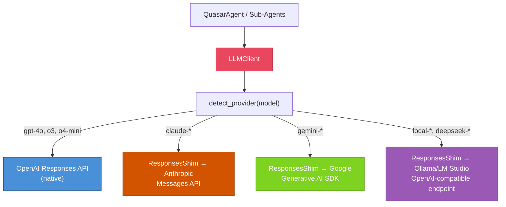
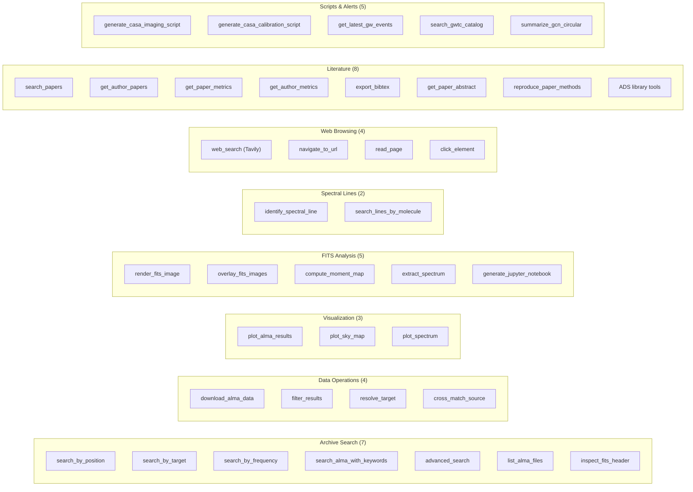
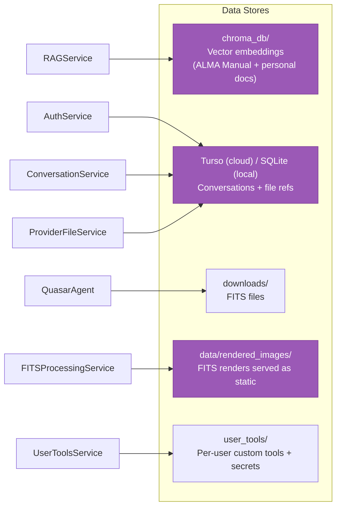
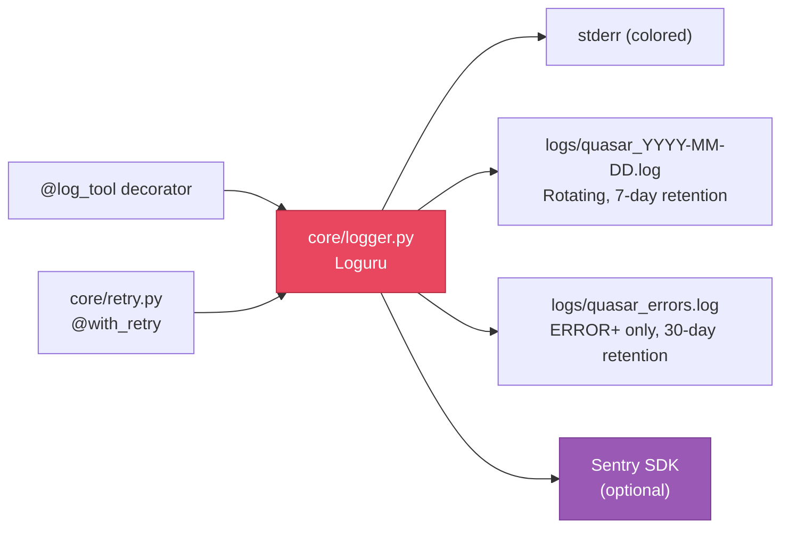
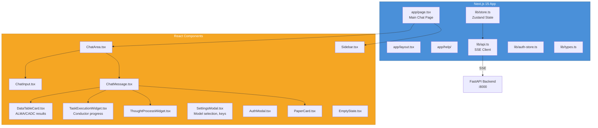

# Quasar Architecture

> **Quasar v4.0** — AI-Powered Multi-Agent Astronomy Research Assistant
> This document maps every module, how they connect, and the data flows through the system.

---

## System Overview

```mermaid
graph TB
    subgraph Entry["Entry Points"]
        CLI["cli.py<br/>Terminal REPL"]
        NextUI["ui-pro/<br/>Next.js 15 Chat UI"]
        FastAPI["ui-pro/api/main.py<br/>FastAPI Backend"]
        TG["channels/telegram.py<br/>Telegram Bot"]
    end

    subgraph Core["Core — Orchestration"]
        Agent["agent.py<br/>QuasarAgent"]
        Conductor["conductor.py<br/>Conductor DAG Engine"]
        LLMClient["llm_client.py<br/>Unified LLM Client"]
        ModelRouter["model_router.py<br/>Task-to-Model Router"]
        TaskDAG["task_dag.py<br/>Parallel Task Graph"]
        Recovery["recovery.py<br/>5-Strategy Recovery"]
        CtxMgr["context_manager.py<br/>Context Compaction"]
        SessMem["session_memory.py<br/>Background Note-Taker"]
        Memory["memory.py<br/>ConversationMemory"]
        Tools["tools.py<br/>ToolRegistry"]
        Prompts["prompts.py<br/>LLM Prompts"]
    end

    subgraph Agents["Agents — Specialist Sub-Agents"]
        BaseAgent["base_agent.py<br/>BaseAgent"]
        ArchiveAg["archive_agent.py"]
        LitAg["literature_agent.py"]
        AnalysisAg["analysis_agent.py"]
        VizAg["viz_agent.py"]
        WebAg["web_agent.py"]
        SynthAg["synthesis_agent.py"]
    end

    subgraph Services["Services — Business Logic"]
        Search["search.py<br/>SearchService"]
        ADS["ads_service.py<br/>ADSService"]
        RAG["rag_service.py<br/>RAGService"]
        Browser["browser.py<br/>BrowserService"]
        Plotting["plotting.py<br/>PlottingService"]
        Splat["splatalogue.py<br/>SplatalogueTool"]
        MultiArch["multi_archive.py<br/>MultiArchiveMatcher"]
        CASA_Gen["casa_generator.py<br/>CASAScriptGenerator"]
        GCN["gcn_monitor.py<br/>GCNAlertMonitor"]
        FITS["fits_processing.py<br/>FITSProcessingService"]
        NbGen["notebook_gen.py<br/>NotebookGenerator"]
        Auth["auth.py<br/>AuthService"]
        ConvSvc["conversation_service.py<br/>ConversationService"]
        ProvFile["provider_file_service.py<br/>ProviderFileService"]
        UserTools["user_tools_service.py<br/>UserToolsService"]
        DB["db.py<br/>Database Layer"]
    end

    subgraph Integrations["Integrations — External API Clients"]
        ADSClient["ads_client.py<br/>ADSClient"]
        DL["datalink.py<br/>DataLinkClient"]
        TAP["tap.py<br/>NRAOTapClient"]
        CASAInt["casa.py<br/>CASA Integration"]
        CARTA["carta.py<br/>CARTA Integration"]
    end

    subgraph External["External Services"]
        OpenAI["OpenAI API<br/>GPT-4o / o3 / o4-mini"]
        Anthropic["Anthropic API<br/>Claude Sonnet 4"]
        Google["Google AI<br/>Gemini 2.0 Pro/Flash"]
        Local["Local LLM<br/>Ollama / LM Studio"]
        ALMA_Archive["ALMA Science Archive"]
        CADC["CADC Archive<br/>JWST / HST / CFHT"]
        NASA_ADS["NASA ADS<br/>Paper Search"]
        ChromaDB["ChromaDB<br/>Vector Store"]
        Turso["Turso / SQLite<br/>Conversations"]
        SIMBAD["SIMBAD/NED/MAST<br/>Catalogs"]
        Splatalogue_DB["Splatalogue<br/>Line Database"]
        Tavily["Tavily<br/>Web Search"]
        GWOSC["GWOSC<br/>GW Events"]
        Sentry["Sentry<br/>Error Tracking"]
    end

    %% Entry → Core
    CLI --> Agent
    NextUI -->|"SSE /api/chat"| FastAPI
    FastAPI --> Agent
    TG -->|"Webhook"| FastAPI

    %% Core internal
    Agent --> Conductor
    Agent --> LLMClient
    Agent --> ModelRouter
    Agent --> CtxMgr
    Agent --> SessMem
    Agent --> Memory
    Agent --> Tools
    Agent --> Prompts
    Conductor --> TaskDAG
    Conductor --> Recovery
    Conductor --> BaseAgent

    %% Agents
    BaseAgent --> ArchiveAg
    BaseAgent --> LitAg
    BaseAgent --> AnalysisAg
    BaseAgent --> VizAg
    BaseAgent --> WebAg
    BaseAgent --> SynthAg

    %% Core → Services
    Agent --> Search
    Agent --> ADS
    Agent --> RAG
    Agent --> Browser
    Agent --> Plotting
    Agent --> Splat
    Agent --> MultiArch
    Agent --> CASA_Gen
    Agent --> GCN
    Agent --> FITS
    Agent --> NbGen
    FastAPI --> Auth
    FastAPI --> ConvSvc
    FastAPI --> ProvFile
    Agent --> UserTools

    %% Services → Integrations
    ADS --> ADSClient
    Agent --> DL

    %% Services/Integrations → External
    LLMClient --> OpenAI
    LLMClient --> Anthropic
    LLMClient --> Google
    LLMClient --> Local
    Search --> ALMA_Archive
    Search --> CADC
    ADSClient --> NASA_ADS
    RAG --> ChromaDB
    ConvSvc --> Turso
    MultiArch --> SIMBAD
    Splat --> Splatalogue_DB
    Browser --> Tavily
    GCN --> GWOSC

    classDef entry fill:#4A90D9,stroke:#2C5F8A,color:#fff
    classDef core fill:#E8475F,stroke:#B33044,color:#fff
    classDef agent fill:#D35400,stroke:#A04000,color:#fff
    classDef service fill:#F5A623,stroke:#C17D12,color:#fff
    classDef integration fill:#7ED321,stroke:#5CA018,color:#fff
    classDef external fill:#9B59B6,stroke:#7D3C98,color:#fff

    class CLI,NextUI,FastAPI,TG entry
    class Agent,Conductor,LLMClient,ModelRouter,TaskDAG,Recovery,CtxMgr,SessMem,Memory,Tools,Prompts core
    class BaseAgent,ArchiveAg,LitAg,AnalysisAg,VizAg,WebAg,SynthAg agent
    class Search,ADS,RAG,Browser,Plotting,Splat,MultiArch,CASA_Gen,GCN,FITS,NbGen,Auth,ConvSvc,ProvFile,UserTools,DB service
    class ADSClient,DL,TAP,CASAInt,CARTA integration
    class OpenAI,Anthropic,Google,Local,ALMA_Archive,CADC,NASA_ADS,ChromaDB,Turso,SIMBAD,Splatalogue_DB,Tavily,GWOSC,Sentry external
```



---

## Layered Architecture

Quasar follows a strict **5-layer** design. Each layer only calls the layer below it.


---

## Query Processing Flow (Main Pipeline)



---

## Conductor Pipeline (Multi-Agent DAG Engine)

The Conductor is Quasar's advanced reasoning engine, triggered for complex multi-hop queries (complexity score ≥ 0.7). It implements a Perplexity-style architecture:



### Key Components

| Component | File | Role |
|-----------|------|------|
| **Conductor** | `core/conductor.py` | Decomposes queries into a DAG of subtasks, dispatches to specialist agents, synthesizes results |
| **TaskDAG** | `core/task_dag.py` | Dependency-aware graph with parallel execution via `asyncio.gather()` |
| **RecoveryEngine** | `core/recovery.py` | 5-strategy cascading recovery: RETRY → REPLAN → REASSIGN → DECOMPOSE → CREATE_WORKER |
| **ModelRouter** | `core/model_router.py` | Routes each subtask to the optimal LLM (GPT-4o for tool-calling, Gemini for long context, Claude for reasoning) |
| **BaseAgent** | `agents/base_agent.py` | Abstract base class for all specialist sub-agents with domain-specific system prompts |

---

## Unified LLM Client (`core/llm_client.py`)

Quasar uses a provider-agnostic LLM interface that routes requests to the right backend via a `ResponsesShim`:



The `ResponsesShim` translates OpenAI Responses API calls into the native format of each provider, so all agent code can use a single interface regardless of which LLM is being used.

---

## Context Management

Quasar uses two complementary systems to maintain context through long conversations:

### ContextManager (`core/context_manager.py`)
- **Token-aware compaction**: Triggers at 70% of the model's context window
- **LLM-powered summarization**: Summarizes old turns using a cheap model (GPT-4o-mini), preserving astronomical targets, search results, and decisions
- **Protected tail**: Keeps the last 8 messages uncompacted for recency
- **Circuit breaker**: Stops compaction after 3 consecutive failures
- Per-model context windows: GPT-4o (128K), Claude (200K), Gemini (2M), o3/o4-mini (200K)

### SessionMemory (`core/session_memory.py`)
- **Background note-taking**: Runs extraction in a background thread after each agent turn
- **Dual thresholds**: Triggers when both token growth (8K+) and tool calls (4+) thresholds are met
- **Structured memory**: Organizes extracted context by topic (Targets, Search History, Key Data, Decisions, Errors)
- **System prompt injection**: Memory is injected into the system prompt on every turn

---

## Agent Initialization — What Connects to What

```mermaid
graph TD
    Agent["QuasarAgent.__init__()"]

    Agent --> M1["ConversationMemory"]
    Agent --> M2["ToolRegistry (35+ tools)"]
    Agent --> M3["LLMClient (multi-provider)"]
    Agent --> M4["Conductor + AgentPool"]
    Agent --> M5["ModelRouter"]
    Agent --> M6["RecoveryEngine"]
    Agent --> M7["ContextManager"]
    Agent --> M8["SessionMemory"]
    Agent --> M9["SearchService → ALMA/CADC"]
    Agent --> M10["ADSService → NASA ADS API"]
    Agent --> M11["BrowserService → Tavily + Playwright"]
    Agent --> M12["PlottingService → Matplotlib"]
    Agent --> M13["SplatalogueTool → Splatalogue API"]
    Agent --> M14["MultiArchiveMatcher → SIMBAD/NED/MAST"]
    Agent --> M15["CASAScriptGenerator"]
    Agent --> M16["GCNAlertMonitor → GWOSC"]
    Agent --> M17["DataLinkClient → ALMA DataLink"]
    Agent --> M18["FITSProcessingService"]
    Agent --> M19["NotebookGenerator"]
    Agent --> M20["UserToolsService + MCP bridge"]

    M4 --> A1["ArchiveAgent"]
    M4 --> A2["LiteratureAgent"]
    M4 --> A3["AnalysisAgent"]
    M4 --> A4["VizAgent"]
    M4 --> A5["WebAgent"]
    M4 --> A6["SynthesisAgent"]

    style Agent fill:#E8475F,stroke:#B33044,color:#fff
    style M3 fill:#4A90D9,stroke:#2C5F8A,color:#fff
    style M4 fill:#D35400,stroke:#A04000,color:#fff
    style M2 fill:#F5A623,stroke:#C17D12,color:#fff
```



---

## Registered Tools (35+)



---

## Data Storage



---

## Observability



- **`@log_tool`**: Wraps every agent tool method with entry/exit/timing/error logs and Sentry captures
- **`@with_retry`**: Exponential backoff with jitter for LLM API calls (retries 429, 500, 502, 503; skips 401, 403, 404)
- **Sentry**: Optional integration via `SENTRY_DSN` — captures unhandled exceptions with FastAPI integration

---

## Frontend Architecture (ui-pro/)



---

## File Index

| File | Layer | One-Line Purpose |
|------|-------|--------------------|
| **core/** | | |
| `agent.py` | Core | Central orchestrator — routes queries, manages tools, streams SSE responses |
| `conductor.py` | Core | Multi-agent DAG engine — decomposes complex queries, dispatches to sub-agents |
| `llm_client.py` | Core | Unified LLM interface — routes to OpenAI, Anthropic, Google, or local models |
| `model_router.py` | Core | Task-to-model routing table (archive→GPT-4o, literature→Gemini, reasoning→Claude) |
| `task_dag.py` | Core | Dependency-aware parallel task graph with `asyncio.gather()` execution |
| `recovery.py` | Core | 5-strategy cascading recovery engine (RETRY, REPLAN, REASSIGN, DECOMPOSE, CREATE_WORKER) |
| `context_manager.py` | Core | Token-aware context compaction with LLM summarization |
| `session_memory.py` | Core | Background note-taking agent for key facts, targets, and decisions |
| `memory.py` | Core | Short-term conversation memory with topic detection |
| `tools.py` | Core | Tool/function registry for OpenAI function calling |
| `prompts.py` | Core | All LLM prompt templates (system, entity extraction, etc.) |
| `logger.py` | Core | Loguru structured logging + Sentry integration + `@log_tool` decorator |
| `retry.py` | Core | `@with_retry` decorator for exponential backoff on LLM API calls |
| **agents/** | | |
| `base_agent.py` | Agent | Abstract base class — domain-specific system prompts + tool-calling loops |
| `archive_agent.py` | Agent | Specialist for ALMA/CADC/VLA archive queries |
| `literature_agent.py` | Agent | Specialist for NASA ADS paper searches |
| `analysis_agent.py` | Agent | Specialist for spectral line ID, FITS analysis |
| `viz_agent.py` | Agent | Specialist for plots, sky maps, moment maps |
| `web_agent.py` | Agent | Specialist for Tavily web searches |
| `synthesis_agent.py` | Agent | Aggregates results from all other agents into a final answer |
| **services/** | | |
| `search.py` | Service | Facade over astroquery/pyvo for ALMA and CADC archive searches |
| `ads_service.py` | Service | NASA ADS paper search with NLP query building |
| `rag_service.py` | Service | RAG via ChromaDB — ingests PDFs, semantic search |
| `browser.py` | Service | Headless Chromium web browsing via Playwright |
| `plotting.py` | Service | Publication-quality plots (ApJ/MNRAS style, 300 DPI) |
| `splatalogue.py` | Service | Molecular spectral line identification |
| `multi_archive.py` | Service | Cross-match across SIMBAD/NED/MAST/VizieR/Fermi 4FGL |
| `casa_generator.py` | Service | Generate CASA imaging & calibration scripts |
| `gcn_monitor.py` | Service | GW event monitoring via GWOSC catalog + GCN circulars |
| `fits_processing.py` | Service | Remote FITS header reading (HTTP range requests) + rendering |
| `notebook_gen.py` | Service | Jupyter notebook generation for reproducible research |
| `auth.py` | Service | User registration/login with PBKDF2 + Google OAuth |
| `conversation_service.py` | Service | Persistent chat history in Turso/SQLite |
| `provider_file_service.py` | Service | Upload documents to OpenAI/Anthropic/Google file APIs |
| `user_tools_service.py` | Service | Per-user custom tool definitions with schema derivation |
| `db.py` | Service | Database connection layer (Turso cloud / local SQLite) |
| **integrations/** | | |
| `ads_client.py` | Integration | Direct NASA ADS API client (search, metrics, BibTeX, libraries) |
| `datalink.py` | Integration | ALMA DataLink protocol client for file listing |
| `tap.py` | Integration | TAP/VO protocol client for VLA/VLBA/GBT |
| `casa.py` | Integration | CASA software integration for calibration |
| `carta.py` | Integration | CARTA visualization tool integration |
| **config/** | | |
| `settings.py` | Config | Centralized configuration (API keys, paths, limits, feature flags) |
| **ui-pro/** | | |
| `api/main.py` | Entry | FastAPI backend — SSE streaming, auth, file uploads, CORS |
| `src/app/page.tsx` | Frontend | Next.js 15 main chat page |
| `src/lib/store.ts` | Frontend | Zustand state management |
| `src/lib/api.ts` | Frontend | SSE client for streaming chat |
| `src/components/*.tsx` | Frontend | 11 React components (ChatArea, DataTableCard, TaskExecutionWidget, etc.) |

---

## Configuration & Environment

```
.env
├── OPENAI_API_KEY          → GPT-4o / o3 / o4-mini (primary)
├── ANTHROPIC_API_KEY       → Claude Sonnet 4 (optional)
├── GEMINI_API_KEY          → Gemini 2.0 Pro/Flash (optional)
├── LOCAL_LLM_BASE_URL      → Ollama / LM Studio (optional)
├── NASA_ADS_API_KEY        → NASA ADS paper search
├── TAVILY_API_KEY          → Tavily web search (optional)
├── TELEGRAM_BOT_TOKEN      → Telegram channel (optional)
├── SENTRY_DSN              → Sentry error tracking (optional)
├── GOOGLE_CLIENT_ID        → Google OAuth login
├── JWT_SECRET              → JWT signing for auth tokens
├── TURSO_DATABASE_URL      → Turso cloud DB (optional, falls back to SQLite)
└── TURSO_AUTH_TOKEN         → Turso authentication

config/settings.py
├── Environment             → dev / test / production
├── APIConfig               → Keys, endpoints, default model
├── PathConfig              → Data, cache, download directories
├── SearchConfig            → Max results, timeouts, default facilities
├── ProcessingConfig        → CASA pipeline parameters, CARTA ports
├── UIConfig                → Streamlit settings, session timeout
├── PerformanceConfig       → Workers, cache TTL, memory limits
└── FeatureFlags            → Enable/disable features
```

---

*Generated: 2026-04-09 | Quasar v4.0 (Multi-Agent Conductor Architecture)*
