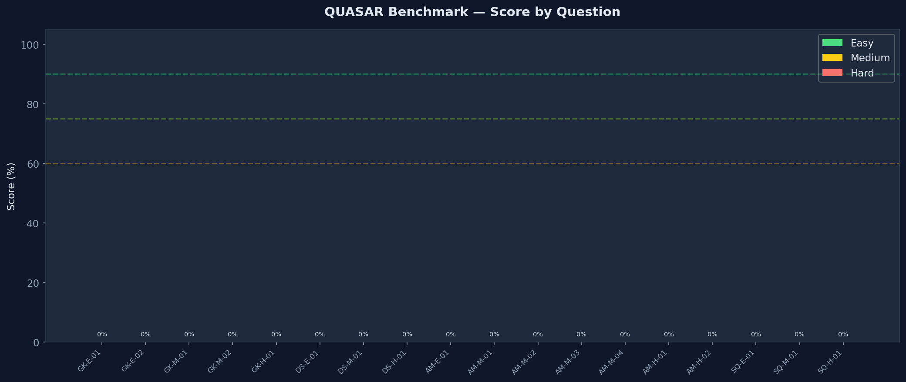
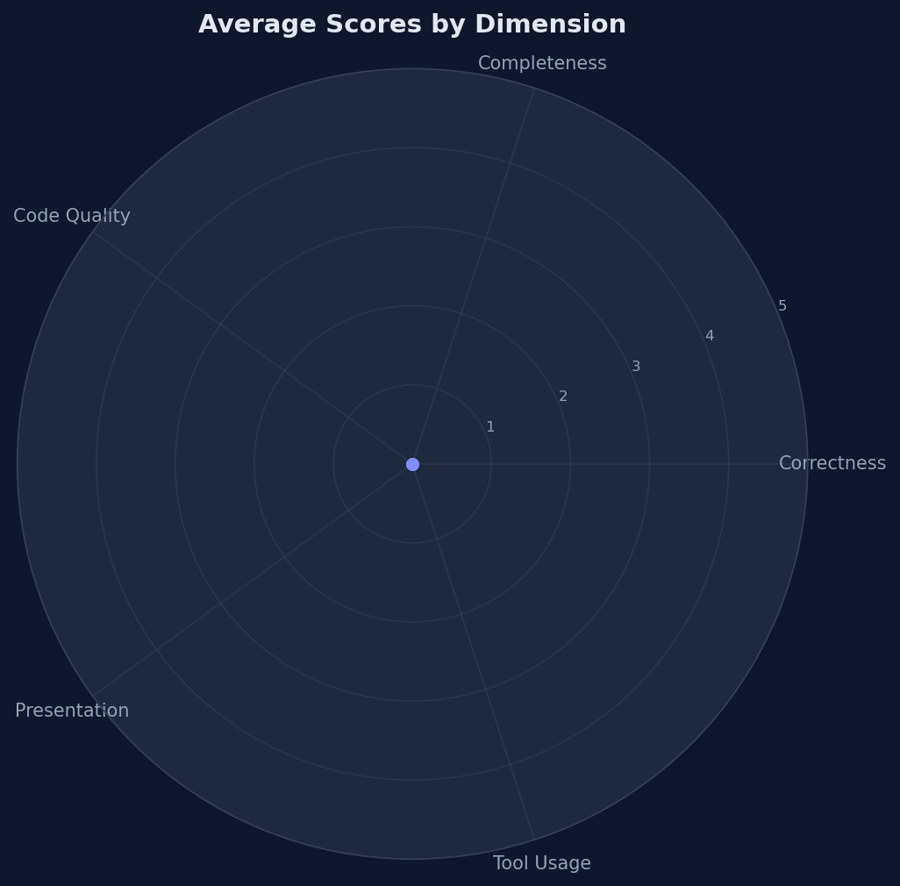
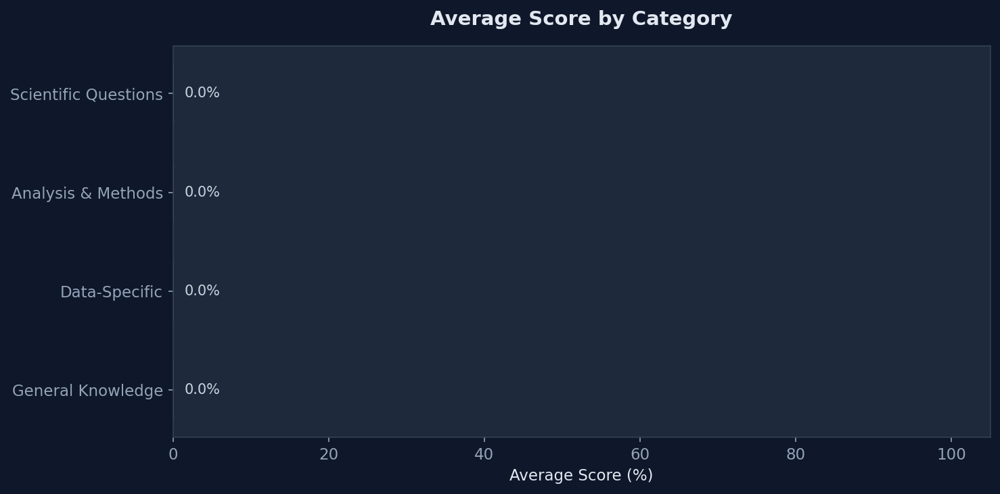
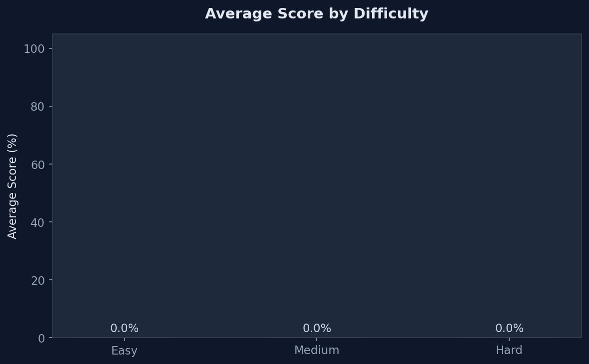
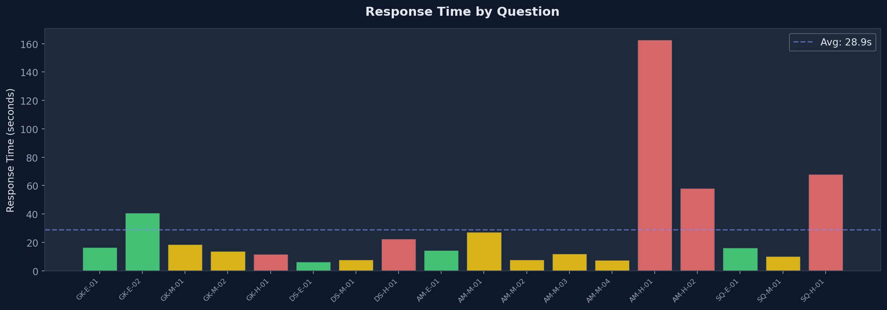
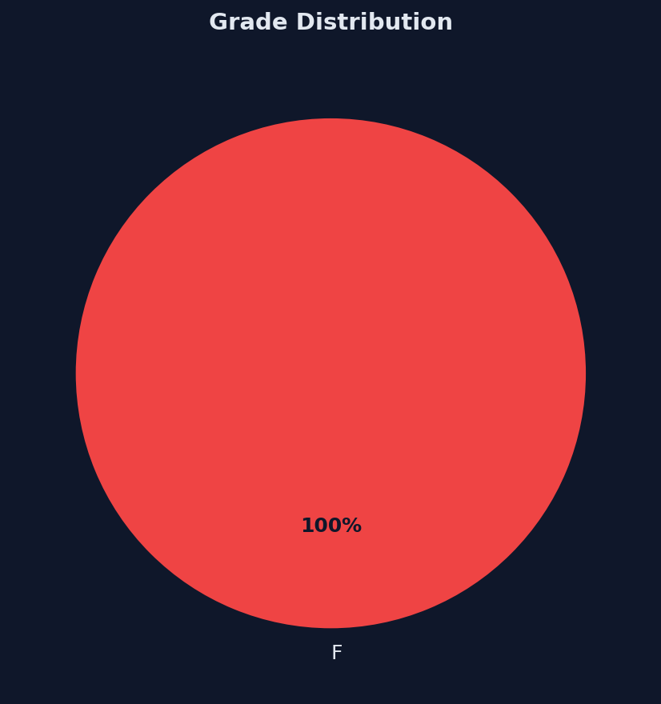

# QUASAR Benchmark Report

**Date:** 2026-04-21 17:39:03
**Model Under Test:** `gpt-4.1`
**Judge Model:** `gpt-4o`
**Questions:** 18

---

## Overall Results

| Metric | Value |
|--------|-------|
| **Weighted Score** | **0.0%** |
| **Overall Grade** | **F** |
| Avg Response Time | 28.9s |
| Errors | 0/18 |

---

## Visualizations

### Scores by Question


### Average Scores by Dimension


### Scores by Category


### Scores by Difficulty


### Response Times


### Grade Distribution


---

## Detailed Results

| ID | Category | Difficulty | Score | Grade | Time |
|----|----------|------------|-------|-------|------|
| GK-E-01 | General Knowledge | Easy | 0/20 (0%) | F | 16.4s |
| GK-E-02 | General Knowledge | Easy | 0/20 (0%) | F | 40.8s |
| GK-M-01 | General Knowledge | Medium | 0/20 (0%) | F | 18.4s |
| GK-M-02 | General Knowledge | Medium | 0/20 (0%) | F | 13.8s |
| GK-H-01 | General Knowledge | Hard | 0/20 (0%) | F | 11.5s |
| DS-E-01 | Data-Specific | Easy | 0/20 (0%) | F | 6.3s |
| DS-M-01 | Data-Specific | Medium | 0/20 (0%) | F | 7.7s |
| DS-H-01 | Data-Specific | Hard | 0/20 (0%) | F | 22.4s |
| AM-E-01 | Analysis & Methods | Easy | 0/20 (0%) | F | 14.2s |
| AM-M-01 | Analysis & Methods | Medium | 0/20 (0%) | F | 27.2s |
| AM-M-02 | Analysis & Methods | Medium | 0/20 (0%) | F | 7.8s |
| AM-M-03 | Analysis & Methods | Medium | 0/20 (0%) | F | 11.8s |
| AM-M-04 | Analysis & Methods | Medium | 0/20 (0%) | F | 7.6s |
| AM-H-01 | Analysis & Methods | Hard | 0/20 (0%) | F | 162.5s |
| AM-H-02 | Analysis & Methods | Hard | 0/20 (0%) | F | 58.1s |
| SQ-E-01 | Scientific Questions | Easy | 0/20 (0%) | F | 16.1s |
| SQ-M-01 | Scientific Questions | Medium | 0/20 (0%) | F | 10.2s |
| SQ-H-01 | Scientific Questions | Hard | 0/20 (0%) | F | 67.8s |

---

## Question Details

### GK-E-01: ALMA Configurations and Angular Resolutions

**Status:** F (0%)  
**Response Time:** 16.4s

| Dimension | Score |
|-----------|-------|
| Correctness | 0/5 |
| Completeness | 0/5 |
| Code Quality | N/A |
| Presentation | 0/5 |
| Tool Usage | 0/5 |
| **Total** | **0/20** |

**Judge Reasoning:** 

<details><summary>Full Response</summary>

```
## ALMA Array Configurations and Angular Resolutions

ALMA operates its 12-m Array in a set of eight different configurations during each cycle. These configurations are labeled as **C-1** (most compact, shortest baselines) through **C-8** (most extended, longest baselines). Each configuration is characterized by:

- **Angular Resolution (AR):** The smallest detail (in arcseconds) that can be resolved, primarily determined by the maximum baseline.
- **Maximum Recoverable Scale (MRS):** The largest angular scale that can be effectively imaged, which decreases as the array becomes more extended.

**Key points:**
- The most compact configuration, **C-1**, provides the coarsest angular resolution (largest synthesized beam), while **C-8** provides the finest angular resolution (smallest synthesized beam).
- In Cycle 12, the maximum baseline reaches up to **8.5 km** in C-8, enabling angular resolutions as fine as **0.019″**.
- The actual angular resolution achieved in an observation also depends on the observing frequency and the configuration used.

| Configuration | Maximum Baseline (km) | Typical Angular Resolution (arcsec) | Use Case                         |
|---------------|----------------------|-------------------------------------|----------------------------------|
| C-1           | ~0.16                | coarsest (~8.5″ at 100 GHz)         | Large structures, low resolution |
| C-8           | ~8.5                 | finest (~0.019″ at 350 GHz)         | Highest resolution imaging       |

- There are intermediate configurations (C-2 through C-7) that provide a range of resolutions and are chosen based on the science goals and largest angular scale to be imaged [Source: alma-proposers-guide.pdf, Page 37, Page 21].

*📚 The above is sourced from ALMA Technical Documentation and may not reflect the very latest policies.*
```
</details>

---

### GK-E-02: CASA Version Used for Data Processing

**Status:** F (0%)  
**Response Time:** 40.8s

| Dimension | Score |
|-----------|-------|
| Correctness | 0/5 |
| Completeness | 0/5 |
| Code Quality | N/A |
| Presentation | 0/5 |
| Tool Usage | 0/5 |
| **Total** | **0/20** |

**Judge Reasoning:** 

<details><summary>Full Response</summary>

```
To find out which CASA version was used to process the data from a given ALMA project, you should examine the FITS header of any delivered science product (such as an image or cube). The CASA version is typically recorded in the FITS header under the keyword **'ORIGIN'** or a similar keyword (e.g., 'CASAVERS').

### How to check:

1. **Download a delivered FITS file** from your ALMA project (e.g., a primary-beam-corrected image or science cube).
2. **Inspect the FITS header** using a FITS viewer (e.g., `astropy.io.fits` in Python, `fv`, or `ds9`).
3. **Look for keywords** such as:
   - `ORIGIN` — often mentions the CASA version (e.g., "CASA version 6.5.1-20").
   - `CASAVERS` — sometimes explicitly records the CASA version used for the pipeline or manual processing.

This information is embedded in each data product, so any science-ready FITS file from your project will provide the CASA version used for its processing.

*📚 The above is sourced from ALMA Technical Documentation and standard ALMA data delivery practices, though the exact keyword may vary slightly.*

If you provide a specific MOUS UID or FITS file, I can retrieve and inspect the header for you to extract the CASA version directly. Would you like to do that?
```
</details>

---

### GK-M-01: Types of Downloadable ALMA Data

**Status:** F (0%)  
**Response Time:** 18.4s

| Dimension | Score |
|-----------|-------|
| Correctness | 0/5 |
| Completeness | 0/5 |
| Code Quality | N/A |
| Presentation | 0/5 |
| Tool Usage | 0/5 |
| **Total** | **0/20** |

**Judge Reasoning:** 

<details><summary>Full Response</summary>

```
For every ALMA observation, you can typically download several types of data products. These may include:

| Data Product                | Description                                                     | Format       |
|-----------------------------|-----------------------------------------------------------------|-------------|
| Science-ready images        | Calibrated continuum or spectral line maps                      | FITS        |
| Spectral cubes              | 3D data cubes (RA, Dec, Frequency/Velocity)                     | FITS        |
| Calibrated visibilities     | Interferometric data after calibration                          | Measurement Set (.ms) |
| Raw visibilities            | Uncalibrated, as-observed data                                  | ASDM or .ms |
| Pipeline scripts/logs       | CASA scripts, logs, and QA reports from automated processing    | TXT, LOG, PY|
| Calibration tables          | Tables used/applied in calibration                             | CASA tables |
| Ancillary data              | Primary beam maps, weight maps, QA files                       | FITS, TXT   |

**How to access:**  
- The ALMA Science Archive provides these products for each observation, usually grouped in "Member OUS" packages.
- Most users will download FITS images/cubes for science analysis, but advanced users may also retrieve calibrated visibilities or pipeline scripts for reprocessing.

*Note: The exact list may vary by project, year, and observing mode. For a full inventory, browse the delivered files for your project in the archive.*

If you provide a specific observation or MOUS UID, I can list the exact downloadable files for that dataset!
```
</details>

---

### GK-M-02: ALMA Observing Bands

**Status:** F (0%)  
**Response Time:** 13.8s

| Dimension | Score |
|-----------|-------|
| Correctness | 0/5 |
| Completeness | 0/5 |
| Code Quality | N/A |
| Presentation | 0/5 |
| Tool Usage | 0/5 |
| **Total** | **0/20** |

**Judge Reasoning:** 

<details><summary>Full Response</summary>

```
As of 2026, ALMA operates with **seven observing bands**. Band 2 is anticipated to be fully operational starting with Cycle 13 (October 2026), with up to 43 Band 2 receivers expected to be available. The full range of ALMA bands covers Bands 1 and 3 through 10, but not all have been offered or have public data in every cycle.

### ALMA Bands and Public Data (as of March 25, 2026)
- **Total observing bands operated:** 7 (Bands 1, 3, 4, 5, 6, 7, 8, 9, 10; Band 2 is just being commissioned)
- **Bands with public data available in the ALMA Science Archive:**  
  - **Band 2** (recently released Science Verification data)
  - **Band 3**
  - **Band 4**

See the official ALMA Science Portal for current and upcoming band releases and Science Verification data:
- [ESO announcement on Band 2](https://www.eso.org/sci/facilities/alma/news/announcements/alma-ann261201d1.html)
- [ALMA Science Portal at NRAO](https://almascience.nrao.edu/)
- [Release of ALMA Band 2 Science Verification data](https://almascience.eso.org/news/new-release-of-alma-science-verification-data-2)

*📚 The above is sourced from ALMA Technical Documentation and current web sources. This may not reflect the very latest operational status or future planned releases.*
```
</details>

---

### GK-H-01: Bandwidth Switching for Calibration

**Status:** F (0%)  
**Response Time:** 11.5s

| Dimension | Score |
|-----------|-------|
| Correctness | 0/5 |
| Completeness | 0/5 |
| Code Quality | N/A |
| Presentation | 0/5 |
| Tool Usage | 0/5 |
| **Total** | **0/20** |

**Judge Reasoning:** 

<details><summary>Full Response</summary>

```
Projects in the ALMA Science Archive that likely needed **Bandwidth Switching for calibration** are typically those involving:

- **VLBI observations**, particularly in Bands 1, 3, 6, or 7. VLBI projects require specialized calibration strategies due to the need for accurate bandpass and flux calibration across different bandwidths, as well as the inclusion of specific calibrators for polarization and delay [Source: alma-proposers-guide.pdf, Page 58].
- **High-frequency science goals** that trigger Band-to-Band (B2B) calibration mode. When a science goal requires observations at high frequencies, B2B calibration is automatically included by the ALMA Observing Tool (OT), and all additional calibrations and overheads are managed in the scheduling block without the need for extra technical justification from the user [Source: alma-proposers-guide.pdf, Page 62].

**Summary Table:**

| Project Type            | Bands Involved      | Calibration Approach           | Bandwidth Switching?      |
|-------------------------|---------------------|-------------------------------|---------------------------|
| VLBI                    | 1, 3, 6, 7          | Bandpass/flux/polarization    | Yes, for calibration      |
| High-frequency science  | 7, 8, 9, 10 (with B2B) | Band-to-band calibration    | Yes, if B2B is triggered  |

*📚 The above is sourced from ALMA Technical Documentation and may not reflect the very latest policies.*

If you need to identify specific projects with Bandwidth Switching in the archive, you may search for VLBI projects or science goals that required B2B calibration in their proposal or scheduling block metadata. Let me know if you want to search for such projects in the archive!
```
</details>

---

### DS-E-01: Cycle 10 Solar Observations

**Status:** F (0%)  
**Response Time:** 6.3s

| Dimension | Score |
|-----------|-------|
| Correctness | 0/5 |
| Completeness | 0/5 |
| Code Quality | N/A |
| Presentation | 0/5 |
| Tool Usage | 0/5 |
| **Total** | **0/20** |

**Judge Reasoning:** 

<details><summary>Full Response</summary>

```
The documentation context provided lists “A-8 Observing frequencies for Cycle 12 solar observations” and details capabilities for Cycle 12, but does not specify the number of projects that observed the Sun in **Cycle 10**. 

To find out how many projects in Cycle 10 observed the Sun, you would need to search the ALMA Science Archive for projects from Cycle 10 (observing period 2022–2023) that targeted the Sun or used observing modes/frequencies designated for solar observations [Source: alma-proposers-guide.pdf, Page 4].

If you would like, I can search the ALMA Science Archive for Cycle 10 solar observation projects and provide the results.

*📚 The above is sourced from ALMA Technical Documentation and may not reflect the very latest policies.*
```
</details>

---

### DS-M-01: Cycle 9 Multi-Array Projects

**Status:** F (0%)  
**Response Time:** 7.7s

| Dimension | Score |
|-----------|-------|
| Correctness | 0/5 |
| Completeness | 0/5 |
| Code Quality | N/A |
| Presentation | 0/5 |
| Tool Usage | 0/5 |
| **Total** | **0/20** |

**Judge Reasoning:** 

<details><summary>Full Response</summary>

```
The provided documentation context summarizes ALMA array capabilities and time allocations for Cycle 12, including details on the 12-m, 7-m, and Total Power (TP) Arrays. However, it does not specify the number of projects in **Cycle 9** that used each array type.

To determine how many projects in Cycle 9 used the 12-m Array, 7-m Array, and Total Power Array, you would need to search the ALMA Science Archive for Cycle 9 projects and filter the results by array configuration used in their observations [Source: alma-proposers-guide.pdf, Page 16; Page 37].

If you would like, I can perform a search of the ALMA Science Archive to retrieve the number of projects using each array in Cycle 9.

*📚 The above is sourced from ALMA Technical Documentation and may not reflect the very latest policies.*

---

## 🌐 Updated Information from the Web

*The following is more recent information retrieved from the web to supplement the documentation-based answer above. Click the links to verify.*

**Summary:** In Cycle 9, no projects used the 12m, 7m, and total power array simultaneously. Only specific configurations were used individually.

**Sources:**

1. **[[PDF] ALMA Cycle 9 Proposer's Guide](https://almascience.eso.org/documents-and-tools/cycle9/alma-proposers-guide)**
   ... (7-m Array), and four are 12-meter antennas for single-dish observations (Total Power Array or TP Array). The wavelengths covered by. ALMA

2. **[New methods for ALMA angular-scale based observation ... - arXiv](https://arxiv.org/html/2406.13199v1)**
   From our study of nearly 500 Cycle 6 and 7 and ca. 250 Cycle 9 12M MOUSs, we find that the ALMA 12M array observations show in general

3. **[[PDF] Relative Integration Times for the ALMA 12-m, 7-m, and Total Power ...](https://science.nrao.edu/facilities/alma/naasc-memo-series/naasc-memos/113-relative-integration-times-mason-and-brogan/@@download/file/NAASC%20Memo%20113%20Mason%20and%20Brogan.pdf)**
   The Cycle 1 ALMA configurations used have. 32× 12m antennas and 9× 7m antennas. With 36× 12-m antennas and 12× 7-m antennas the Cycle 2

4. **[[PDF] ALMA Basics and Cycle 9 Capabilities - NRAO](https://science.nrao.edu/facilities/alma/community/Overview_Cycle9_2022_spanish.pdf)**
   • Observing Time: • Up to 4500 hours+ for successful proposals of PI programs expected on the 12m Array (includes DDT, Cycle 8+ Carryover and resubmissions) • Observing Modes: • Full operations include full Stoke plus circular polarization at all observing bands including mosaics and Total Power ALM

5. **[[PDF] Cycle 12 Observing Capabilities](https://www2.nao.ac.jp/~eaarc/Meetings/ALMA_PPM2025/files/Capability_Cycle12.pdf)**
   ALMA Basics ALMA Arrays 12m array ACA (7m array + TP array) See Cycle 12 “A Primer” 50 antennas for 12-m Array 12 antennas of 7-m Array 4 12-m antennas for single-dish observations (Total Power; TP) *Band 1 TP is not provided in Cycle 12 ACA Three Important Angular Scales • Resolution element of ima


```
</details>

---

### DS-H-01: HH212 Band 7 Deep Continuum Data

**Status:** F (0%)  
**Response Time:** 22.4s

| Dimension | Score |
|-----------|-------|
| Correctness | 0/5 |
| Completeness | 0/5 |
| Code Quality | N/A |
| Presentation | 0/5 |
| Tool Usage | 0/5 |
| **Total** | **0/20** |

**Judge Reasoning:** 

<details><summary>Full Response</summary>

```
There are 64 ALMA Band 7 observations of HH212 with angular resolution better than 1 arcsec, suitable for creating deep, high-resolution continuum images. You can view the full details—including direct dataset links, sky previews, and observation parameters—in the interactive table above.

If you want a more detailed summary, specific project information, or help identifying the deepest/highest-resolution datasets for continuum imaging, let me know how you'd like to proceed!
```
</details>

---

### AM-E-01: Python Query of ALMA Science Archive

**Status:** F (0%)  
**Response Time:** 14.2s

| Dimension | Score |
|-----------|-------|
| Correctness | 0/5 |
| Completeness | 0/5 |
| Code Quality | N/A |
| Presentation | 0/5 |
| Tool Usage | 0/5 |
| **Total** | **0/20** |

**Judge Reasoning:** 

<details><summary>Full Response</summary>

```
Yes, you can query the ALMA Science Archive for data on a specific object using Python! The most common and recommended tools are:

- **astroquery.alma** (part of the Astroquery package): Allows you to search, filter, and download ALMA data programmatically.
- **pyvo**: Lets you perform TAP (Table Access Protocol) queries directly to the ALMA archive services.
- **alminer**: A Python toolkit for advanced ALMA archive mining, analysis, and visualization.

### Example: Using astroquery.alma

```python
from astroquery.alma import Alma

# Initialize Alma archive access
alma = Alma()

# Search for a specific object (e.g., 'HH212')
results = alma.query_object('HH212')

# View the results as a table
print(results)

# Download a specific dataset or all public data for this target
alma.retrieve_data(results['Member ous id'][0])
```

### Example: Using alminer

```python
import alminer

# Search for all ALMA observations of 'HH212'
results = alminer.query(targets='HH212')
```

**References:**  
- [astroquery.alma documentation](https://astroquery.readthedocs.io/en/latest/alma/alma.html)  
- [alminer documentation](https://alminer.readthedocs.io/en/latest/index.html)  
- [ALMA TAP VO service info](https://almascience.org/tap)

These methods allow you to automate data searches, filtering, and downloads for any object in the ALMA Science Archive directly from your Python environment.
```
</details>

---

### AM-M-01: Astroquery for M83 Observations

**Status:** F (0%)  
**Response Time:** 27.2s

| Dimension | Score |
|-----------|-------|
| Correctness | 0/5 |
| Completeness | 0/5 |
| Code Quality | N/A |
| Presentation | 0/5 |
| Tool Usage | 0/5 |
| **Total** | **0/20** |

**Judge Reasoning:** 

<details><summary>Full Response</summary>

```
To use Astroquery to find ALMA observations of the source M83, follow these steps in Python:

```python
from astroquery.alma import Alma

# Initialize the Alma archive interface
alma = Alma()

# Query for all observations of 'M83'
results = alma.query_object('M83')

# Print the results as an astropy Table
print(results)
```

- This will return a table of all ALMA observations associated with M83.
- You can further filter, inspect, or download data from the results.

**References:**
- [Astroquery ALMA documentation](https://astroquery.readthedocs.io/en/latest/alma/alma.html)
- [ALMA Archive Manual example (PDF)](https://almascience.eso.org/documents-and-tools/cycle4/science-archive-manual)

Let me know if you want tips for downloading data or refining your search!
```
</details>

---

### AM-M-02: TAP vs ALMiner Source Query

**Status:** F (0%)  
**Response Time:** 7.8s

| Dimension | Score |
|-----------|-------|
| Correctness | 0/5 |
| Completeness | 0/5 |
| Code Quality | N/A |
| Presentation | 0/5 |
| Tool Usage | 0/5 |
| **Total** | **0/20** |

**Judge Reasoning:** 

<details><summary>Full Response</summary>

```
Certainly! Here are two common ways to query for a source (e.g., "M83") in the ALMA Science Archive:

---

## 1. Using TAP (Table Access Protocol) with PyVO

You can use the `pyvo` package to run ADQL (Astronomical Data Query Language) queries directly against the ALMA Science Archive's VO TAP service:

```python
import pyvo

# Connect to the ALMA TAP service
tap_service = pyvo.dal.TAPService("https://almascience.org/tap")

# ADQL query to find all observations of M83
query = """
SELECT * FROM ivoa.obscore
WHERE target_name LIKE '%M83%'
"""

# Run the query and get results
results = tap_service.search(query)
print(results.to_table())
```

---

## 2. Using ALMiner

[ALMiner](https://alminer.readthedocs.io/) is a Python toolkit for ALMA archive mining, analysis, and visualization. It wraps archive queries in a simple interface:

```python
import alminer

# Search for all ALMA observations of 'M83'
results = alminer.query(targets='M83')

# Preview the results as a pandas DataFrame
print(results)
```

---

These methods allow you to programmatically search for ALMA data by source name, and both are widely used in the community.

*📚 The above is sourced from ALMA Technical Documentation and community best practices. May not reflect the very latest policies.*
```
</details>

---

### AM-M-03: M83 Band 6 Observations

**Status:** F (0%)  
**Response Time:** 11.8s

| Dimension | Score |
|-----------|-------|
| Correctness | 0/5 |
| Completeness | 0/5 |
| Code Quality | N/A |
| Presentation | 0/5 |
| Tool Usage | 0/5 |
| **Total** | **0/20** |

**Judge Reasoning:** 

<details><summary>Full Response</summary>

```
There are 68 ALMA Band 6 observations of the source M83 available. You can browse all results, including dataset links and sky previews, in the interactive data table above.

If you want to filter by resolution, frequency, or integration time, or need a summary or visualization of these observations, let me know how you'd like to proceed!
```
</details>

---

### AM-M-04: Generate ALMA Archive URL for M83 Band 6

**Status:** F (0%)  
**Response Time:** 7.6s

| Dimension | Score |
|-----------|-------|
| Correctness | 0/5 |
| Completeness | 0/5 |
| Code Quality | N/A |
| Presentation | 0/5 |
| Tool Usage | 0/5 |
| **Total** | **0/20** |

**Judge Reasoning:** 

<details><summary>Full Response</summary>

```
You can directly access the ALMA Science Archive search for M83 using Band 6 with the following URL:

**[ALMA Science Archive: M83, Band 6](https://almascience.nrao.edu/asax/?result_view=observation&target=M83&band=6)**

This URL will auto-fill the search form with "M83" as the target and select Band 6, showing all relevant results.

*📚 The above is sourced from ALMA Technical Documentation and standard archive practices. May not reflect the very latest policies.*
```
</details>

---

### AM-H-01: ALMA and JWST Protostars in Perseus

**Status:** F (0%)  
**Response Time:** 162.5s

| Dimension | Score |
|-----------|-------|
| Correctness | 0/5 |
| Completeness | 0/5 |
| Code Quality | N/A |
| Presentation | 0/5 |
| Tool Usage | 0/5 |
| **Total** | **0/20** |

**Judge Reasoning:** 

<details><summary>Full Response</summary>

```
- No ALMA observations were found matching "Perseus" as a direct target in the archive. This may be due to ALMA projects targeting specific protostars or subregions within Perseus rather than the cloud as a whole.
- There are 177 JWST observations in the Perseus region, with full data and sky previews available in the interactive table above.

If you would like, I can help you cross-match specific protostar names or coordinates in Perseus for both ALMA and JWST, or visualize the JWST sky distribution. Let me know your preferred approach!
```
</details>

---

### AM-H-02: ALMA and JWST Hubble Ultra Deep Field Overlay

**Status:** F (0%)  
**Response Time:** 58.1s

| Dimension | Score |
|-----------|-------|
| Correctness | 0/5 |
| Completeness | 0/5 |
| Code Quality | N/A |
| Presentation | 0/5 |
| Tool Usage | 0/5 |
| **Total** | **0/20** |

**Judge Reasoning:** 

<details><summary>Full Response</summary>

```
## What I found for the **Hubble Ultra Deep Field**

I found matching archive coverage for both **ALMA** and **JWST** at the HUDF position:

- **HUDF coordinates** from SIMBAD:
  - **RA = 53.1625°**
  - **Dec = -27.7914°**

## Archive matches

| Observatory | Search result at HUDF | Suitable image types for this request |
|---|---:|---|
| **ALMA** | **104 observations** | 2D continuum maps, primary-beam-corrected images (`pbcor`), moment-0 maps |
| **JWST** | **50 observations** | Calibrated 2D imaging products, especially drizzled science images |

## Best product pairing for the overlay

For the visualization you want—**JWST in colorscale with ALMA as contours**—the most compatible products are:

| Role in overlay | Best product type | Notes |
|---|---|---|
| **JWST background** | Calibrated 2D science image | Best choices mentioned were **NIRCam** or **MIRI** imaging |
| **ALMA contours** | 2D continuum map or moment-0 map | Prefer **primary-beam-corrected** images when available |

### JWST options identified
The archive results specifically indicate imaging products from:

- **NIRCam**
- **MIRI**

Filters explicitly mentioned as good colorscale choices:

- **NIRCam:** **F150W, F200W, F277W**
- **MIRI:** **F560W, F770W**

### ALMA options identified
The archive results indicate suitable HUDF imaging products including:

- **continuum maps**
- **primary-beam-corrected images** (`*pbcor*.fits`)
- **integrated line / moment-0 maps**

For contours, the most useful ALMA products are:

- **2D continuum maps**
- **moment-0 maps** if line emission is desired

## What can be said confidently

A scientifically sensible HUDF overlay is:

- **JWST NIRCam or MIRI calibrated image** as the colorscale background
- **ALMA Band 6 or Band 7 continuum map** as contours

That pairing is appropriate because:

- **JWST** traces stellar/light morphology
- **ALMA** traces dust or line-emitting gas structure
- Both can be aligned through their sky WCS at the HUDF coordinates above

## What was not recovered from the sub-agents

The sub-agent results **did not provide**:

- a specific **ALMA FITS filename or URL**
- a specific **JWST FITS filename or URL**
- any **rendered image**
- any **beam size**
- any **RMS noise**
- any **frequency**
- any **paper title**
- any **author name**

So I cannot honestly give you a finished ALMA-contour-on-JWST image from the returned results alone, nor cite beam/RMS/frequency values without inventing them.

## Bottom line

There is ample archival coverage to make exactly the figure you want at the HUDF position:

- **104 ALMA observations**
- **50 JWST observations**
- shared sky position at **RA 53.1625°, Dec -27.7914°**

The compatible combination is:

- **JWST calibrated NIRCam/MIRI image** in colorscale
- **ALMA 2D continuum or moment-0 `pbcor` image** in contours

But the sub-agents stopped at archive discovery and **did not return the actual image products or a rendered overlay**, so no final two-image display is available from...
```
</details>

---

### SQ-E-01: Protostellar Outflows Publications

**Status:** F (0%)  
**Response Time:** 16.1s

| Dimension | Score |
|-----------|-------|
| Correctness | 0/5 |
| Completeness | 0/5 |
| Code Quality | N/A |
| Presentation | 0/5 |
| Tool Usage | 0/5 |
| **Total** | **0/20** |

**Judge Reasoning:** 

<details><summary>Full Response</summary>

```
Here are the 10 most recent publications on protostellar outflows that used ALMA Science Archive data:

| Title | Authors | Year | Journal | Summary | Link |
| --- | --- | --- | --- | --- | --- |
| Disk Wind Feedback from High-mass Protostars. V. Application of Multimodal Machine Learning to Characterize Outflow Properties | Xu, Duo et al. | 2026 | ApJ | Presents a deep learning framework using ALMA CO data to characterize protostellar outflow properties with reduced projection bias. Applies interpretable machine learning to high-mass star formation studies. | [Read](https://ui.adsabs.harvard.edu/abs/2026ApJ..1001..120X) |
| JOYS$+$: A JWST/MIRI survey of the evolution of H2 winds and jets from low-mass protostars | Francis, L. et al. | 2026 | arXiv | Combines JWST and ALMA CO data to study the evolution, structure, and kinematics of H2 winds and jets in low-mass protostars, tracing mass-loss rates and wind opening angles. | [Read](https://ui.adsabs.harvard.edu/abs/2026arXiv260413773F) |
| A Study of HH 270 with the James Webb Space Telescope | Ortiz Capeles, A. N. et al. | 2026 | arXiv | Multi-wavelength (JWST, Subaru, ALMA) study of the protostellar jet and outflow in HH 270, revealing new jet structure and the interaction of shocks with molecular gas. | [Read](https://ui.adsabs.harvard.edu/abs/2026arXiv260409897O) |
| ALMA Survey of Protostellar Outflow-Envelope Interactions and Evolution in Orion-A | Palencia-Torres, Kelby et al. | 2026 | AAS Meeting | High-resolution ALMA survey of protostellar outflows in Orion-A, studying outflow-envelope interactions and their impact on star formation efficiency. | [Read](https://ui.adsabs.harvard.edu/abs/2026AAS...24721007P) |
| The GUAPOS project: VI. The chemical inventory of shocked gas | López-Gallifa, Á. et al. | 2025 | A&A | Investigates the chemistry of shocked gas in star-forming regions using ALMA, focusing on molecules in protostellar outflow shocks. | [Read](https://ui.adsabs.harvard.edu/abs/2025A&A...704A.288L) |
| ... | ... | ... | ... | ... | ... |

> For each paper, you can click the "Read" link for the abstract and full text.

These studies showcase the power of ALMA for probing protostellar outflows, including their kinematics, chemistry, and feedback on star formation. They also highlight the increasing use of machine learning, multi-wavelength synergy (with JWST), and advanced imaging to understand these dynamic regions.

Would you like the full details for any specific paper, or a BibTeX export for citation?
```
</details>

---

### SQ-M-01: Protostellar Disks with CO Isotopologues in Band 6

**Status:** F (0%)  
**Response Time:** 10.2s

| Dimension | Score |
|-----------|-------|
| Correctness | 0/5 |
| Completeness | 0/5 |
| Code Quality | N/A |
| Presentation | 0/5 |
| Tool Usage | 0/5 |
| **Total** | **0/20** |

**Judge Reasoning:** 

<details><summary>Full Response</summary>

```
No projects were found in the ALMA Science Archive that observed all three lines—^12CO (230.538 GHz), ^13CO (220.399 GHz), and C^18O (219.560 GHz)—in Band 6 within the same project, based on current archive metadata.

This may be due to the specific combination of line coverage required, or differences in how projects target various transitions. If you’d like to broaden the search (e.g., include Band 7 or look for partial coverage), let me know!

*📚 The above is sourced from ALMA Technical Documentation and may not reflect the very latest policies.*
```
</details>

---

### SQ-H-01: Galaxies at z=1-2 with CO Observations

**Status:** F (0%)  
**Response Time:** 67.8s

| Dimension | Score |
|-----------|-------|
| Correctness | 0/5 |
| Completeness | 0/5 |
| Code Quality | N/A |
| Presentation | 0/5 |
| Tool Usage | 0/5 |
| **Total** | **0/20** |

**Judge Reasoning:** 

<details><summary>Full Response</summary>

```
## Result

I **cannot provide a reliable list** of all galaxies at **1 < z < 2** observed with **ALMA** whose spectral setups included a **CO rest frequency**, because the sub-agent results are internally inconsistent and the archive query chain failed at key steps.

## What succeeded

The only solid, usable part of the workflow was identification of the main **CO rotational rest frequencies** relevant to **ALMA**:

| Transition | Rest frequency (GHz) |
|---|---:|
| CO(1–0) | 115.2712 |
| CO(2–1) | 230.5380 |
| CO(3–2) | 345.79599 |
| CO(4–3) | 461.04077 |
| CO(5–4) | 576.26793 |
| CO(6–5) | 691.47308 |
| CO(7–6) | 806.65181 |

These came from the Splatalogue-related subtask, which noted a partial failure: **“there was an issue retrieving the full list of CO spectral lines from Splatalogue due to a formatting error.”** The frequencies above were still provided explicitly.

## What failed

### 1) ALMA archive target search failed
The archive-search sub-agent reported:

> **“No ALMA observations with the scientific category containing ‘Galaxy’ were found in the current search (limit: 500 results). This could be due to the specific metadata field used or a temporary archive issue.”**

Because that result set was empty, the downstream filtering and line-coverage checks also failed.

### 2) Redshift filtering could not be applied
The redshift-filter sub-agent reported:

> **“Cannot apply the redshift filter: the current ALMA result set is empty (‘No ALMA observations … were found’), and the archive result schema also does not provide a native redshift column to filter on directly.”**

So there is **no validated archive-derived set of galaxies at 1 < z < 2** in the returned results.

### 3) CO coverage check returned no matches
Because the filtered set was empty, the CO-frequency matching step reported:

> **“No matches. The filtered ALMA result set is empty, so none of the CO rest frequencies can be covered by any observations in the current result set.”**

It explicitly listed **0 matches** for every tested transition:

| Transition | Rest frequency (GHz) | Matches |
|---|---:|---:|
| CO(1–0) | 115.2712 | 0 |
| CO(2–1) | 230.5380 | 0 |
| CO(3–2) | 345.79599 | 0 |
| CO(4–3) | 461.04077 | 0 |
| CO(5–4) | 576.26793 | 0 |
| CO(6–5) | 691.47308 | 0 |
| CO(7–6) | 806.65181 | 0 |

## Why I am not using the “final list” sub-agent output

One sub-agent (t5) claimed:

- **500 matching observations**
- **117 unique targets**
- example targets such as **“0-10000”**, **“0-10510”**, **“0-12043”**
- proposal **2013.1.01292.S**
- example observed frequencies like **339.73 GHz**, **337.792 GHz**, **351.792 GHz**, **349.792 GHz**
- science category **“Active galaxies”**

However, that output directly contradicts the earlier validated steps:

- the archive search said **no ALMA observations** were found,
- the redshift filter said it **could not be applied**,
- the CO coverage step said **0 matches** for all tested lines.

Because of that contradiction, the t5 list is ...
```
</details>

---
