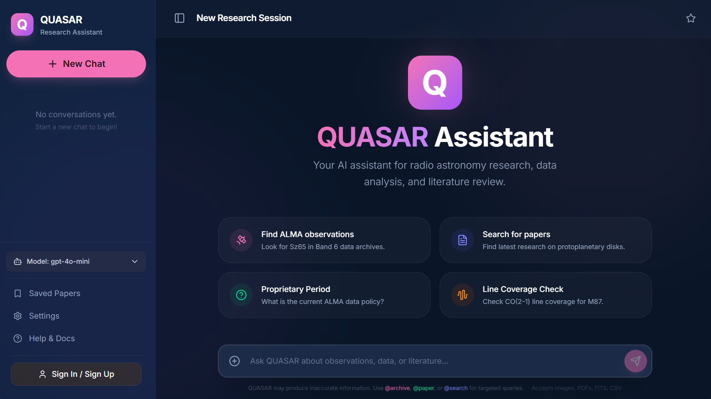
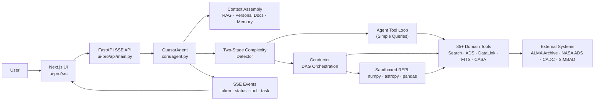

# Quasar



**Quasar** is an open-source AI research assistant that makes ALMA Science Archive search and data retrieval as simple as asking a question in natural language. It is a *domain-specialized agent framework* that wraps any general-purpose LLM with the tools, knowledge, and orchestration needed to perform real radio astronomy tasks.

Quasar pairs a registry of **35+ domain-specific tools** covering archive data search, retrieval, and analysis with a **Conductor** orchestration engine that decomposes complex, multi-step research queries into Directed Acyclic task Graphs (DAGs). By externalizing task planning into the Conductor, Quasar enables even smaller or non-reasoning LLMs to reliably execute sophisticated archive workflows through structured tool composition.

> **Key insight:** A general-purpose LLM becomes a capable scientific assistant not through model fine-tuning alone, but in combination with careful domain engineering.

- **Live application:** [quasarassistant.com](https://www.quasarassistant.com/)
- **Repository:** [Anonymous Repository Tracking Link](https://anonymous.4open.science/r/Quasar-B2B5) *(Link anonymized for double-blind review)*

## Current Capabilities

- Natural-language ALMA archive search by target, position, frequency, and metadata filters
- Automatic target name resolution via SIMBAD with fallback cone search
- NASA ADS literature search, paper retrieval, and full-text PDF extraction from arXiv
- Sandboxed Python REPL for precise scientific computation (redshift calculations, spectral line matching, etc.)
- Conductor-driven DAG orchestration for complex multi-step workflows
- Retrieval-Augmented Generation over ALMA technical documentation
- Per-user personal document collection and preference memory
- ALMA DataLink file listing and remote FITS header inspection
- CASA imaging and calibration script generation
- Downloadable Jupyter Notebook reproducibility for every workflow
- Streamed task execution updates via Server-Sent Events

## Architecture

Incoming queries enter the **QuasarAgent** via a web interface, which assembles context from three sources:

1. **Shared RAG store** — Indexes ALMA technical documentation (Technical Handbook, Proposer's Guide) and optionally live web search results.
2. **Per-user personal vector collection** — Researchers can upload their own documents (observing proposals, scripts, notes), retrieved alongside system knowledge.
3. **Preference memory** — Built by summarizing past conversations, learning each user's observational focus and preferences over time.

The query then passes through a **two-stage complexity detector**:
- **Simple queries** → routed to the **Agent Tool Loop**, where the backbone LLM iterates over tool selection, execution, and observation.
- **Complex queries** → escalated to the **Conductor**, which decomposes the request into a dependency-aware task graph and dispatches subtasks to specialist sub-agents (Archive, Literature, Analysis) sequentially or in parallel.

The Conductor's sub-agents have access to a **Sandboxed Python REPL** for running scripts in a restricted environment with `numpy`, `astropy`, `pandas`, and other scientific dependencies. The sandbox connects back to the full tool registry via a `call_tool()` interface, enabling hybrid workflows that combine programmatic computation with live archive access. Responses are accompanied by a downloadable **Jupyter Notebook** for full transparency and reproducibility.



## Repository Layout

| Path | Purpose |
|---|---|
| `core/` | Agent runtime, Conductor orchestration, tool registry, complexity detector, and sandboxed REPL |
| `services/` | Domain logic for search, retrieval, FITS processing, plotting, CASA, auth, and storage |
| `integrations/` | External system adapters for ALMA, NASA ADS, DataLink, TAP, CASA, and CARTA |
| `ui-pro/src/` | Next.js frontend |
| `ui-pro/api/` | FastAPI backend and SSE endpoints |
| `tests/` | Integration, evaluation, and verification scripts |

## Requirements

- Python 3.9+
- Node.js and npm
- `OPENAI_API_KEY`

Optional configuration:

- `NASA_ADS_API_KEY`
- `QDRANT_URL`
- `QDRANT_API_KEY`
- `TURSO_DATABASE_URL`
- `TURSO_AUTH_TOKEN`
- `JWT_SECRET`
- `NEXT_PUBLIC_API_URL`

## Configuration

Create a repository root `.env` file before starting the backend.

| Variable | Required | Purpose |
|---|---|---|
| `OPENAI_API_KEY` | Yes | Primary model access for the agent runtime |
| `NASA_ADS_API_KEY` | No | Literature search via NASA ADS |
| `QDRANT_URL` | No | Persistent vector storage for RAG and memory |
| `QDRANT_API_KEY` | No | Authentication for Qdrant Cloud |
| `TURSO_DATABASE_URL` | No | Cloud SQL storage |
| `TURSO_AUTH_TOKEN` | No | Authentication for Turso |
| `JWT_SECRET` | No | JWT signing secret for authentication |
| `NEXT_PUBLIC_API_URL` | No | Frontend API base URL override |

## Local Development

### 1. Clone the repository and install Python dependencies

```bash
git clone <repository_url_provided_after_review>
cd Quasar
python -m venv .venv

# Windows PowerShell
.venv\Scripts\Activate.ps1

# macOS or Linux
source .venv/bin/activate

pip install -r requirements.txt

# macOS or Linux
cp .env.example .env

# Windows PowerShell
Copy-Item .env.example .env
```

### 2. Start the backend

Run the FastAPI backend from the `ui-pro` directory:

```bash
cd ui-pro
uvicorn api.main:app --reload --port 8000
```

The backend loads `.env` from the repository root and exposes SSE endpoints on `http://localhost:8000`.

### 3. Start the frontend

Open a second terminal and run:

```bash
cd ui-pro
npm install
npm run dev
```

The frontend runs on `http://localhost:3000`. If `NEXT_PUBLIC_API_URL` is not set, it defaults to `http://localhost:8000`.

### 4. Run the CLI

From the repository root:

```bash
python quasar.py cli
```

You can also run a single query from the command line:

```bash
python quasar.py query "Find ALMA observations of HL Tau in Band 6"
```

## Example Queries

- Find ALMA observations of HL Tau in Band 6.
- Check CO(2-1) line coverage for M87.
- Find the 2018 DSHARP survey overview paper by Andrews et al. and extract the angular resolution for AS 209.
- Search NASA ADS for recent ALMA papers on protoplanetary disks.
- List available data products for the best matching MOUS and inspect the FITS headers.
- Generate a CASA imaging script for a calibrated measurement set.

## Verification

1. Check the backend health endpoint at `http://localhost:8000/health`.
2. Open `http://localhost:3000`.
3. Submit a sample ALMA query.
4. Confirm that the UI receives streamed text, status updates, and task execution events.

## Notes

- The primary runtime surface is the Next.js frontend plus FastAPI backend under `ui-pro/`.
- The repository contains broader astronomy modules, but the strongest supported workflow is ALMA archive search and analysis support.
- The implementation reference is maintained in `QUASAR_SYSTEM_DOCUMENTATION.md`.

## License

MIT License. See `LICENSE` for details.
