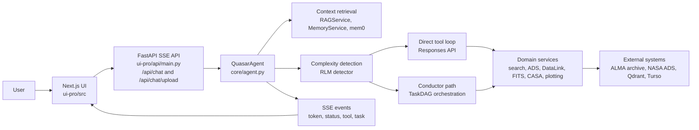

# Quasar


Quasar is a full stack ALMA-focused research assistant. The current implementation combines a Next.js client, a FastAPI streaming API, and a tool-enabled agent runtime to support natural-language archive search, technical retrieval, literature lookup, remote FITS metadata inspection, and workflow-oriented analysis.

## Access

- Live application: [quasar-alpha.vercel.app](https://quasar-alpha.vercel.app/)
- Repository: [adamzacharia/Quasar](https://github.com/adamzacharia/Quasar)

## Current Capabilities

- Natural-language ALMA archive search by target, position, frequency, and metadata filters
- NASA ADS literature search and paper retrieval
- Retrieval over ALMA technical and policy documents
- Personal document retrieval for authenticated users
- ALMA DataLink file listing and remote FITS header inspection
- CASA imaging and calibration script generation
- Streamed task execution updates for complex multi-step queries

## Architecture



## Repository Layout

| Path | Purpose |
|---|---|
| `core/` | Agent runtime, orchestration, tool registry, RLM, and Conductor |
| `services/` | Domain logic for search, retrieval, FITS processing, plotting, CASA, auth, and storage |
| `integrations/` | External system adapters for ALMA, ADS, DataLink, TAP, CASA, and CARTA |
| `ui-pro/src/` | Next.js frontend |
| `ui-pro/api/` | FastAPI backend and SSE endpoints |
| `tests/` | Integration, evaluation, and verification scripts |

## Requirements

- Python 3.9+
- Node.js and npm
- `OPENAI_API_KEY`

Optional configuration:

- `NASA_ADS_API_KEY`
- `QDRANT_URL`
- `QDRANT_API_KEY`
- `TURSO_DATABASE_URL`
- `TURSO_AUTH_TOKEN`
- `JWT_SECRET`
- `NEXT_PUBLIC_API_URL`

## Configuration

Create a repository root `.env` file before starting the backend.

| Variable | Required | Purpose |
|---|---|---|
| `OPENAI_API_KEY` | Yes | Primary model access for the agent runtime |
| `NASA_ADS_API_KEY` | No | Literature search via NASA ADS |
| `QDRANT_URL` | No | Persistent vector storage for RAG and memory |
| `QDRANT_API_KEY` | No | Authentication for Qdrant Cloud |
| `TURSO_DATABASE_URL` | No | Cloud SQL storage |
| `TURSO_AUTH_TOKEN` | No | Authentication for Turso |
| `JWT_SECRET` | No | JWT signing secret for authentication |
| `NEXT_PUBLIC_API_URL` | No | Frontend API base URL override |

## Local Development

### 1. Clone the repository and install Python dependencies

```bash
git clone https://github.com/adamzacharia/Quasar.git
cd Quasar
python -m venv .venv

# Windows PowerShell
.venv\Scripts\Activate.ps1

# macOS or Linux
source .venv/bin/activate

pip install -r requirements.txt

# macOS or Linux
cp .env.example .env

# Windows PowerShell
Copy-Item .env.example .env
```

### 2. Start the backend

Run the FastAPI backend from the `ui-pro` directory:

```bash
cd ui-pro
uvicorn api.main:app --reload --port 8000
```

The backend loads `.env` from the repository root and exposes SSE endpoints on `http://localhost:8000`.

### 3. Start the frontend

Open a second terminal and run:

```bash
cd ui-pro
npm install
npm run dev
```

The frontend runs on `http://localhost:3000`. If `NEXT_PUBLIC_API_URL` is not set, it defaults to `http://localhost:8000`.

### 4. Run the CLI

From the repository root:

```bash
python quasar.py cli
```

You can also run a single query from the command line:

```bash
python quasar.py query "Find ALMA observations of HL Tau in Band 6"
```

## Example Queries

- Find ALMA observations of HL Tau in Band 6.
- List available data products for the best matching MOUS and inspect the FITS headers.
- Search NASA ADS for recent ALMA papers on protoplanetary disks.
- Generate a CASA imaging script for a calibrated measurement set.

## Verification

1. Check the backend health endpoint at `http://localhost:8000/health`.
2. Open `http://localhost:3000`.
3. Submit a sample ALMA query.
4. Confirm that the UI receives streamed text, status updates, and task execution events.

## Notes

- The primary runtime surface is the Next.js frontend plus FastAPI backend under `ui-pro/`.
- The repository contains broader astronomy modules, but the strongest supported workflow is ALMA archive search and analysis support.
- The implementation reference is maintained in `QUASAR_SYSTEM_DOCUMENTATION.md`.

## License

MIT License. See `LICENSE` for details.
