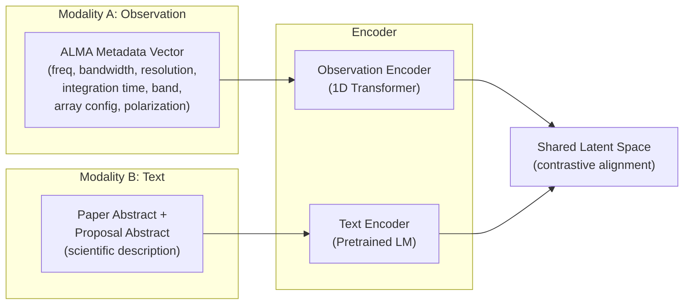
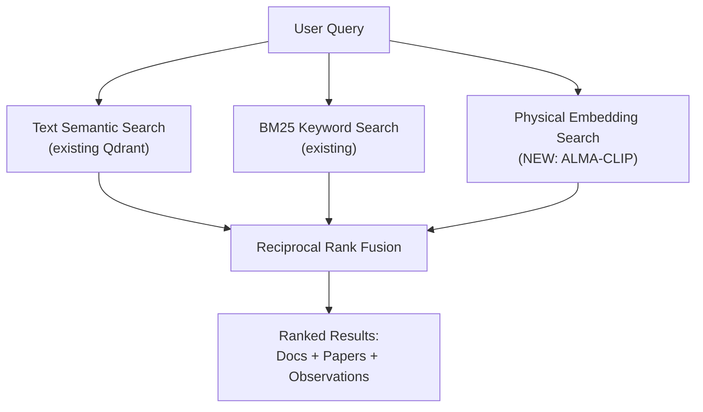

# ALMA Physical Language Model — Implementation Blueprint

## What We're Building

A **contrastive learning model** (like CLIP, but for radio astronomy) that creates a shared embedding space between **ALMA observation metadata/spectra** and **scientific text from papers**. This lets Quasar's RAG pipeline go from keyword/semantic text search → genuine physical understanding of data.



**End result:** Given an ALMA observation, find the most relevant papers. Given a research question, find the most relevant observations. Zero-shot, no fine-tuning needed.

---

## The Data Pipeline

### Step 1: Harvest ALMA Metadata (~95K observations)

```python
# Query ALL ALMA observations via TAP
from astroquery.alma import Alma

query = """
SELECT proposal_id, target_name, s_ra, s_dec, 
       frequency, bandwidth, t_resolution, s_resolution,
       ant_min_bl, ant_max_bl, science_keyword,
       calib_level, t_min, t_exptime, pol_states,
       instrument_name, obs_id
FROM ivoa.ObsCore
WHERE calib_level >= 1
"""
results = Alma().query_tap(query)
# ~95,000 rows, each is one observation
```

**What we get per observation:**
| Field | Example | Type |
|-------|---------|------|
| `proposal_id` | `2021.1.00172.L` | Links to proposal abstract |
| `target_name` | `HL Tau` | Target identifier |
| `frequency` | `230.538e9` | Central freq (Hz) |
| `bandwidth` | `7.5e9` | Total bandwidth |
| `s_resolution` | `0.035` | Angular resolution (arcsec) |
| `science_keyword` | `Protoplanetary disks` | ALMA science category |
| `t_exptime` | `3600` | Integration time (s) |

### Step 2: Link Observations → Paper Abstracts via ADS

Each ALMA observation has a `proposal_id` (e.g., `2021.1.00172.L`). We use this to find:

1. **Proposal abstract** — available directly from the ALMA archive (hover-over metadata)
2. **Published papers** — search ADS for papers citing the project code

```python
import ads

def get_papers_for_project(proposal_id):
    """Find all papers that reference this ALMA project."""
    papers = ads.SearchQuery(
        q=f'full:"{proposal_id}"',
        fl=['bibcode', 'abstract', 'title', 'keyword', 'year']
    )
    return list(papers)

# Build pairs: (observation_metadata, paper_abstract)
```

### Step 3: Build Contrastive Training Pairs

For each observation, we create **positive pairs**:

```
(observation_vector, associated_paper_abstract) → similar
(observation_vector, random_other_abstract)     → dissimilar
```

**Observation vector** (numerical features, normalized):
```python
obs_vector = [
    log10(frequency),           # Central frequency
    log10(bandwidth),           # Bandwidth  
    log10(s_resolution),        # Angular resolution
    log10(t_exptime),           # Integration time
    s_ra / 360.0,               # RA (normalized)
    s_dec / 180.0 + 0.5,        # Dec (normalized)
    band_onehot[0:10],          # ALMA Band (1-10)
    science_keyword_embedding,  # Category embedding
]
```

**Text** (concatenated string):
```
"Title: {paper_title}. Abstract: {paper_abstract}. 
 Keywords: {keywords}. Target: {target_name}."
```

### Expected Dataset Size

| Component | Count |
|-----------|-------|
| ALMA observations | ~95,000 |
| Unique proposal IDs | ~4,000 |
| Linked ADS papers | ~15,000-25,000 |
| Training pairs (obs, text) | ~200,000+ (augmented) |

This is comparable to AstroCLIP's dataset scale and very trainable on a single GPU node.

---

## The Model Architecture

Following AstroCLIP's proven approach, adapted for ALMA:

### Observation Encoder
```
Input: 64-dim observation feature vector
  → Linear(64, 256) + LayerNorm + GELU
  → 4-layer Transformer encoder (d=256, 4 heads)
  → Mean pooling → Linear(256, 512)
  → L2 normalize → 512-dim embedding
```

### Text Encoder
```
Input: Paper abstract (tokenized)
  → Pretrained SciBERT or astro-ph BERT
  → [CLS] token → Linear(768, 512)  
  → L2 normalize → 512-dim embedding
```

### Contrastive Loss (InfoNCE)
```python
# Same as CLIP — maximize similarity of matched pairs
def info_nce_loss(obs_embeddings, text_embeddings, temperature=0.07):
    logits = obs_embeddings @ text_embeddings.T / temperature
    labels = torch.arange(len(logits))
    loss = (F.cross_entropy(logits, labels) + 
            F.cross_entropy(logits.T, labels)) / 2
    return loss
```

### Training Compute (on TACC)

| Phase | GPUs | Time | TACC Queue |
|-------|------|------|------------|
| Data harvesting | CPU only | ~4 hours | `normal` |
| Text encoder fine-tune | 1× A100 | ~6 hours | `gpu-a100` |
| Observation encoder pretrain | 1× A100 | ~4 hours | `gpu-a100` |
| CLIP alignment | 1× A100 | ~8 hours | `gpu-a100` |
| **Total** | **1 node** | **~22 hours** | — |

AstroCLIP used 20× A100s for 46 hours on images. Our task is much smaller (metadata vectors vs. galaxy images), so **1 node is sufficient**.

---

## Integration into Quasar

### New Module: `services/alma_embeddings.py`

```python
class ALMAEmbeddingService:
    """Physical language model for ALMA observations."""
    
    def __init__(self, model_path: str):
        self.model = ALMACLIPModel.load(model_path)
    
    def embed_observation(self, obs_metadata: dict) -> np.ndarray:
        """Encode ALMA observation metadata → 512-dim vector."""
        features = self._extract_features(obs_metadata)
        return self.model.encode_observation(features)
    
    def embed_query(self, text: str) -> np.ndarray:
        """Encode research question → 512-dim vector."""
        return self.model.encode_text(text)
    
    def find_similar_observations(self, query: str, top_k=10):
        """Given a research question, find relevant ALMA observations."""
        query_emb = self.embed_query(query)
        # Search pre-computed observation index (Qdrant)
        return self.qdrant.search(query_emb, top_k=top_k)
    
    def find_similar_papers(self, obs_metadata: dict, top_k=5):
        """Given an observation, find relevant papers."""
        obs_emb = self.embed_observation(obs_metadata)
        return self.qdrant.search(obs_emb, collection="papers", top_k=top_k)
```

### Enhanced RAG Pipeline: `services/rag_service.py`



The physical embedding search adds a **third retrieval channel** alongside the existing semantic + BM25 hybrid. Results are fused via the existing RRF implementation.

### New Quasar Capabilities Unlocked

| Capability | Example Query | How It Works |
|------------|--------------|--------------|
| **"Find observations like X"** | "Find ALMA observations similar to the HL Tau disk study" | Embed the reference obs → nearest neighbors in observation space |
| **"What's been done on this source?"** | "What do we know about TW Hya from ALMA?" | Cross-modal: text query → observation embeddings |
| **"Which papers are relevant to this data?"** | After retrieving obs, "explain this observation" | Embed obs → find aligned paper abstracts |
| **"Anomaly detection"** | "Find unusual Band 6 observations" | Cluster observation embeddings, find outliers |

---

## Phased Execution Plan

### Phase 0: TACC Access (Week 1)
- [ ] Apply for TACC Startup Allocation via UT portal
- [ ] Request access to Lonestar6 `gpu-a100` queue
- [ ] Set up conda environment on TACC with PyTorch 2.0 + transformers

### Phase 1: Data Harvesting (Week 2)
- [ ] Script to query all ALMA observations via TAP → CSV
- [ ] Script to bulk-query ADS for papers linked to each `proposal_id`
- [ ] Script to scrape proposal abstracts from ALMA archive
- [ ] Build and validate contrastive pair dataset
- [ ] Store raw dataset on TACC `$SCRATCH`

### Phase 2: Model Training (Weeks 3-4)
- [ ] Implement observation encoder (1D Transformer)
- [ ] Fine-tune SciBERT text encoder on astro-ph abstracts
- [ ] Implement InfoNCE contrastive loss
- [ ] Train CLIP alignment on TACC A100 node
- [ ] Evaluate: retrieval recall@k, zero-shot property prediction
- [ ] Export model weights + publish to HuggingFace

### Phase 3: Quasar Integration (Week 5)
- [ ] Build `ALMAEmbeddingService` module
- [ ] Pre-compute embeddings for all 95K observations → Qdrant collection
- [ ] Add physical embedding channel to RAG fusion pipeline
- [ ] Add `find_similar_observations` and `find_similar_papers` tools
- [ ] UI: show "physically similar observations" panel

### Phase 4: Paper & Publication (Week 6+)
- [ ] Write up as extension to Quasar paper or standalone methods paper
- [ ] Benchmark against vanilla text-only RAG
- [ ] Open-source the trained model weights (MIT license)
- [ ] Register dataset on HuggingFace Datasets

---

## Key References

| Paper | Relevance |
|-------|-----------|
| **AstroCLIP** (Parker et al. 2024, MNRAS) — [GitHub](https://github.com/PolymathicAI/AstroCLIP) | Direct template: CLIP for galaxy images + spectra. MIT license. |
| **Lium/AstroMind** — "Augmenting X-ray representations with contrastive learning" | The paper to beat: X-ray spectra ↔ text alignment |
| **SpecCLIP** (2026, Acta Astrophysica Sinica) | Contrastive learning for stellar spectra across telescopes |
| **AION-1** | 3B-param foundation model unifying 5 surveys |

---

## Why This Wins

| | Lium (X-ray) | Quasar (Radio) |
|---|---|---|
| **Data source** | Chandra X-ray catalog | ALMA archive (95K obs) |
| **Text source** | X-ray literature | ADS papers + ALMA proposals |
| **Modality** | X-ray spectra ↔ text | Observation metadata ↔ text |
| **Compute** | Unknown (VC-funded cloud) | TACC A100s (free, university) |
| **Model access** | Proprietary | Open-source (MIT) |
| **Integration** | Lium platform only | Quasar RAG pipeline + standalone |
| **Downstream** | Source classification | Observation discovery, paper recommendation, anomaly detection |

> [!IMPORTANT]
> **The key advantage:** Lium built this for Chandra (~200K sources, narrow domain). We build it for ALMA (~95K observations, the world's most powerful radio telescope). The ALMA community is larger, more active, and the data is richer. Open-sourcing the model makes it citable and extensible — a permanent competitive moat.
