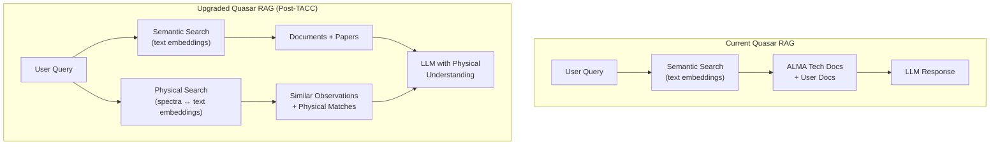
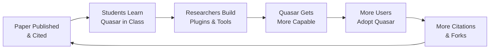

# How Quasar Beats Lium — Competitive Strategy

## The Core Insight

Lium is playing an **enterprise game** — selling to oil & gas, defense, and compliance buyers who have procurement budgets. Their astronomy vertical (Chandra X-ray) is a **credibility play**, not their revenue focus.

Quasar is playing the **academic game** — where open-source tools become standards through papers, citations, teaching, and community adoption.

**These are fundamentally different games.** And in academia, the open-source tool that works always wins:

| Incumbent | Winner | Why |
|-----------|--------|-----|
| IDL | astropy / Python | Free, community-driven, citable |
| MATLAB | Python / numpy | Free, extensible, taught in grad school |
| Commercial pipelines | CASA | Open, standard, required by observatories |
| Proprietary viz | ds9 / CARTA | Free, runs anywhere, community support |

Lium cannot win the academic astronomy market with a closed-source enterprise SaaS tool. **The playbook is proven.**

---

## 5 Strategic Pillars

### 🏎️ Pillar 1: SPEED — Ship Before They Launch

Lium is pre-launch. Every feature Quasar ships before Lium goes live is a feature astronomers already depend on. Switching costs compound daily.

| Action | Timeline | Status |
|--------|----------|--------|
| Quasar is already live at quasarassistant.com | ✅ Done | **Advantage: Quasar** |
| 35+ domain tools already built | ✅ Done | **Advantage: Quasar** |
| Conductor DAG orchestration proven | ✅ Done | **Advantage: Quasar** |
| Jupyter reproducibility pipeline | ✅ Done | **Advantage: Quasar** |
| Evidence trails UI (steal from Lium's pitch) | 🎯 Build in Week 1 | Close the gap |
| Chandra/CIAO tools (H1-H3) | 🎯 Build in Weeks 2-3 | Invade their turf |

> [!IMPORTANT]
> **Every week Quasar is live and Lium isn't = more users, more feedback, more citations, more lock-in.** Speed is the #1 weapon.

---

### 🏰 Pillar 2: DEPTH — Make the Tool Gap Unbridgeable

Lium is spreading across 3 verticals (subsurface, satellite, space) with $2.54M and a 2-person exec team. Each vertical gets ~$800K of attention. They **cannot** build the depth Quasar already has.

**Current Quasar depth that Lium can't match:**

```
ALMA: Search → DataLink → FITS headers → Sensitivity calc → Beam calc →
      CASA scripts → Moment maps → Spectral profiles → Line ID → uv-coverage

MAST: JWST/HST/TESS search → data retrieval → cross-match

ADS:  NL query builder → PDF extraction → consensus evaluation → 
      OpenAlex bibliometrics → researcher profiles

Orchestration: 3-tier complexity detection → DAG decomposition → 
              sub-agent dispatch → recovery engine → HITL review

Reproducibility: Every workflow → downloadable Jupyter notebook
```

**Deepen the moat — attack their demonstrated domain:**

| Feature | ID | Impact | Effort |
|---------|----|--------|--------|
| CIAO Script Generator (Chandra) | H1 | Directly compete in Lium's X-ray demo | 4-6 hrs |
| XSPEC Model Advisor | H2 | X-ray spectral fitting guidance | 4-6 hrs |
| Fermi LAT 4FGL Search | H3 | High-energy gamma-ray coverage | 3-4 hrs |
| X-ray Image Display | H4 | Visual Chandra data exploration | 6-8 hrs |
| Timing Analysis Tool | H5 | Lightcurves, power spectra | 6-8 hrs |

> [!TIP]
> **When Lium finally launches their astronomy vertical, every astronomer who tries it should immediately think: "This can't do half of what Quasar does."**

---

### 🧬 Pillar 3: STEAL THEIR SCIENCE — Physical Language Models on TACC

Lium's deepest technical advantage is their contrastive learning approach — "physical language models" that create embeddings aligning X-ray spectra with scientific text. Their paper is **published and public**. The method is reproducible.

**The play: Train ALMA-specific physical language models on TACC.**



**Concrete steps:**
1. Collect ALMA archive metadata + associated ADS paper abstracts (data is public)
2. Build contrastive pairs: observation parameters ↔ paper descriptions
3. Train on TACC GPUs (free compute via university allocation)
4. Deploy as an enhanced RAG embedding alongside existing BM25 + semantic search
5. **Publish the method** — creates an academic contribution Lium can't claim

**Why TACC is the unfair advantage:**
- TACC = $100M+ taxpayer-funded supercomputer. Lium has $2.54M total.
- Free GPU hours for university research
- Data stays on US academic infrastructure (better than "your cloud or ours")
- Can train models that would cost Lium significant cloud compute budget

---

### 🌍 Pillar 4: COMMUNITY LOCK-IN — The Open-Source Flywheel

This is the moat Lium can **never** buy. Every component reinforces every other:



**Immediate actions:**

| Action | Why It Matters |
|--------|---------------|
| **Get the paper published** (it's in review) | Citations = permanent adoption record |
| **Register on ASCL** (Astrophysics Source Code Library) | Official discovery channel for astronomers |
| **Submit to ADASS / AAS** | Conference visibility in the community |
| **Create 5 tutorial notebooks** | Professors assign these → students learn Quasar |
| **Launch plugin marketplace** | Contributors become stakeholders |
| **"Powered by Quasar" badge** for notebooks | Every shared notebook = free marketing |

> [!IMPORTANT]
> **Academic citations are an immutable, permanent, public record of adoption.** Once a PI cites Quasar in a paper, they're invested. This is a moat that compounds forever and that no amount of VC money can replicate.

---

### 🧠 Pillar 5: LEAPFROG — Build What They Can't

Some things a VC-funded startup structurally cannot do that an open-source academic tool can:

#### A) Zero-Cost Inference on TACC

Deploy Quasar with **DeepSeek R1** or similar open-weights models on TACC:
- No API costs → any astronomer can use it for free, unlimited
- Chain-of-thought reasoning visible in UI (from your earlier architecture work)
- Data never leaves university infrastructure
- **Lium charges enterprise pricing. Quasar is free.** In academia, free wins.

#### B) Full Transparency

- Every tool is open source — scientists can verify, audit, extend
- Jupyter notebooks show exact computations — not just an "evidence trail"
- DAG execution is visible and debuggable
- **Lium says "trust every answer" — Quasar says "verify every answer"**

#### C) Instrument-Specific Depth

Lium's "ask your instruments" pitch is generic. Quasar can be literal:
- Chat with a specific ALMA data cube (W3 — already built)
- Generate CASA calibration scripts for a specific observation
- Calculate sensitivity for a specific array configuration and frequency
- Inspect FITS headers of a specific data product

**This isn't "ask your instruments" as a metaphor. It's "ask your instruments" as a feature.**

---

## The 90-Day Battle Plan

### Phase 1: NEUTRALIZE (Weeks 1–2)
> Close every visible gap before Lium launches

- [ ] **Sources & Evidence panel** — collapsible evidence chain on every response showing which archives were queried, what data was returned, what reasoning was applied
- [ ] **"Investigation" mode** — rebrand complex Conductor workflows as investigations in the UI, with a visual DAG progress tracker
- [ ] **Chandra/CIAO tool (H1)** — generate CIAO data reduction scripts, directly competing in Lium's only demonstrated astronomy domain
- [ ] **XSPEC advisor (H2)** — recommend X-ray spectral models

### Phase 2: DEEPEN (Weeks 3–6)
> Make the feature gap unbridgeable

- [ ] **Fermi LAT search (H3)** — gamma-ray catalog coverage
- [ ] **X-ray image display (H4)** — visual Chandra data exploration  
- [ ] **Earth observation tools** — Sentinel/Landsat integration (match Lium's "multi-domain" pitch)
- [ ] **Investigation dashboard** — real-time evidence chains with clickable source links
- [ ] **Complete remaining Tier 2 features** — O2, O1, I2, I3

### Phase 3: LEAPFROG (Weeks 7–12)
> Build what they structurally cannot match

- [ ] **TACC deployment** — Quasar on TACC with open-weights models, zero-cost inference
- [ ] **ALMA contrastive embeddings** — train physical language models (spectra ↔ text) on TACC GPUs
- [ ] **Paper published + ASCL registration** — start the citation flywheel
- [ ] **Plugin marketplace launch** — community-contributed tools
- [ ] **5 tutorial notebooks** — for classroom adoption
- [ ] **ADASS / AAS submission** — conference visibility

---

## Kill Shot: The Comparison Table They Can't Win

When an astronomer evaluates both tools, this is what they see:

| | **Quasar** | **Lium** |
|---|---|---|
| **Price** | Free (MIT license) | Enterprise pricing |
| **Source code** | Open, auditable, extensible | Closed, proprietary |
| **Astronomy tools** | 35+ specialized tools | Generic "investigation" layer |
| **Archives** | ALMA, MAST, ESO, IRSA, NRAO, ADS, NED, SIMBAD | Chandra only (demo) |
| **Reproducibility** | Downloadable Jupyter notebooks | "Evidence trail" (proprietary format) |
| **Orchestration** | Conductor DAG with 3-tier complexity | Unknown |
| **Script generation** | CASA, CIAO scripts | None |
| **Compute** | TACC supercomputer (free) | Your cloud ($$$) |
| **Model choice** | Any LLM (GPT-4.1, DeepSeek R1, etc.) | "Bring your own" (still on their infra) |
| **Community** | Open-source, GitHub, academic citations | Enterprise customer base |
| **Data sovereignty** | University infrastructure | "Your cloud or ours" |
| **Status** | **Live today** | Early access waitlist |

> [!CAUTION]
> **The one thing Quasar must NOT do:** Try to become an enterprise SaaS product. That's Lium's game, and they have the team and funding for it. Stay in the open-source academic lane — it's a lane they structurally cannot enter, and it's where astronomy actually happens.

---

## TL;DR

1. **They're playing enterprise. We're playing academia. Different games.**
2. **Ship fast** — every day Quasar is live and Lium isn't = more lock-in
3. **Go deeper** — 35 tools → 50 tools. Make the gap obvious.
4. **Steal their science** — train ALMA physical language models on TACC with their published methods
5. **Build the community flywheel** — paper → citations → teaching → plugins → adoption → citations
6. **Stay free, stay open** — in academia, that's the unbeatable moat
