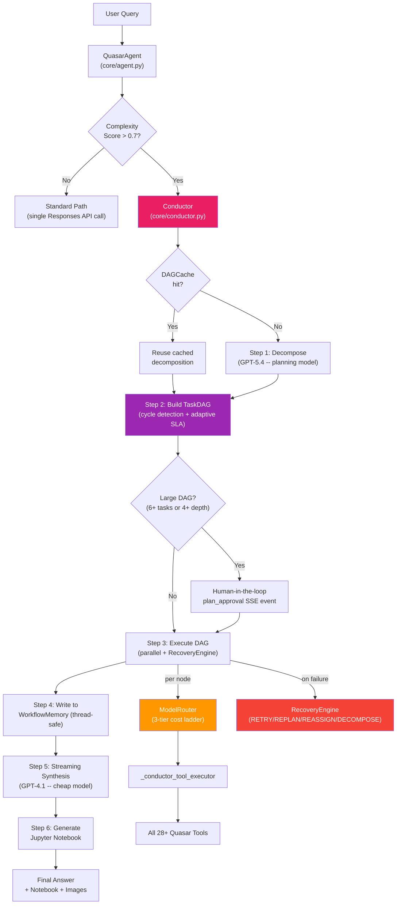
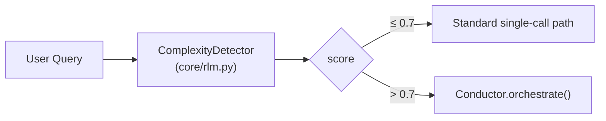
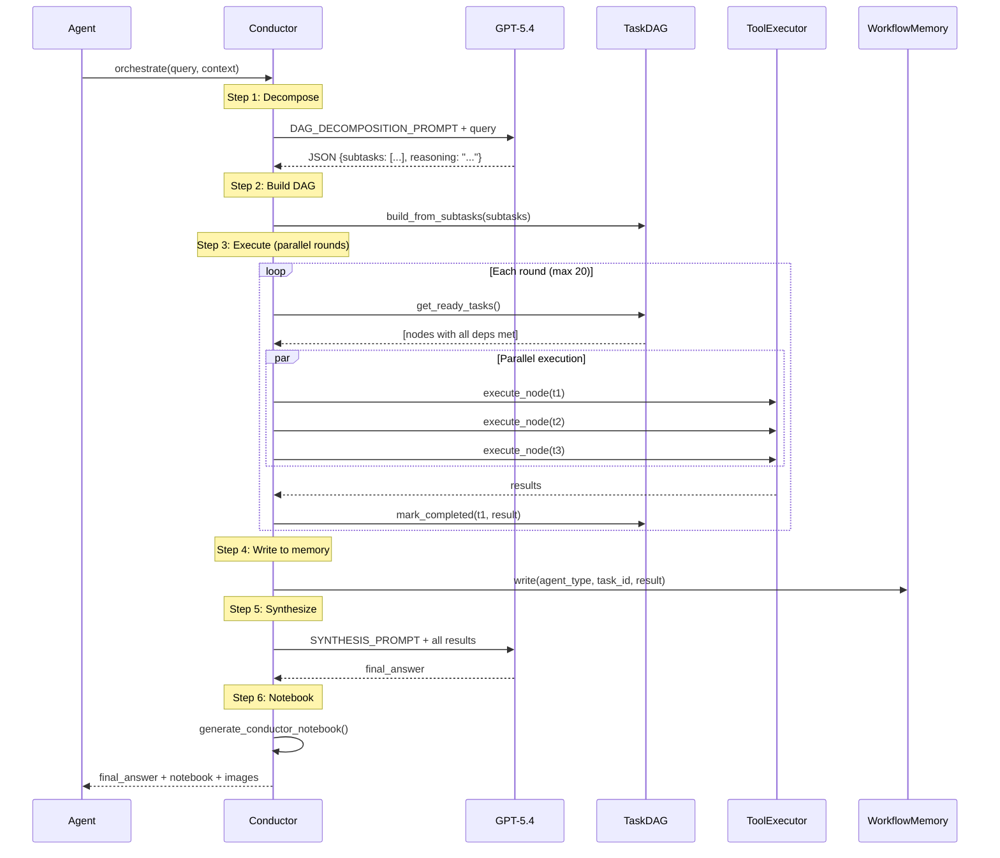
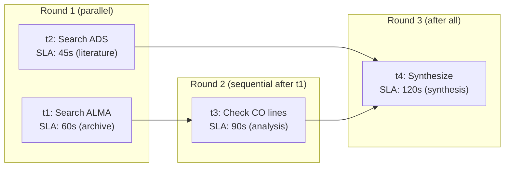
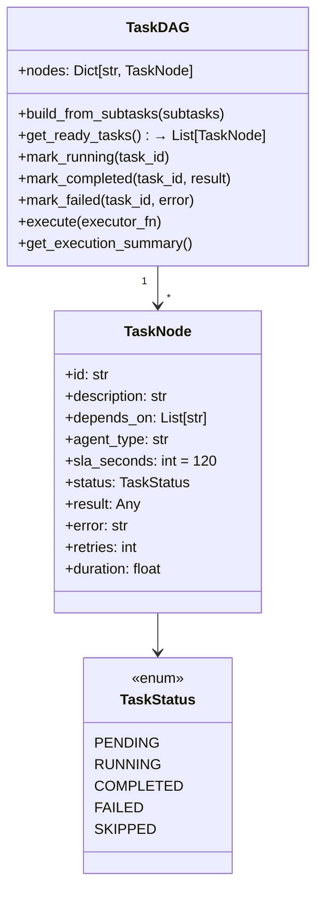
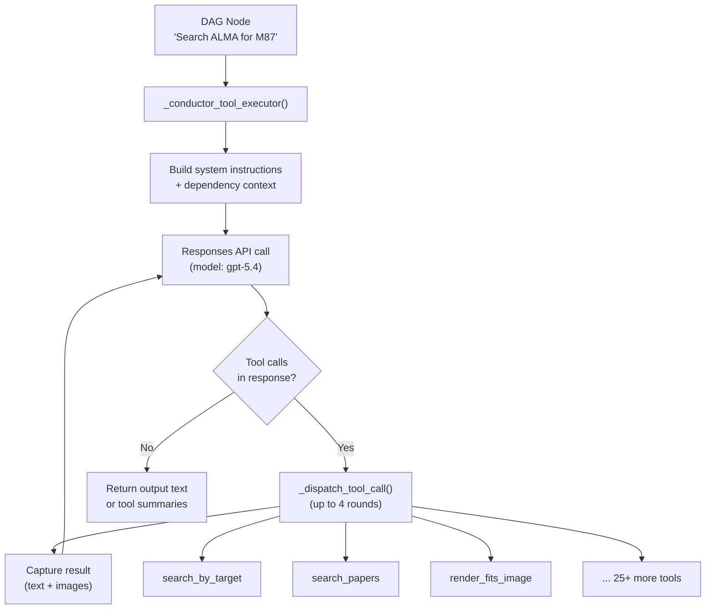
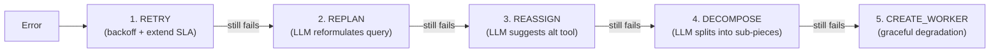
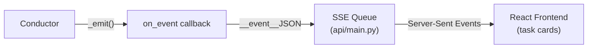
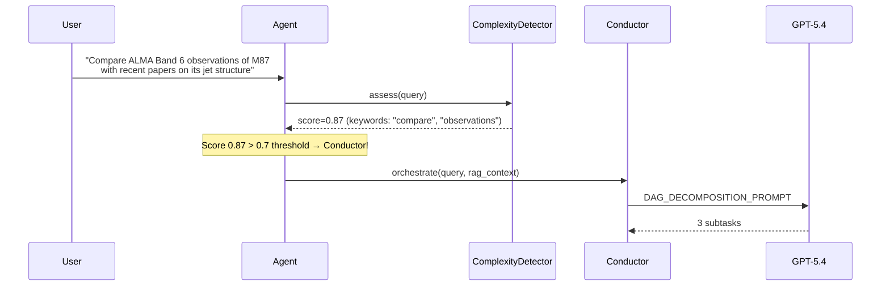

# Quasar Conductor -- Architecture Deep Dive

> **The Conductor is Quasar's multi-agent orchestration engine.**  
> It decomposes complex astronomy queries into a dependency DAG, routes subtasks to specialized sub-agents, runs them in parallel, handles failures, and synthesizes a final answer.

---

## Table of Contents

1. [High-Level Overview](#1-high-level-overview)
2. [How the Conductor Gets Triggered](#2-how-the-conductor-gets-triggered)
3. [The 6-Step Orchestration Pipeline](#3-the-6-step-orchestration-pipeline)
4. [The Task DAG Engine](#4-the-task-dag-engine)
5. [Sub-Agent Tool Executor](#5-sub-agent-tool-executor)
6. [Supporting Infrastructure](#6-supporting-infrastructure)
7. [SSE Event Protocol](#7-sse-event-protocol)
8. [Concrete Example Walkthrough](#8-concrete-example-walkthrough)
9. [File Map](#9-file-map)

---

## 1. High-Level Overview



**Key idea:** Instead of one monolithic LLM call, the Conductor breaks hard questions into a graph of small, focused tasks that run in parallel where possible — like "search ALMA for M87" and "search ADS for M87 papers" at the same time.

---

## 2. How the Conductor Gets Triggered

The entry point is `stream_response_api()` in `agent.py` (line ~4029):



### The Complexity Detector (2-Stage)

| Stage | Method | Cost | When Used |
|-------|--------|------|-----------|
| **Stage 1** | Heuristic keyword scan | Free | Always runs first |
| **Stage 2** | LLM probe (gpt-4o-mini) | ~$0.001 | Only if heuristic score is 0.2–0.8 |

**Heuristic keywords** that bump the score: `"coverage across"`, `"overlap"`, `"redshift"`, `"observed frequency"`, `"compare"`, `"correlate"`, `"combine"`, `"step by step"`, etc.

**Fast-tracked as simple (score=0.0):** queries starting with `find/search/show/get/list` + `observations/data` with no multi-hop indicators.

### Threading Model

The Conductor is **async** but the agent runs in a sync context. Solution:

```
agent.py (sync thread) 
  └─ spawns threading.Thread(_run_conductor)
       └─ creates new asyncio event loop
            └─ runs Conductor.orchestrate() 
                 └─ asyncio.gather() for parallel subtasks
                      └─ each subtask → run_in_executor() (real thread)
                           └─ _conductor_tool_executor() (sync OpenAI calls)
```

This ensures `asyncio.gather()` actually runs subtasks **in parallel** instead of sequentially.

---

## 3. The 6-Step Orchestration Pipeline



### Step 1: Decomposition (GPT-5.4 -- planning model)

The Conductor sends `DAG_DECOMPOSITION_PROMPT` to **GPT-5.4** (the only step that uses the expensive model). The prompt:

- Lists all available tools grouped by agent type
- Defines anti-patterns (never search VLA, never chain independent searches)
- Demands explicit `depends_on` arrays for sequential deps
- Caps at 10 subtasks max

**Output format:**
```json
{
  "subtasks": [
    {"id": "t1", "description": "Search ALMA for M87", "depends_on": [], "agent_type": "archive"},
    {"id": "t2", "description": "Search ADS for M87 papers", "depends_on": [], "agent_type": "literature"},
    {"id": "t3", "description": "Check CO line coverage", "depends_on": ["t1"], "agent_type": "analysis"},
    {"id": "t4", "description": "Synthesize findings", "depends_on": ["t1","t2","t3"], "agent_type": "synthesis"}
  ],
  "reasoning": "t1 and t2 are independent → parallel. t3 needs t1's results. t4 depends on all."
}
```

### Step 2: Build TaskDAG (with validation)

`TaskDAG.build_from_subtasks()` creates `TaskNode` objects, then runs 3 validation passes:
1. **Unknown deps**: removes references to non-existent task IDs
2. **Self-loops**: detects and removes `t1 depends_on t1`
3. **Cycle detection**: Kahn's algorithm finds cycles; breaks them by removing edges

Also applies **adaptive SLA** per agent type (archive=60s, literature=45s, web=30s, viz=180s, etc.) instead of a flat 120s timeout.

### Step 3: Execute DAG (Parallel Rounds + RecoveryEngine)



Each round:
1. `get_ready_tasks()` -- all PENDING nodes whose deps are COMPLETED
2. `asyncio.gather()` runs them in parallel
3. **RecoveryEngine** handles failures with cascading strategies (RETRY -> REPLAN -> REASSIGN -> DECOMPOSE)
4. **Adaptive SLA**: each node's timeout is set by its `agent_type` (not a flat 120s)
5. **WorkflowMemory**: results are written immediately per-task for downstream access
6. Failed nodes cascade: dependents get marked FAILED with "Unmet dependencies"

### Step 4: WorkflowMemory (thread-safe)

A **thread-safe** key-value store (`threading.Lock` on all ops) where each sub-agent writes its results. Now supports:
- `write(agent_id, key, value, task_id=...)` -- links entries to DAG tasks
- `get_task_result(task_id)` -- reads structured result for a specific upstream task
- `get_dependency_context(task_ids)` -- builds organized context string for downstream tasks
- `get_context_summary()` -- full dump for synthesis prompt

### Step 5: Streaming Synthesis (GPT-5.4)

All results (including failures) are fed to `CONDUCTOR_SYNTHESIS_PROMPT` with `stream=True`. Tokens appear word-by-word in the UI instead of a 3-5s silent wait. Key rules:
- Cite specific values from results (frequencies, beam sizes, paper titles)
- Handle failures honestly (quote exact errors)
- Format for web UI (Markdown tables, bold key findings)
- Never invent "recommendations" or "next steps"

### Step 6: Jupyter Notebook Generation (smart codegen)

`generate_conductor_notebook()` creates a reproducible `.ipynb` with:
- Title + query
- Standard astropy/astroquery imports
- One code cell per subtask with **real values** extracted from results (target names, bands, frequencies) instead of placeholder comments
- CADC/pyvo templates for JWST/HST queries
- Summary section

---

## 4. The Task DAG Engine

**File:** `core/task_dag.py`



### Ready Task Selection Logic

A task is "ready" when:
1. Its status is `PENDING`
2. **All** of its `depends_on` tasks have status `COMPLETED`

This is what enables automatic parallelism — no manual scheduling needed.

---

## 5. Sub-Agent Tool Executor

**File:** `agent.py:3465` → `_conductor_tool_executor()`

This is the bridge between the Conductor's DAG nodes and Quasar's 28+ tools.



**Key details:**
- Uses the **Responses API** with all registered tools
- Runs up to **4 tool-call rounds** per subtask
- Captures image results thread-safely via `_conductor_images_lock`
- Falls back to tool summaries if the LLM produces no text

---

## 6. Supporting Infrastructure

### Model Router (`core/model_router.py`) -- ACTIVE

Routes each subtask to the optimal OpenAI model using a 3-tier cost ladder:

| Task Category | Model | Tier | Reason |
|--------------|-------|------|--------|
| Archive Search | gpt-4.1 | Solid | Reliable tool-calling for ALMA/CADC |
| Literature Review | gpt-4.1-mini | Cheap | Simple ADS search -- fast + cheap |
| Scientific Reasoning | gpt-5.4 | Heavy | Complex multi-step reasoning |
| Data Analysis | gpt-4.1 | Solid | Structured output for spectral analysis |
| Code Generation | gpt-4.1 | Solid | Reliable code + tool calling |
| Synthesis | gpt-5.4 | Heavy | Combining results requires deep reasoning |
| Visualization | gpt-4.1 | Solid | Tool calling for FITS rendering |
| Simple QA | gpt-4.1-mini | Cheap | Fast + cheap for trivial questions |
| Web Search | gpt-4.1-mini | Cheap | Simple tool calls |

The ModelRouter is fully wired into `Conductor._execute_node()` -- each subtask gets routed to the optimal model before execution. GPT-5.4 is reserved only for planning/synthesis.

### Recovery Engine (`core/recovery.py`) -- FULLY WIRED

5 escalating strategies when a subtask fails. Now wired into `Conductor._run_one()` so every DAG node gets automatic cascading recovery:



- **RETRY**: Transient errors -- exponential backoff (2^attempt seconds), extend SLA by 1.5x
- **REPLAN**: Empty results -- LLM rewrites the task description (e.g. target name search -> coordinate search)
- **REASSIGN**: Soft failures -- LLM suggests an alternative tool or approach (e.g. ALMA failed -> try CADC)
- **DECOMPOSE**: Repeated timeouts -- LLM breaks task into 2-3 smaller sub-pieces, executes each
- **CREATE_WORKER**: All strategies exhausted -- returns graceful error message

All recovery attempts are logged to `_recovery_log` for observability (`get_stats()`).

### Result Cache (`core/result_cache.py`) -- NEW

Thread-safe LRU cache that deduplicates tool calls across Conductor subtasks:

- **Strict matching**: SHA-256 hash of `(tool_name, sorted_args)` -- no fuzzy matching
- **TTL**: 5-minute default, auto-evicts expired entries
- **Never caches errors**: `success=False`, empty results, zero-count results are always skipped
- **Force-fresh bypass**: callers can set `force_fresh=True` to skip cache
- **Per-conversation scoping**: `clear()` between conversations

### DAG Cache (`core/dag_cache.py`) -- NEW

Cross-session learning that reuses successful DAG decompositions:

- **Query normalization**: replaces target names/bands with `{TARGET}`, `{BAND}` placeholders
- **Fingerprint matching**: exact hash match first, word-overlap similarity fallback (threshold=0.8)
- **Quality gating**: only caches plans with 2+ tasks and <50% failure rate
- **Persistence**: JSON file at `data/dag_cache.json`
- **Savings**: skips GPT-5.4 decomposition call (~$0.01 + 2s latency per cache hit)

### Agent Pool (`core/agent_pool.py`)

Keeps initialized sub-agents warm across queries. Auto-cleans idle agents after 300s.

### Health Monitor (`core/health_monitor.py`)

Tracks LLM provider health. After 3 consecutive failures, marks provider unhealthy and routes to fallback. Rechecks unhealthy providers every 2 minutes.

### Workflow Memory (`core/workflow_memory.py`) -- THREAD-SAFE

Shared key-value store for cross-agent communication, now with `threading.Lock` on all operations:

```python
wm.write("archive_agent", "search_results_m87", {...}, task_id="t1")
wm.write("analysis_agent", "co_coverage", [...], task_id="t3")

# Downstream tasks read structured context from upstream
context = wm.get_dependency_context(["t1", "t2"], max_chars=8000)
result = wm.get_task_result("t1")  # read specific task output
all_data = wm.read_all()  # synthesis agent reads everything
```

### Query Tracer (`core/observability.py`) -- WITH COST TRACKING

Every Conductor run gets a `trace_id`. Each step tracks:
- Duration (ms)
- Model used
- Input/output tokens
- Estimated cost (USD) via per-model pricing table

Aggregated per-trace: `total_cost_usd`, `total_input_tokens`, `total_output_tokens`, `models_used`.

### Dashboard API (`ui-pro/api/main.py`) -- NEW ENDPOINTS

| Endpoint | Purpose |
|----------|--------|
| `GET /api/conductor/traces` | Aggregated metrics + recent traces |
| `GET /api/conductor/traces/{id}` | Detailed single trace with per-step costs |
| `GET /api/conductor/health` | Model router config, recovery stats, cache stats |
| `GET /api/conductor/dag-cache` | Cached decomposition patterns |

---

## 7. SSE Event Protocol

The Conductor emits structured events for the Perplexity-style task UI:

| Event Type | Purpose | Payload |
|-----------|---------|---------|
| `task_list` | Full checklist view | All tasks with status/icons |
| `task_group` | Parallel batch header | Group of tasks running together |
| `task_update` | Individual task progress | Status, detail, agent label |
| `plan_approval` | Human-in-the-loop gate | Full DAG plan for user approval (large DAGs only) |

The `plan_approval` event is emitted for DAGs with 6+ tasks or 4+ critical path depth. It includes `auto_approve_after_ms: 10000` so execution auto-proceeds after 10s if the user doesn't intervene.

These flow: `Conductor -> on_event callback -> agent.py -> SSE queue -> FastAPI -> Frontend`



Agent types map to display icons:

| Agent Type | Icon | Display Name |
|-----------|------|-------------|
| archive | archive | Archive Search |
| literature | literature | Literature Review |
| analysis | analysis | Data Analysis |
| viz | viz | Visualization |
| web | web | Web Search |
| synthesis | synthesis | Result Synthesis |

---

## 8. Concrete Example Walkthrough

**User asks:** *"Compare ALMA Band 6 observations of M87 with recent papers on its jet structure"*

### Step-by-step:



**Decomposed DAG:**

```
t1 (archive):    "Search ALMA archive for M87 Band 6"     depends_on: []
t2 (literature): "Search ADS for M87 jet structure papers" depends_on: []
t3 (synthesis):  "Compare archive data with literature"    depends_on: [t1, t2]
```

**Execution:**

| Round | Tasks | Model Used | SLA | What Happens |
|-------|-------|-----------|-----|--------------|
| **1** | t1 + t2 (parallel) | t1: gpt-4.1, t2: gpt-4.1-mini | 60s, 45s | t1 calls `search_by_target("M87", band="6")` -> 47 results. t2 calls `search_papers("M87 jet structure")` -> 12 papers. Both run simultaneously. |
| **2** | t3 (sequential) | gpt-5.4 | 120s | Receives t1+t2 results via WorkflowMemory. Produces comparison table. |

**Synthesis:** GPT-5.4 streams the final answer token-by-token -- the user sees it appear immediately instead of waiting 3-5s.

**Cost tracking:** The QueryTracer logs that t1 used ~1200 input + 400 output tokens on gpt-4.1 ($0.005), t2 used ~800+200 on gpt-4.1-mini ($0.0006), synthesis used ~2000+1500 on gpt-5.4 ($0.065). Total: ~$0.07.

**DAG cache:** This decomposition pattern is stored in `dag_cache.json`. Next time someone asks "Compare ALMA Band 3 observations of NGC 1068 with papers", the cached template is reused -- skipping the GPT-5.4 planning call.

**Output:** Streaming final answer + auto-generated Jupyter notebook (with real M87 Band 6 values pre-filled) + any rendered FITS images.

---

## 9. File Map

| File | Purpose | Key Classes/Functions |
|------|---------|----------------------|
| [conductor.py](../core/conductor.py) | Main orchestrator | `Conductor`, `orchestrate()`, `_decompose()`, `_synthesize()` |
| [task_dag.py](../core/task_dag.py) | DAG engine + validation | `TaskDAG`, `TaskNode`, cycle detection, adaptive SLA, speculative execution |
| [agent.py](../core/agent.py) | Entry point + tool bridge | `_conductor_tool_executor()`, complexity gate |
| [rlm.py](../core/rlm.py) | Complexity detector | `ComplexityDetector`, `_heuristic_score()` |
| [workflow_memory.py](../core/workflow_memory.py) | Thread-safe shared state | `WorkflowMemory`, `get_dependency_context()`, `get_task_result()` |
| [recovery.py](../core/recovery.py) | Failure recovery (5 strategies) | `RecoveryEngine`, RETRY/REPLAN/REASSIGN/DECOMPOSE |
| [model_router.py](../core/model_router.py) | 3-tier OpenAI cost ladder | `ModelRouter`, `ROUTING_TABLE` |
| [result_cache.py](../core/result_cache.py) | Tool call deduplication | `ResultCache`, strict SHA-256 keying, TTL |
| [dag_cache.py](../core/dag_cache.py) | Cross-session DAG learning | `DAGCache`, query fingerprinting, similarity matching |
| [observability.py](../core/observability.py) | Tracing + cost tracking | `QueryTracer`, `estimate_cost()`, per-model pricing |
| [agent_pool.py](../core/agent_pool.py) | Agent instance reuse | `AgentPool` |
| [health_monitor.py](../core/health_monitor.py) | Provider health tracking | `HealthMonitor`, `FALLBACK_MODELS` |
| [notebook_gen.py](../services/notebook_gen.py) | Smart notebook output | `generate_conductor_notebook()`, `_extract_target()` |
| [main.py](../ui-pro/api/main.py) | Dashboard API | `/api/conductor/traces`, `/health`, `/dag-cache` |

---

## Architecture Inspiration

The Conductor draws from two systems:
- **Perplexity Computer Architecture**: Single "brain" model holds full context, decomposes into DAG, runs parallel
- **CAMEL Workforce**: Workflow memory, recovery engine, agent pool patterns

The key innovation is the **parallel DAG execution with SSE streaming** -- users see each subtask start, run, and complete in real-time, similar to Perplexity's task cards UI. The 15-improvement upgrade adds cost-aware model routing, cross-session learning, human-in-the-loop gates, and full observability.
