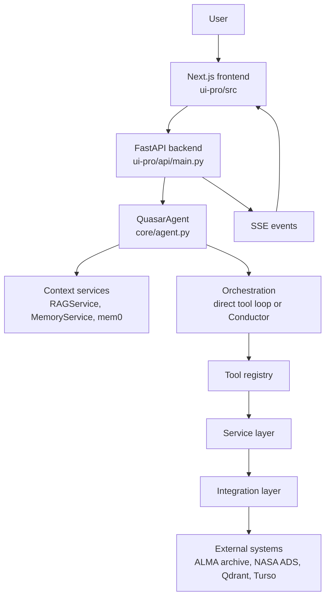
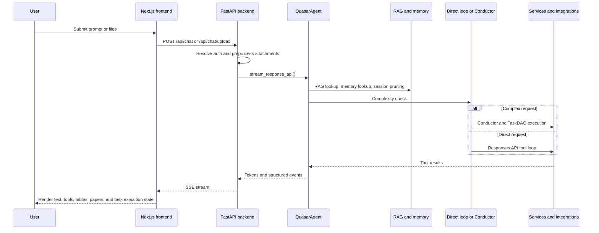

# Quasar System Documentation

## 1. Purpose and Scope

Quasar is a full stack research application built around ALMA archive workflows. The active runtime system combines a Next.js frontend, a FastAPI streaming backend, and a Python agent runtime that can search the archive, retrieve documentation and literature context, inspect remote FITS headers, and generate workflow guidance such as CASA scripts. The default backbone model is `gpt-4.1`.

This document describes the current implementation. It does not treat `ARCHITECTURE.md` as the source of truth. Where the repository contains older, parallel, or experimental paths, this file identifies the active runtime path and calls out important gaps.

## 2. Deployment Surfaces

| Surface | Location | Role |
|---|---|---|
| Public frontend | [quasarassistant.com](https://www.quasarassistant.com/) | User-facing web client |
| Local frontend | `ui-pro/src/` | Next.js application |
| Local backend | `ui-pro/api/main.py` | FastAPI API and SSE transport |
| CLI | `quasar.py` | Local interactive or one-shot execution |
| Tests and evaluation scripts | `tests/` | Verification, smoke tests, and evaluation helpers |

## 3. System Overview

At a high level:

1. The frontend submits chat requests to the FastAPI backend.
2. The backend loads or reuses `QuasarAgent`.
3. `QuasarAgent` performs context retrieval, complexity detection, and tool-enabled execution.
4. Services and integrations reach external systems such as ALMA, NASA ADS, Qdrant, and Turso.
5. The backend streams tokens, status updates, tool events, and task events back to the frontend over SSE.

## 4. Frontend Architecture

The primary frontend is the Next.js application under `ui-pro/src/`.

### 4.1 Primary frontend modules

| File or area | Role |
|---|---|
| `ui-pro/src/app/page.tsx` | Main page composition |
| `ui-pro/src/components/ChatArea.tsx` | Primary chat workflow, request dispatch, and response rendering |
| `ui-pro/src/components/TaskExecutionWidget.tsx` | UI for streamed multi-step task execution |
| `ui-pro/src/components/ChatMessage.tsx` | Message rendering |
| `ui-pro/src/lib/api.ts` | HTTP and SSE client transport |
| `ui-pro/src/lib/store.ts` | Zustand state store for messages, conversations, and task execution state |
| `ui-pro/src/lib/auth-store.ts` | Authentication state |

### 4.2 Frontend request flow

`ChatArea.tsx` is the operational center of the frontend. It:

- collects the prompt and attachments
- submits chat requests through `sendChatMessage()`
- submits proposal reviews through `reviewProposal()`
- appends streamed tokens to the last assistant message
- reacts to status, tool, data, paper, notebook, and task execution events

`ui-pro/src/lib/api.ts` parses SSE line by line and dispatches these event types:

- `token`
- `status`
- `tool_call`
- `data`
- `papers`
- `notebook`
- `task_group`
- `task_update`
- `task_list`
- `error`

`ui-pro/src/lib/store.ts` persists the client-side chat state. It also stores task groups, task items, and task checklists so that the UI can present a structured execution view when the backend uses the Conductor path.

### 4.3 Authentication and personalization in the frontend

The frontend supports bearer-token based requests for authenticated users. When a token is present, it is attached to the chat request so the backend can search personal RAG collections and expose personalization endpoints.

## 5. Backend API Architecture

The active backend is defined in `ui-pro/api/main.py`.

### 5.1 Backend responsibilities

The backend is responsible for:

- loading environment variables from the repository root
- setting up logging, CORS, and global exception handling
- lazy-loading `QuasarAgent`
- exposing SSE chat endpoints
- handling file uploads for chat requests
- exposing authentication-related and personalization-related endpoints
- exposing model listing and health endpoints

### 5.2 Active endpoints

| Endpoint | Method | Purpose |
|---|---|---|
| `/` | GET | Basic service status |
| `/api/models` | GET | Available model list for the frontend |
| `/api/chat` | POST | Primary SSE chat endpoint |
| `/api/chat/upload` | POST | Chat endpoint with attachment preprocessing |
| `/api/personalization/upload` | POST | Upload and index personal documents |
| `/api/personalization/documents` | GET | List personal documents |
| `/api/personalization/document/{doc_id}` | DELETE | Delete a personal document |
| `/api/proposals/review` | POST | Proposal review SSE endpoint |
| `/health` | GET | Health check |

There are also conversation endpoints in `ui-pro/api/main.py`, but they are currently placeholders and do not yet wire into `ConversationService`.

### 5.3 Chat transport

`/api/chat` is implemented as a streaming generator wrapped by `StreamingResponse`. The route:

- resolves the authenticated user when a bearer token is present
- optionally enriches the prompt with personal RAG context
- delegates the request to `QuasarAgent.stream_response_api()`
- streams the resulting events back to the frontend

`/api/chat/upload` preprocesses attachments before dispatching the request. Based on the code path:

- image uploads can take a direct vision-style route
- PDF uploads are converted to extracted text when possible
- FITS uploads are parsed for header metadata before the request is forwarded

## 6. Request Lifecycle

The main request lifecycle is:

1. The user submits a prompt or files in the Next.js UI.
2. The frontend calls `/api/chat` or `/api/chat/upload`.
3. The backend resolves authentication and optional personal context.
4. `QuasarAgent.stream_response_api()` performs session pruning, RAG lookup, optional mem0 lookup, and tool preparation.
5. The complexity detector decides whether to stay on the direct tool loop or move to the Conductor path.
6. Services and integrations execute archive, literature, retrieval, and analysis work.
7. The backend streams SSE events back to the frontend.

## 7. Orchestration Paths

### 7.1 QuasarAgent

`core/agent.py` is the central runtime module. It initializes:

- the OpenAI client
- `ConversationMemory`
- `ToolRegistry`
- domain services such as search, RAG, memory, plotting, Splatalogue, multi-archive matching, CASA generation, DataLink, and FITS processing
- `RecursiveLanguageModel`
- `Conductor`
- recovery and observability helpers
- `DocUpdater` for automated documentation maintenance

Additional core modules:

| Module | Role |
|---|---|
| `core/doc_updater.py` | Automated documentation updates (issue logging, feature status, architecture checks) |
| `core/dag_cache.py` | Caching layer for TaskDAG decompositions |
| `core/result_cache.py` | Caching layer for tool execution results |
| `core/token_budget.py` | Token budget tracking for context window management |
| `core/tool_budget.py` | Tool call budget management |
| `core/model_router.py` | Model selection and routing logic |
| `core/model_council.py` | Multi-model consensus for high-stakes decisions |
| `core/health_monitor.py` | Runtime health monitoring |
| `core/session_memory.py` | Per-session memory management |
| `core/workflow_memory.py` | Workflow pattern memory for the Conductor |
| `core/workflow_store.py` | Persistent workflow storage |
| `core/agent_pool.py` | Agent pooling for Conductor sub-agents |
| `core/context_manager.py` | Context window management and pruning |
| `core/llm_client.py` | Multi-provider LLM client abstraction |

It also:

- builds tool definitions for the OpenAI Responses API
- caches recent run state
- performs session pruning when the internal token estimate crosses the configured threshold
- routes complex requests into the Conductor path

### 7.2 Direct tool loop

The primary direct execution path is inside `QuasarAgent.stream_response_api()`.

This path:

- retrieves RAG context from `RAGService`
- retrieves optional long-term memory
- builds function tools from `ToolRegistry`
- calls the OpenAI Responses API
- dispatches tool calls back into local Python functions
- streams response text and structured events back to the API layer

### 7.3 RLM

`core/rlm.py` provides recursive reasoning support.

Important runtime facts from the code:

- `ComplexityDetector` uses a heuristic pass plus an LLM pass
- the complexity threshold is `0.55`
- `RecursiveLanguageModel.execute()` can use a REPL-backed route when context exceeds `80_000` characters
- the REPL executor lives in `core/rlm_environment.py`

In the current runtime, the complexity detector is used inside `QuasarAgent.stream_response_api()` to decide whether the request should remain on the direct tool loop or move into the Conductor path.

### 7.4 Conductor and TaskDAG

`core/conductor.py` and `core/task_dag.py` implement the multi-step orchestration path.

This path:

- decomposes a complex query into subtasks
- builds a dependency graph
- executes ready tasks in parallel batches
- emits structured task events:
  - `task_list`
  - `task_group`
  - `task_update`
- synthesizes a final answer after subtask completion

The current execution path uses `_conductor_tool_executor()` from `QuasarAgent`, which means the Conductor relies on the agent-level tool loop rather than a completely separate worker runtime.

### 7.5 Specialist sub-agent modules

The repository contains specialist agent classes under `agents/`, including archive, analysis, literature, synthesis, visualization, and web agents.

These modules are useful for understanding the intended direction of the orchestration layer, but they are not the primary runtime execution path for the current chat flow. The active Conductor implementation executes through the agent-level tool executor.

## 8. Service Layer

The service layer contains the main domain logic used by the runtime system.

| Service | Primary role |
|---|---|
| `services/search.py` | Archive search facade over ALMA integrations |
| `services/rag_service.py` | Shared and personal retrieval over technical documents |
| `services/memory_service.py` | Long-term vector memory |
| `services/plotting.py` | Publication-style plots |
| `services/splatalogue.py` | Spectral line identification |
| `services/multi_archive.py` | Cross-archive lookup |
| `services/casa_generator.py` | CASA imaging and calibration script generation |
| `services/fits_processing.py` | FITS metadata extraction and remote header reads |
| `services/fits_service.py` | Higher-level FITS analysis operations |
| `services/browser.py` | Browser and web search support |
| `services/proposal_critic.py` | Proposal review workflow |
| `services/auth.py` | Local and Google-based authentication |
| `services/conversation_service.py` | Conversation persistence service |
| `services/gcn_monitor.py` | GCN transient alert monitoring |
| `services/notebook_gen.py` | Jupyter Notebook generation for reproducibility |
| `services/code_generator.py` | General code generation service |
| `services/visualization_service.py` | Advanced visualization and chart generation |
| `services/pdf_processing.py` | PDF text extraction for uploads |
| `services/ads_service.py` | ADS search facade (higher-level than `ads_client`) |
| `services/paper_search.py` | Literature search coordination |
| `services/user_tools_service.py` | User-defined custom tools |
| `services/alminer_query_service.py` | ALminer query orchestration |

### 8.1 Search and retrieval services

`SearchService` is the archive search facade used by the agent tools. It delegates target, position, frequency, and keyword searches to the ALMA integration layer.

`RAGService` is used for both shared documentation retrieval and per-user personal retrieval. It supports collections for shared ALMA documentation, proposal rubrics, and user-specific personal content.

`MemoryService` stores long-term user facts in a vector store for later reuse.

### 8.2 File and analysis services

`FITSProcessingService` supports:

- local FITS metadata extraction
- remote FITS header reads from URLs
- extraction of beam, RMS, rest-frequency, and image-size metadata

`CASAScriptGenerator` builds imaging and calibration scripts based on provided parameters.

`PlottingService` produces image files for frontend display and export.

### 8.3 Auth and persistence services

`AuthService` handles:

- local user registration and login
- PBKDF2 password hashing
- JWT generation and verification
- Google-login account creation or reuse

`ConversationService` provides a persistence layer for chat conversations and messages. However, the current API conversation endpoints are not fully integrated with this service.

## 9. Integration Layer

The integration layer is where Quasar connects to external systems.

| Integration | Primary role |
|---|---|
| `integrations/alminer_client.py` | ALMA archive search, including target resolution and parallel search logic |
| `integrations/datalink.py` | ALMA DataLink file enumeration and direct file access |
| `integrations/ads_client.py` | NASA ADS search and literature access |
| `integrations/tap.py` | TAP/VO protocol client for NRAO archives (VLA/VLBA/GBT) |
| `integrations/mast_client.py` | MAST archive client for HST/JWST/Kepler data |
| `integrations/eso_tap_client.py` | ESO archive TAP client |
| `integrations/irsa_client.py` | IRSA (NASA) archive client |
| `integrations/skyview_client.py` | SkyView multi-wavelength image service |
| `integrations/casa.py` | CASA integration helpers (disabled by default) |
| `integrations/carta.py` | CARTA integration helpers (disabled by default) |

### 9.1 ALMA archive path

The ALMA archive path is centered on `ALminerClient` and `DataLinkClient`.

Key runtime behaviors:

- target searches resolve names and can use parallel search strategies
- DataLink is used to enumerate file-level products
- FITS header inspection operates on direct access URLs without requiring full file download

### 9.2 Literature path

The main runtime literature integration imported by `QuasarAgent` is `ADSService` from `integrations/ads_client.py`.

There are other ADS-related files in the repository, but the active agent import path is the one in `integrations/ads_client.py`.

## 10. Persistence and Vector Storage

### 10.1 SQL storage

`services/db.py` provides a shared database abstraction:

- Turso when `TURSO_DATABASE_URL` and `TURSO_AUTH_TOKEN` are set
- local SQLite otherwise

Current SQL-backed concerns include:

- user authentication data
- personalization document metadata

Conversation persistence infrastructure exists in `services/conversation_service.py`, but the active API conversation routes are still placeholders.

### 10.2 Vector storage

`services/vector_db.py` provides the vector database abstraction:

- Qdrant Cloud when `QDRANT_URL` and `QDRANT_API_KEY` are set
- in-memory Qdrant fallback otherwise

Relevant collections from the runtime code:

- `alma_general`
- `proposal_rubrics`
- `user_{id}_personal`
- `user_memory`

### 10.3 Filesystem paths

The codebase also uses local directories for runtime artifacts such as:

- `downloads/`
- `user_uploads/`
- `data/`

## 11. Authentication and Personalization

Authentication is implemented through `services/auth.py` and exposed through the frontend auth flow and backend bearer-token handling.

Current behavior:

- local users are stored with PBKDF2 password hashes
- JWTs are used for session identity
- Google-login users can be registered or reused
- authenticated chat requests can search personal vector collections
- personalization uploads are indexed into user-specific RAG collections

The API layer stores document metadata in SQL and indexes document content into the vector database.

## 12. Operational Constraints and Known Gaps

The following points are important for operating or extending the current system:

- `ARCHITECTURE.md` should not be treated as the current source of truth.
- The active user-facing runtime is the Next.js frontend plus FastAPI backend under `ui-pro/`.
- The backend import path is `api.main:app` from the `ui-pro` directory. If started from the repository root, `uvicorn --app-dir ui-pro api.main:app --reload --port 8000` should be used.
- The default LLM model is `gpt-4.1` (configured via `DEFAULT_LLM_MODEL` in `.env`).
- CASA and CARTA integrations are **disabled by default** (`ENABLE_CASA_PIPELINE=false`, `ENABLE_CARTA_INTEGRATION=false`) due to high RAM requirements.
- Conversation endpoints in `ui-pro/api/main.py` are placeholders and are not yet wired into `ConversationService`.
- The repository includes specialist agent modules under `agents/`, but the main Conductor runtime still executes through the agent-level tool executor.
- Qdrant falls back to in-memory mode when cloud credentials are absent, so local vector persistence can be non-persistent.
- SQL storage falls back to local SQLite when Turso is not configured.
- `JWT_SECRET` should be explicitly set in `.env` for deployed environments.
- The codebase includes broader astronomy modules, but the primary supported workflow is still ALMA-first.
- CI runs via GitHub Actions (`.github/workflows/ci.yml`) on pushes to `main`/`beta` and all PRs.

## 13. Summary

The active Quasar system is a streaming web application centered on a Next.js frontend, a FastAPI SSE backend, and the `QuasarAgent` runtime powered by `gpt-4.1`. Its strongest implemented path is ALMA archive search and follow-on workflow support, enriched by documentation retrieval, literature search, DataLink file inspection, multi-archive cross-matching (MAST, ESO, IRSA, SkyView), and multi-step orchestration via the Conductor. Experimental modules and older architecture notes exist in the repository, but the current runtime path is defined by the code described in this document.

*Last updated: 2026-04-21*
