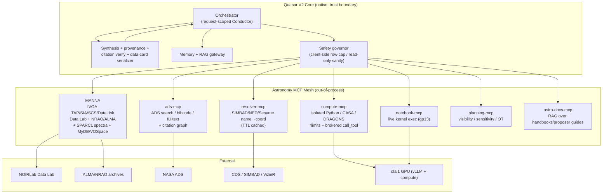
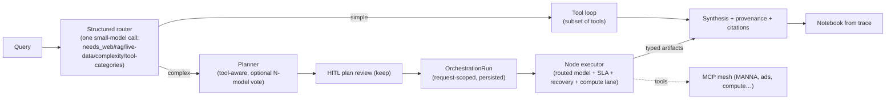
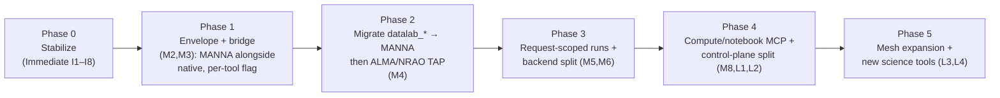

# Quasar V2.0 — Architecture & Development Roadmap

**Status:** Draft technical design document
**Date:** 2026-07-08
**Author:** Prepared for Adam Zacharia Anil (Quasar maintainer)
**Backing evidence:** Whole-repo subsystem analysis (10 code readers over `Quasar-main/`, saved to `France/.research/data/400–409`), the PAI26 Quasar paper, the STABLE/MANNA one-pager + poster, and the 281-file Astro Data Lab knowledge base (`France/.research/`).

> **Reading note.** This document is deliberately blunt about V1's real state, because the redesign only makes sense against ground truth. V1 is a genuinely impressive solo/small-team system with several ideas worth preserving verbatim. The criticisms below are the input to V2, not a verdict on V1.

---

## 0. Executive Summary

Quasar V1 proved the thesis of the PAI26 paper: **domain engineering + externalized planning turns a general LLM into a capable archive assistant.** The DAG Conductor, two-stage complexity gate, sandboxed compute, and literature integration are real and differentiating.

But the codebase has drifted far from its own documentation, and three structural facts now dominate any V2 decision:

1. **The monolith is the bottleneck.** `core/agent.py` is a **12,714-line god object** registering **142 tools** inline (README says "75+", paper says "35+"). Adding capability means inserting at "4 anchors in a ~10,850-line file" (its own CONVENTIONS.md). This is unsustainable and is the root cause of most tech debt below.

2. **Several flagship features are partially or wholly non-functional in production** — not by design, but by drift: the specialist sub-agent layer (`agents/`) is imported nowhere; the long-term/preference **memory stack is dead** (4 implementations, ~0 live call sites); **notebook reproducibility is fabricated** (generated then discarded; code cells are keyword-templated fiction); the **RAG retrieval gate has a score-scale bug** likely suppressing shared-doc context, and its advertised hybrid BM25 rerank silently no-ops (`rank_bm25` isn't installed); the **recovery path bypasses** the routing/sandbox/SLA architecture; and the **MCP client bridge is broken** (cross-event-loop `anyio` misuse).

3. **The security posture blocks multi-user scale.** `exec()`-based user tools and the `/api/mcp-servers` stdio spawner are **arbitrary code/command execution in the shared server process**; `'1@1'` is a compiled-in admin; JWTs live in `localStorage`; CORS wildcards `*.vercel.app`/`*.onrender.com` with credentials; several endpoints (traces, proposal upload) are unauthenticated; and multiple tools **fabricate scientific data** on failure (mock UV coverage, invented ADS papers with fake bibcodes).

**The V2 thesis:** keep Quasar's orchestration/synthesis brain, delete or isolate everything that executes untrusted work in-process, and **make MCP the primary tool transport** — with **MANNA as the first and canonical archive server**. Quasar already ships 80% of the MCP plumbing (`services/mcp_server_service.py` + `/api/mcp-servers` + a registry that maps `mcp_tool.inputSchema`); V2 promotes it from an optional user add-on to the backbone, and rebuilds the one broken piece (the async bridge).

This converts the two worst liabilities (the monolith and the in-process code execution) into the cleanest extension point (out-of-process, independently-deployable, independently-tested MCP servers), and directly delivers the paper's stated future work (open-weight local models via MANNA's dlai1/vLLM plan; NRAO/MAST/Data Lab expansion).

**Headline recommendation table (detail in §10):**

| Horizon | Theme | Top 3 moves |
|---|---|---|
| **Immediate (0–6 wk)** | Stop the bleeding | Fix RAG score-scale bug; delete/quarantine fabrication paths + `exec()` user tools; fix the recovery-path bypass |
| **Medium (1–3 mo)** | De-monolith + MCP-first | Split `agent.py` into tool packages; rebuild the MCP bridge; adopt MANNA for `datalab_*` + ALMA/TAP; request-scoped orchestration |
| **Long (3–9 mo)** | Scale-out | Agent-worker/queue split; durable jobs+runs; the astronomy MCP mesh; local-LLM (dlai1) tier; reproducibility-from-traces |

---

## 1. Current-State Assessment (what stays / improves / is redesigned)

| Subsystem | Verdict | Rationale (evidence in `.research/data/`) |
|---|---|---|
| **`core/task_dag.py`** (DAG structure, Kahn cycle detection, adaptive SLAs) | **KEEP** | Clean, dependency-free, correct. The one component to carry forward nearly as-is. (401, 406) |
| **Two-stage complexity gate** (`core/complexity.py`) + tiered subtask budgets | **KEEP concept, retune** | Right cost shape (free regex → cheap LLM probe only in the 0.2–0.8 band). Keyword lists are brittle. (401, 406) |
| **Conductor** (`core/conductor.py`) | **REDESIGN** | Shared mutable singleton → concurrent complex queries corrupt each other's DAG/memory; 300s abandonment double-answers; planner blind to 89% of tools. Make it **request-scoped**. (401, 406) |
| **Specialist sub-agents** (`agents/`) | **REDESIGN (currently dead)** | Imported nowhere; `BaseSubAgent` is broken. Reimplement as **declarative tool-scope+prompt+model+SLA bundles**, not classes. (406) |
| **RecoveryEngine** (`core/recovery.py`) | **IMPROVE (high-priority fix)** | Escalation ladder is good, but it **bypasses routing/sandbox/context** and enforces **no SLA**; treats "0 results" (a valid answer) as failure. (401, 406) |
| **Sandbox** (`core/sandbox.py`) | **REDESIGN** | RLM-style design is forward-looking but it's **in-process `exec()` with a regex denylist** — not a security boundary, and **unreachable in the production path**. Move to isolated worker + broker. (401) |
| **Tool registry** (`core/tools.py`) | **KEEP shape, extend** | Right seam to federate MCP tools behind. Add namespacing + validation. (401) |
| **Data Lab stack** (`services/datalab_sql_policy.py` + `datalab_query_builders.py` + `datalab_registry.py`) | **KEEP (port into MANNA)** | Best-designed code in the repo: builder/governor/registry triad, hand-verified against the live service. The template for guarding all archive access. (402) |
| **Integrations** (`integrations/*`) | **REDESIGN → protocol engines** | ~5 near-duplicate IVOA-TAP clients; `print()` logging; per-process caches; **fabricated-data fallbacks**. Collapse to one TAP engine + shared transport core. `datalab_client.py`/`datalab_sia_client.py` are the quality templates. (403) |
| **RAG pipeline** (`services/rag_service.py`, `vector_db.py`) | **IMPROVE (fix bugs) + expand** | `vector_db.py` abstraction is right-sized; version-aware retrieval is a differentiator. But **score-scale gate bug**, missing `rank_bm25`, non-idempotent ingestion, corpus pollution. (404) |
| **Memory** (4 implementations) | **REDESIGN → 1 service** | `SessionMemory`/`ContextManager`/`MemoryService`/`mem0` all effectively **dead**. Collapse to one memory contract. (401, 404) |
| **FastAPI backend** (`ui-pro/api/main.py`, 4,368 lines) | **REDESIGN (split)** | Monolith mixing routing + SSE state machine + UI shaping; single-process state dicts; TOCTOU quota; `commit()` is a no-op (no transactions). Extract routers + services + durable state. (400) |
| **BYOK + Fernet key storage + SSE event vocabulary** | **KEEP** | Careful isolation model; rich proven frontend contract. Version the SSE schema; don't redesign it. (400, 405) |
| **Frontend** (`ui-pro/src`, Next.js) | **IMPROVE** | Rich domain render layer (Aladin, FITS workbench, sky maps). Fix `${}` template bug, `localStorage` JWT, polling→events, virtualize tables, message-parts architecture. (405) |
| **Notebook reproducibility** | **REDESIGN (currently fiction)** | Generated then discarded; code cells fabricated from keyword matches. Rebuild from **execution traces**. (406) |
| **DataLabBench** (`Benchmark/datalabbench/`) | **KEEP + generalize** | Evidence-grounded checkpoints, anti-gaming rules, fabrication penalty — genuinely rigorous. Make it the one scoring architecture; run the full matrix through the harness (headline numbers currently only exist in hand-written `tmp/*.md`). (407) |
| **`ALMA_MCP/`** (standalone FastMCP) | **ABSORB into MANNA** | Working proof that ALMA lives behind MCP; 16-intent taxonomy is reusable, but internals have unit bugs (Hz/GHz, `public_only` no-op, ADQL injection). (409) |
| **`CONVENTIONS.md` / `PROGRESS.md` discipline** | **KEEP (codify as code)** | `{success, warnings, provenance}` return contract, never-raise services, waiver log — proven V2-ready process. Turn the prose contract into a base class. (408) |
| **`config/settings.py`** | **REDESIGN** | Dead (imported by nothing); real config is ~170 ad-hoc `os.getenv` calls. Replace with one typed pydantic-settings schema. (408) |

---

## 2. Q1 — Which existing tools should be upgraded?

The registry has **142 tools**; the problems cluster, so upgrades are described by family, not per-tool.

**A. Kill fabrication paths (correctness-critical, do first).**
- `analyze_uv_coverage` returns hardcoded `mock_results` (16 km baselines, 50 antennas) when CASA is absent → must return an explicit "CASA not installed" error.
- ADS tools (`ads_service._get_example_papers`) return **invented papers with fake bibcodes/DOIs** on missing key *or* any live-search exception → must become typed errors.
- `search.py` swallows every exception and returns an empty DataFrame with a `print()` → the agent cannot distinguish "archive down" from "no data exists," which **corrupts scientific conclusions**. Replace with a typed `{success, rows, warnings, error, degraded, provenance}` envelope.

**B. Replace "LAST results" hidden state with explicit result handles.**
15+ tools (`filter_results`, `check_co_lines`, `check_line_coverage`, `get_mast_products`, `download_mast_data`, `plot_alma_results`, `plot_sky_map`) operate on `self.last_search_results`, a **thread-local**. Conductor subtasks run on different threads, so cross-node data passing "works by thread-identity luck." The `datalab_*` family already uses the correct pattern (`result_id` handles into a `DatalabResultStore`) — **generalize it registry-wide.** This is also the prerequisite for MCP migration (MCP servers are stateless).

**C. Consolidate duplicated tool logic.**
- **One IVOA-TAP engine.** `tap.py` (NRAO), `alminer_client.py` (ALMA), `eso_tap_client.py`, the CADC path (inline in `agent.py`), and `datalab_client.py` are ~5 near-duplicate TAP clients. Collapse to a single timeout-injected, retrying pyvo engine parameterized by endpoint + ObsCore dialect.
- **One ADS client.** `ads_service`, `paper_search.NASAADSClient`, and `citation_verifier`'s lookups are three ADS clients — unify behind one cached client.
- **One plotting service.** `PlottingService`, `visualization_service`, `datalab_analysis`, `sed_plotter`, `radio_sed` all re-implement matplotlib plumbing.
- **One SIMBAD resolver** with a TTL cache (today `lru_cache` caches `None` forever → a transient SIMBAD outage permanently poisons a target until restart).

**D. Fix the ALminer thread-race.** `alminer_client.py` races a direct TAP query against `alminer`; the loser daemon thread keeps hammering the archive, and the winner is non-deterministic so **column sets differ run-to-run.** Replace with primary + explicit fallback + cancellation.

**E. Parameterize ADQL construction.** `_sanitize_adql` is a blacklist (`;`, `--`); `ESOTAPClient` interpolates raw strings; `ALMA_MCP` f-strings everything (a target like `Barnard's Star` breaks the query). Introduce one identifier/literal-quoting builder used by every TAP caller. Apply the **`datalab_sql_policy` governor pattern** (SELECT-only, row caps, q3c execution rules) to `vo_registry.tap_query` and `advanced_search` too.

**F. Retire aspirational stubs.** `carta.py` (returns manual click-through instructions), `casa.py`'s "simulated" calibration paths, `search.check_line_coverage` (a `pass` stub full of design notes), `data_processor.fetch_source_data` (canned data). Either implement or delete — shipped fiction is worse than an honest gap.

**G. Downgrade the two worst tools to out-of-process.** `user_tools` (`exec()` of user Python with full `__builtins__`+`os`) and the `/api/mcp-servers` stdio spawner (persists `{command:'bash',args:['-c',...]}` and runs it) are **RCE by design**. See §3/§6 — both are superseded by the MCP-server model.

---

## 3. Q2 — What entirely new tools should be built?

Organized by research-workflow stage. Items marked **[MCP]** should be built as MCP tools/servers (§5), not native.

| Stage | New capability | Notes |
|---|---|---|
| **Literature discovery** | **Semantic literature search** [MCP] over ADS/arXiv/OpenAlex with embeddings (à la Pathfinder over 350k ADS papers); **citation-graph traversal** (who cites/extends a result); **"papers that used this archive dataset"** linking observations↔publications (V1's `ObservationPaperGraph` is a UI-only substring matcher — make it a real service via ADS `data:` links + DOI bibcodes) | ADS has no official MCP → build `ads-mcp` (§5) |
| **Proposal writing** | **Proposal drafting assistant** (target list → feasibility → sensitivity/time estimates → boilerplate); **duplication check** against the archive ("has this been observed?"); **ALMA OT / sensitivity calculator** wrapper. V1 has `proposal_critic` (critique only) — add generation | High scientific value; ties RAG (proposer's guide) + archive + calculators |
| **Observation planning** | **Visibility / airmass / LST planner**; **moon/Sun separation, altitude windows**; **multi-facility schedulability** (is this observable from ALMA *and* VLA this semester?); **finder-chart generation** (partly exists via hips2fits) | astroplan-backed; a clean new MCP server |
| **Archive exploration** | **Cross-archive federated search** [MCP] (one query fans out to ALMA/NRAO/Data Lab/MAST/ESO/CADC and merges) — V1's `MultiArchiveMatcher` is the seed; **coverage/overlap maps** (MOC-based; `moc_coverage` exists); **time-domain / alert** hooks (ANTARES, GCN — `gcn_monitor` exists) | The core MANNA value proposition |
| **Data reduction** | **Real CASA pipeline execution** in an isolated worker (V1 only *generates* scripts and *fabricates* results); **DRAGONS/Gemini reduction** (Data Lab hosts these kernels); **cube→moment/PV** (exists in workbench — expose as a tool) | Needs the compute-worker tier (§9); heavy, long-running |
| **Visualization** | **Server-side interactive cube/spectral viewer** (CARTA control is stubbed); **publication-quality figure generator** from a declarative spec; **SED builder** across archives | Move base64-PNG-in-tool-result → artifact URIs |
| **Statistical analysis** | **Sandboxed stats/fitting toolkit** (curve_fit, MCMC/emcee, survival stats for upper limits) exposed through the isolated compute lane; **cross-matching at scale** via Q3C/server-side (Data Lab `x1p5__` tables) | Reuse Data Lab crossmatch primitives from the KB |
| **Simulation** | **Forward-model / mock-observation tools** (CASA `simobserve`, radiative-transfer wrappers) — new frontier, MCP server | Long-horizon |
| **Reproducibility** | **Trace→notebook** (rebuild the notebook generator on real execution traces); **environment capture** (pin package versions per run); **one-click re-run** of a saved run | Fixes a currently-false claim |
| **Collaboration** | **Shareable runs / workspaces** (a run becomes a URL with its DAG, artifacts, and notebook); **VOSpace/MyDB write-through** (save results to the user's Data Lab storage — the KB verified this works); **team RAG collections** | Ties to the durable-runs redesign (§9) |
| **Publication** | **Methods-section drafting from the run trace** (`lit_to_code` exists in reverse — do code→methods); **auto-acknowledgements** (Data Lab/ALMA/facility citation strings — captured in the KB); **data-availability statement generator** | Cheap, high-goodwill |

---

## 4. Q3 — MCP servers vs native tools

**Recommendation: MCP-first for anything that talks to an external archive/service or executes untrusted/heavy work; native only for in-process, latency-critical, or UI-coupled concerns.**

| Dimension | Native (in-process) tools | MCP servers | V2 implication |
|---|---|---|---|
| **Scalability** | Bounded by the one API process (V1: `ThreadPoolExecutor(2)`, 2 GB Render instance, per-request `gc.collect()`). Every tool competes for the same CPU/RAM. | Each server scales independently; heavy servers (CASA, cube) get their own hosts/GPU. | **MCP** for archives + compute |
| **Maintainability** | Adding a tool = edit the 12.7k-line god object at "4 anchors." | Each server is a small repo with its own tests/CI/release. | **MCP** — this is the single biggest win |
| **Security** | `exec()` user tools + stdio spawner = RCE in the shared process. | Out-of-process isolation; own credentials; OAuth 2.1 for remote. | **MCP** eliminates the two worst liabilities |
| **Modularity** | Tool families entangled via shared thread-local state. | Clean protocol boundary (tools/resources/prompts). | **MCP** forces the boundary V2 needs |
| **Latency** | In-process call, no network hop. | Adds a hop (+serialization); worse for chatty/sub-second tools. | **Native** for hips2fits thumbnails, deep-link builders, data-card shaping |
| **Deployment complexity** | One artifact to deploy. | N servers to host, monitor, keep-alive, version. | Mitigate with **one process mounting MANNA over streamable HTTP** (not per-user stdio subprocesses) |
| **Future extensibility** | New capability requires core changes + redeploy of the whole app. | Drop in a new server; the planner discovers tools from `list_tools`. | **MCP** — plus the ecosystem (astro_mcp, ADS-MCP…) becomes reusable |
| **Reproducibility** | Notebook fabricated from task descriptions. | Server returns the exact executed query/endpoint per call → honest snippets. | **MCP** makes reproducibility truthful |

**What must stay native regardless:** auth/JWT, conversation storage, usage quotas + BYOK keys, provider-file plumbing, content-safety/evidence-quality/citation-verifier/provenance (these must run on Quasar's trust boundary), the SSE/data-card presentation layer, and client-side CDS calls (Aladin, hips2fits cutouts — putting sky cutouts behind MCP would add latency and break client-side zoom/survey-switch).

**The migration risks that MCP introduces (and their fixes):**
1. **Result-shape coupling.** Native tools pass live pandas DataFrames; MCP returns JSON content blocks. → Define **one canonical `ToolResult` envelope** (`records + columns + dtypes + provenance + pagination cursor + reproducible_snippet`) that both native and MCP tools emit; a serialization layer reconstructs data cards.
2. **Hidden cross-tool state.** "LAST results" thread-locals don't cross a stateless server. → Result-handle pattern; **MANNA owns the result store** and exposes `get_rows/to_csv/stats` follow-ups.
3. **Auth passthrough.** Per-user Data Lab/ADS tokens currently go through `os.environ` (cross-user leak risk). → Scope credentials **per MCP session** via server initialization options / OAuth, never process-global env.
4. **Planner/routing name coupling.** Prompts hardcode tool names; MCP namespacing renames them (`manna__cone_search`). → Generate the planner's tool section from live `list_tools` metadata; derive routing/recovery hints from **tool annotations**.
5. **SLAs.** DAG SLAs were tuned for in-process HTTP; MCP adds a hop and async Data Lab jobs exceed them. → SLAs become **per-tool metadata** supplied by the server.

---

## 5. Q4/Q5 — The astronomy MCP ecosystem: integrate vs build

### 5a. Existing servers to evaluate for immediate integration

> Verify current capability/maturity before committing; the assessments below combine the Quasar paper's related-work, the `astro_mcp` search hit, and known infra servers. Treat maturity claims as "check before adopting."

| Server | Capabilities | How Quasar uses it | Replace or complement | Limitations / risk |
|---|---|---|---|---|
| **`SandyYuan/astro_mcp`** (github.com/SandyYuan/astro_mcp) | Unified NL access to DESI/SDSS/DES survey data | Reference design + possible complement for optical/spectroscopic surveys Quasar doesn't cover | **Complement** (adds surveys); study its tool ergonomics | Solo research project; scope/maintenance unknown — verify |
| **MANNA** (STABLE/NRAO, FastMCP, IVOA TAP/SIA/SCS; Data Lab + NRAO/ALMA) | The archive layer Quasar needs; async jobs; per-archive quirks KB; dlai1 vLLM plan | **Primary archive transport** (see §5b) | **Replace** `datalab_*`, ALMA/NRAO TAP, SIA | Same team → direct collaboration; still maturing |
| **StarAI / CADC-CANFAR** (Damian+2025, MCP-based) | CADC archive + CANFAR platform via MCP; RAG over proposals; astroquery ADQL | Complement for CADC/JWST/HST/JCMT/Gemini (Quasar's `search_cadc_archive`) | **Complement** (or replace the CADC path) | Availability as a consumable server unclear — verify |
| **Jupyter MCP** (e.g. `jupyter-mcp-server`) | Drive a live notebook kernel (run cells, read outputs) | Powers real reproducibility + the compute lane on gp13 | **Replace** the fabricated notebook generator's execution | Kernel lifecycle/isolation per user |
| **Code-sandbox MCP** (e2b, Pyodide, or container-based) | Isolated Python execution with resource limits | Replaces the in-process `exec()` sandbox and `user_tools` RCE | **Replace** `core/sandbox.py` execution + `user_tools` | e2b is commercial (cost); self-host for on-prem/dlai1 |
| **Search MCPs** (Brave / Tavily / Exa official) | Web search with citations | Replaces the 1,142-line `web_search_service.py` router | **Replace** | Must preserve `sanitize_web_payload`/evidence-quality ranking on Quasar's side |
| **Vector-DB MCP** (Qdrant / Chroma official) | Vector store as a service | Optional backing for RAG/memory if externalized | **Complement** (Quasar's `vector_db.py` is already a clean seam) | Adds a hop to hot retrieval path |
| **OpenAlex / Semantic-Scholar MCP** | Scholarly metadata, citation graphs | Complements ADS for non-astro / open citations | **Complement** `openalex_client` | Coverage gaps vs ADS for astronomy |
| **Wolfram Alpha MCP** | Symbolic math, unit conversions, constants | Offloads deterministic math the LLM shouldn't do | **Complement** the sandbox | External dependency/cost |
| **Filesystem / Git / GitHub MCP** (official) | Repo + file ops | Dev-side + user "analyze my repo" flows | **Complement** | Scope tightly for multi-user |

**No mature official MCP exists for: NASA ADS, ALMA/NRAO archives, SIMBAD/VizieR/NED, MAST, SkyView.** These are **build** targets (§5b).

### 5b. The proposed Quasar/astronomy MCP mesh (build)

Design principle from the analysis: **MANNA serves protocol-grade primitives; Quasar keeps the semantic layer.** Each server is small, independently deployed, streamable-HTTP, OAuth-capable, and emits the canonical `ToolResult` envelope with a `reproducible_snippet`.



| Server | Purpose | Key tools (API surface) | Responsibilities |
|---|---|---|---|
| **MANNA** | Canonical archive access | `tap_query`, `sia_search`, `scs_cone`, `datalink_list`, `sparcl_find/retrieve`, `resolve_name` (or delegate), `job_submit/status/results/cancel`, `mydb_*`, `vospace_*`, `get_rows/to_csv/stats` on a result handle | Owns query execution, **server-side SQL policy** (port `datalab_sql_policy`), the result store, async jobs, per-archive quirks KB, per-session Data Lab token auth |
| **ads-mcp** | Literature | `search`, `get_bibcode`, `fulltext`, `citations`, `references`, `export_bibtex` | ADS key handling, caching, citation-graph traversal |
| **resolver-mcp** | Name resolution | `resolve(name) → {ra,dec,otype,…}` | SIMBAD→NED→Sesame fallback, TTL cache (fixes V1's permanent-`None` bug) |
| **compute-mcp** | Isolated compute | `run_python(code, inputs)`, `run_casa(script)`, `call_tool(name,args)` broker | Container/subprocess with CPU/mem/wall rlimits; **the real sandbox**; brokers back to the mesh |
| **notebook-mcp** | Live notebooks | `create_kernel`, `run_cell`, `read_outputs` | Drives gp13 kernels; the honest reproducibility engine |
| **planning-mcp** | Observation planning | `visibility`, `sensitivity`, `duplication_check` | astroplan/OT wrappers |
| **astro-docs-mcp** | Documentation RAG | `search_documentation(filters)`, `get_chunk` | Serves the ALMA handbook/proposer-guide corpus MANNA doesn't cover |

**Deployment:** for `quasarassistant.com`, mount each server **once per process over streamable HTTP** with shared rate limiting — **not** per-user stdio subprocesses (V1's registry spawns one server per user per agent, an unbounded process/keep-alive problem). Keep stdio for local dev / Claude Desktop distribution.

---

## 6. Q6 — Agent architecture changes

The orchestration brain is worth keeping; the plumbing around it needs surgery.

1. **Make orchestration request-scoped and serializable.** Replace the shared-singleton Conductor with an `OrchestrationRun` object (DAG + WorkflowMemory + images + trace-id + budget + event emitter) created per query and **persisted** (SQLite/Redis) so runs survive restarts, support resume/audit, and enable horizontal scaling. This fixes the concurrent-query corruption and the 300s double-answer.

2. **Fix the recovery-path bypass (highest-impact single fix).** Today `RecoveryEngine` calls a bare `run_in_executor` lambda, skipping model routing, the sandbox, dep-context, and SLA enforcement. Route recovery through the **full node executor** wrapped in `asyncio.wait_for(node.sla_seconds)`. One change restores per-node timeouts, correct model selection, and compute routing in the production path.

3. **Typed task IO instead of prompt-string context injection.** Each node declares `produces`/`consumes` (e.g. `observations_table`, `result_id`, `image_ref`); dependencies pass **typed handles**, not char-truncated strings (V1 truncates dep-context to 2000 chars/entry, silently corrupting mid-JSON). Synthesis receives structured artifacts. This also eliminates the thread-local "LAST results" fragility.

4. **Planner tool-awareness from live metadata.** Generate the DAG decomposition prompt's tool section from the live registry/`list_tools` (grouped by category, per-tier truncated) instead of a hand-written whitelist that covers **~15 of 142 tools**. Feed the complexity probe's `suggested_subtasks` in as a seed plan to skip one LLM call.

5. **Intent-based tool subsetting.** Stop sending all 142 schemas every round (thousands of tokens/round). Classify the query into 2–3 tool categories, send only those + a `search_tools` escape hatch. Improves both cost and tool-selection accuracy (a live-test failure mode was wrong-tool selection).

6. **Multi-LLM consensus planning (the paper's own future work).** The Conductor plan is a single LLM generation → single point of failure (paper §Limitations). `core/model_council.py` exists but is dead — wire an N-model plan vote for the decomposition step only (expensive, so gate on complexity tier).

7. **Recovery that understands "empty is often the answer."** `_is_empty_result` treats 0 rows as failure → "are there ALMA observations of X?" (answer: no) triggers a REPLAN that rewrites the task. Gate REPLAN on a judgment of whether zero results is scientifically meaningful.

8. **Real isolation for all untrusted compute.** Move the sandbox and any user-supplied code to `compute-mcp` (container/subprocess, rlimits, brokered `call_tool`). Delete `exec()`-based `user_tools`; replace with "bring your own MCP server."

9. **Collapse the two intent systems.** Delete the legacy `process_query`/`determine_intent` CLI path; route the CLI through the same streaming runner.

10. **Health-aware model fallback.** `HealthMonitor` + `FALLBACK_MODELS` exist but `record_success/failure` are never called, so fallback can't trigger. Wire them into the LLM retry path.



---

## 7. Q7 — RAG pipeline expansion

**First, fix what's broken** (these gate any expansion — see §10 Immediate):
- **Score-scale gate bug:** the `_rag_doc_score >= 0.15` filter reads a metadata `_score` that after RRF rerank is bounded at ~0.017 → **legitimate docs are dropped** whenever rerank fires. Normalize scoring to one scale end-to-end.
- **`rank_bm25` not in `requirements.txt`** → the advertised hybrid search silently degrades to semantic+recency. Install it or drop the claim.
- **Non-idempotent ingestion** (fresh `uuid4` per run → duplicate chunks; the only "fix" wipes the corpus) → deterministic content-hash chunk IDs + a corpus manifest.
- **Corpus pollution** (`RLM.pdf`, `mem0.pdf` — AI papers — ingested as ALMA docs and citable as "ALMA Technical Handbook") → category guards.
- **Make retrieval a model-callable tool** (`search_documentation` with year/category filters) instead of ~150 lines of regex-gated prompt pre-injection; this also hardens the prompt-injection surface (uploaded PDFs currently enter the prompt verbatim).

**Then expand** the retrievable surface (much of it via `astro-docs-mcp` + structured tools rather than more vector stuffing):

| New resource | Form | Value |
|---|---|---|
| **Structured catalogs & archive schemas** | Live schema discovery tools (Data Lab `qc.schema`/TAP_SCHEMA — captured in the KB) + cached schema cards | The model writes correct ADQL because it *retrieves* the schema, not guesses it |
| **Facility docs** (VLA/VLBA/GBT/NRAO, JWST/HST via MAST, Gemini/DRAGONS) | Per-facility doc collections | Multi-wavelength expansion (paper's goal) |
| **Literature as a knowledge graph** | ADS citation graph + `data:` links | "Papers using this dataset"; provenance |
| **Observatory status / proposal calls / cycle deadlines** | Time-sensitive structured feeds | Planning tools |
| **Line lists / molecular databases** | Splatalogue (exists) + CDMS/JPL | Spectral-line science |
| **The Data Lab dataset registry** | The 281-file KB → a queryable "which archive/table has X" index | Federated routing |
| **User/team knowledge** | Per-team RAG collections (fix the per-user-collection scaling: one shared collection with payload filters, not one Qdrant collection per user) | Collaboration |

---

## 8. Q8 — Missing capabilities researchers would expect

Grouped by how absent they are.

**Absent entirely:**
- **Reliable reproducibility** — the notebook is fabricated; there's no environment capture and no re-run.
- **Persistent projects/workspaces** — every conversation is ephemeral; no saved run, no shared workspace, no "resume yesterday's analysis."
- **Real data reduction** — CASA/DRAGONS scripts are generated but not executed (and failures fabricate results).
- **Observation planning** — no visibility/sensitivity/duplication tooling.
- **Working long-term memory** — 4 dead implementations; the assistant doesn't actually learn a user's targets/preferences despite the paper claiming it does.
- **Proprietary-data access** — everything is anonymous-only; ALMA proprietary-period, MAST-token, ESO/CADC-auth data silently returns nothing.
- **Multi-user correctness at scale** — single-process state, TOCTOU quotas, per-user token cross-contamination via `os.environ`.

**Present but unreliable:**
- **Trustworthy failure signaling** — swallowed exceptions + fabrication mean "no data" and "archive down" are indistinguishable to the user (the cardinal sin for a science tool).
- **Honest tool-use accounting** — the ALMA benchmark judge scores tool use from prose, so a model that *narrates* fake tool use scores well.
- **Uncertainty/limits handling** — upper limits, non-detections, and error bars aren't first-class.

**Expected by the field, forward-looking:**
- Time-domain/multi-messenger alerts (ANTARES/GCN hooks exist but aren't wired into workflows).
- Simulation/forward-modeling.
- Collaborative/shareable science objects (a run as a citable artifact).

---

## 9. Q9 — Ideal long-term architecture

**Target: a horizontally-scalable, multi-tenant control plane orchestrating a mesh of independently-deployed MCP servers and a compute tier, with durable runs and multi-provider LLMs.**

```mermaid
flowchart TB
    subgraph Edge["Edge / Clients"]
        WEB["Next.js UI (Vercel)"]
        GP13["jupyter-ai on gp13"]
        DESK["Claude Desktop / other MCP hosts"]
    end

    subgraph CP["Control Plane (stateless, horizontally scaled)"]
        GW["API gateway<br/>auth · quotas · rate-limit · CORS"]
        RELAY["SSE relay<br/>(reads run-event stream)"]
    end

    subgraph Workers["Agent Workers (queue consumers)"]
        AW["Orchestrator workers<br/>request-scoped runs"]
    end

    subgraph State["Durable State"]
        PG[("Postgres/Turso<br/>users · convos · runs · quotas")]
        REDIS[("Redis<br/>run events · job state · HITL · cache")]
        VEC[("Qdrant<br/>RAG + memory")]
        OBJ[("Object store<br/>artifacts · FITS · plots · notebooks")]
    end

    subgraph LLMs["LLM Providers"]
        LOCAL["vLLM on dlai1<br/>(open-weights, MIG/replicas)"]
        COMM["OpenAI/Anthropic/Google/DeepSeek (BYOK)"]
    end

    subgraph Mesh["MCP Mesh + Compute"]
        MANNA & ADSM["ads-mcp"] & COMPUTE["compute-mcp (GPU)"] & NBM["notebook-mcp"] & MOREM["…"]
    end

    WEB & GP13 & DESK --> GW
    GW --> AW
    AW <--> REDIS
    AW --> PG & VEC & OBJ
    AW --> LOCAL & COMM
    AW --> Mesh
    RELAY <-- REDIS
    WEB <-- RELAY
```

**Load-bearing properties:**
- **Stateless control plane + queue + agent workers** → thousands of users; runs survive restarts (fixes every single-process assumption in V1).
- **SSE relay reads a persisted run-event stream** (Redis) → reconnect/resume, multi-worker, cancellation, and HITL feedback all work across instances.
- **Durable runs** (the `OrchestrationRun` persisted) → reproducibility, audit, sharing, resume.
- **One durable job service** (replaces V1's 3 divergent job frameworks) with pluggable backends (threads in dev, queue+worker in prod), progress mapped onto both SSE and MCP progress notifications.
- **MCP mesh** for all archive/compute/literature; **compute tier on GPU (dlai1)** for CASA/DRAGONS/heavy Python; **local vLLM** as the free/equal-access model tier with commercial BYOK as the quality ceiling.
- **Config-as-contract** (one typed settings schema; fail-fast on missing prod secrets) and **generated reference docs** (tool registry, endpoints, diagrams rebuilt in CI).
- **Trust boundary**: safety governor + provenance + citation verification stay in the control plane; SQL policy also runs server-side in MANNA (defense in depth).

---

## 10. Q10 — Prioritized roadmap

Each item: **Impact** (scientific/user), **Complexity**, **Effort**, **Dependencies**, **Risk**, **Priority (P0–P3)**.

### Immediate (0–6 weeks) — correctness, safety, and unblocking

| # | Recommendation | Impact | Cx | Effort | Deps | Risk | Prio |
|---|---|---|---|---|---|---|---|
| I1 | **Fix RAG score-scale gate bug** + add `rank_bm25` (or drop the hybrid claim) | High (retrieval silently broken) | Low | 1–2 d | — | Low | **P0** |
| I2 | **Delete/quarantine fabrication paths** (mock UV, example ADS papers, empty-DF swallows → typed errors) | High (prevents fabricated science) | Low | 3–5 d | ToolResult envelope | Low | **P0** |
| I3 | **Remove `exec()` user tools + lock down `/api/mcp-servers` spawner**; remove `'1@1'` admin; tighten CORS; auth the open endpoints | Critical (RCE/authz) | Low–Med | 3–5 d | — | Low | **P0** |
| I4 | **Fix the recovery-path bypass** (route through full node executor + SLA) | High (timeouts/routing restored) | Med | 2–3 d | — | Med | **P0** |
| I5 | **Fix DAGCache wrong-target replay** (fingerprint normalizes target → serves NGC 1068's plan for M87) | High (wrong answers) | Low | 1 d | — | Low | **P0** |
| I6 | Make `search_documentation` a callable tool; idempotent ingestion; purge corpus pollution | Med–High | Med | 1 wk | I1 | Low | **P1** |
| I7 | Capture a **real benchmark baseline** through the harness (full DataLabBench × {local, deepseek}); wire self-tests into CI | High (measures V2) | Med | 1 wk | — | Low | **P1** |
| I8 | Move JWT off `localStorage`; hmac-compare passwords; basic rate limiting | Med (security) | Low | 3–4 d | — | Low | **P1** |

### Medium (1–3 months) — de-monolith and MCP-first

| # | Recommendation | Impact | Cx | Effort | Deps | Risk | Prio |
|---|---|---|---|---|---|---|---|
| M1 | **Split `core/agent.py`** into per-domain tool packages + a runner class + declarative registration | High (unblocks everything) | High | 3–4 wk | — | Med | **P0** |
| M2 | **Canonical `ToolResult` envelope** + data-card serializer (records/columns/provenance/cursor/snippet) | High | Med | 1–2 wk | M1 | Med | **P0** |
| M3 | **Rebuild the MCP client bridge** (one long-lived loop; `run_coroutine_threadsafe`); mount MANNA over streamable HTTP behind a per-tool feature flag | High (enables the mesh) | Med | 2 wk | M2 | Med | **P0** |
| M4 | **Adopt MANNA for `datalab_*`** (cleanest 1:1; already result_id-based), then ALMA/NRAO TAP + DataLink | High (validates MCP-first) | Med | 2–3 wk | M3 | Med | **P1** |
| M5 | **Request-scoped `OrchestrationRun`** (kill the shared-singleton Conductor); planner tool-awareness from live metadata; intent-based tool subsetting | High (concurrency + cost) | High | 3 wk | M1 | Med | **P1** |
| M6 | **Split `ui-pro/api/main.py`** into routers + services; durable job state (Redis/SQLite); fix `db.py` pooling+transactions | High (scale + data-loss) | High | 3 wk | — | Med | **P1** |
| M7 | Collapse memory to **one service**; typed config schema (pydantic-settings, fail-fast) | Med | Med | 2 wk | M1 | Low | **P2** |
| M8 | **compute-mcp** (isolated Python/CASA) replacing in-process sandbox; **notebook-mcp** for honest reproducibility | High | High | 3 wk | M3 | Med | **P2** |

### Long-term (3–9 months) — scale-out and new science

| # | Recommendation | Impact | Cx | Effort | Deps | Risk | Prio |
|---|---|---|---|---|---|---|---|
| L1 | **Control-plane / agent-worker / SSE-relay split** with durable runs (the §9 architecture) | Critical for 1000s of users | High | 6–8 wk | M5,M6 | High | **P1** |
| L2 | **Local-LLM tier on dlai1** (vLLM, MIG vs replicas, multi-tenancy) as the free/equal-access model | High (cost/access/equity) | High | 4–6 wk | L1 | High | **P1** |
| L3 | **Astronomy MCP mesh** (ads-mcp, resolver-mcp, planning-mcp, astro-docs-mcp) + evaluate `astro_mcp`/StarAI integration | High (capability breadth) | Med–High | ongoing | M3 | Med | **P2** |
| L4 | **New workflow tools**: observation planning, proposal drafting, real data reduction, collaboration/shareable runs (§3) | High (fills the biggest gaps) | High | ongoing | L1,L3 | Med | **P2** |
| L5 | **Multi-LLM consensus planning** + health-aware fallback (paper's future work) | Med–High (robustness) | Med | 2–3 wk | M5 | Med | **P2** |
| L6 | **Reproducibility-from-traces**, environment capture, one-click re-run | High (trust/credibility) | Med | 2–3 wk | M8 | Low | **P2** |
| L7 | **Proprietary-data auth** per archive (ALMA login, MAST token) scoped per MCP session | Med | Med | 2 wk | M3 | Med | **P3** |
| L8 | Generated reference docs + CI hardening + repo slimming | Med (maintainability) | Low–Med | ongoing | M1 | Low | **P3** |

---

## 11. Migration Plan (native → MCP-first, without a big-bang rewrite)



**Principles:** (1) every phase ships behind feature flags with the benchmark (I7) as the regression gate; (2) native and MCP paths coexist per tool family until parity is proven; (3) `datalab_*` migrates first (least state coupling, already result-handle-based); (4) safety logic (SQL policy) moves *into* MANNA but Quasar keeps a client-side sanity check; (5) nothing user-visible depends on the Render ephemeral disk after Phase 3.

---

## 12. Technology Choices (summary)

- **MCP transport:** streamable HTTP (mount-once, shared rate-limit) for hosted; stdio for local/Claude-Desktop. OAuth 2.1 for remote per-user auth; per-session credential scoping (never process-global env).
- **MCP framework:** FastMCP (matches MANNA/ALMA_MCP and the `dl`/`sparclclient`/`pyvo` stack).
- **State:** Postgres or Turso (with real pooling/transactions — fix `db.py`); Redis for run events/jobs/HITL/cache; Qdrant for RAG+memory; object store for artifacts.
- **Compute:** containerized/subprocess workers with rlimits; GPU tier on dlai1; vLLM (OpenAI-compatible) for local models.
- **Config:** one typed pydantic-settings schema, fail-fast on missing prod secrets.
- **Contracts:** codify `CONVENTIONS.md`'s `{success, warnings, provenance}` as a base `ServiceClient` + `ToolResult` dataclass; generate the tool-registry doc and diagrams in CI.
- **Keep:** the SSE event vocabulary (versioned), BYOK+Fernet, HITL plan review, TaskDAG, complexity gating, DataLabBench, the Data Lab SQL policy/builder/registry triad.

---

## Appendix A — Backing evidence

Full per-subsystem analyses (inventory, exhaustive tool lists, strengths, weaknesses, upgrade/redesign/keep/MCP-migration notes) are saved as:
`France/.research/data/400_quasar_api-backend.md` … `409_quasar_alma-mcp-bridge.md`.
Astro Data Lab technical reference (281 files) is in `France/.research/`. Quasar paper/poster text extracted to the analysis scratch. Ecosystem entries in §5 marked "verify" should be confirmed against the live repos before adoption (the 4 web-research agents were interrupted by a session limit; those claims lean on the PAI26 related-work, the `astro_mcp` search result, and the MANNA one-pager).
