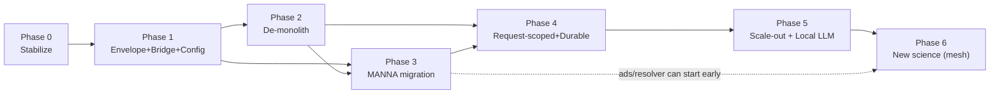

# Quasar V2.0 — Step-by-Step Execution Plan

**Companion to:** `QUASAR_V2_DESIGN.md` (architecture + rationale) and the subsystem analyses in `France/.research/data/400–409`.
**Date:** 2026-07-08

**How to read this.** Seven phases, each a shippable milestone gated by a concrete **Exit criterion**. Steps are ordered by dependency. Each step lists: **Do** (concrete actions + the exact files from the analysis), **Done when** (acceptance test), **Effort**, **Blocks/Blocked-by**. Every phase ships behind feature flags with the benchmark (Phase 0, step 0.9) as the regression gate. Do **not** start a phase before its predecessor's exit criterion is green.

**Legend:** Effort = dev-days (rough, solo). `[SEC]` security, `[COR]` correctness, `[ARCH]` architecture, `[SCALE]` scaling.

---

## Phase 0 — Stabilize (correctness + safety). Target: ~3 weeks. No new features.

**Goal:** stop the assistant from fabricating science, close the RCE holes, and establish a measurable baseline. Nothing here changes architecture; it makes the current system safe to keep running and safe to refactor.

### Correctness

**0.1 `[COR]` Fix the RAG score-scale gate bug.**
- **Do:** In `core/agent.py` (~L11311–11318), the filter `_rag_doc_score(d) >= 0.15` reads `metadata['_score']`, which after `_hybrid_rerank` is an RRF value capped at ~0.017 → real docs are dropped whenever rerank fires. Normalize to one scale: either compare against the RRF-scale threshold, or stop overwriting `_score` with the RRF value (keep cosine sim in `_score`, put RRF in `_rrf`). Add a unit test asserting a known-relevant doc survives the gate.
- **Done when:** a retrieval unit test shows docs with cosine ≥0.3 are never dropped by the gate; manual query "ALMA Band 6 sensitivity" returns handbook chunks.
- **Effort:** 1–2. **Blocks:** 0.6.

**0.2 `[COR]` Install `rank_bm25` or drop the hybrid-search claim.**
- **Do:** Add `rank_bm25` to `requirements.txt` (the ImportError is swallowed at `rag_service.py:1066`, so hybrid silently degrades to semantic+recency). Verify it loads; if you choose not to ship BM25, remove the claim from README/docstrings.
- **Done when:** `python -c "import rank_bm25"` succeeds in a clean venv OR the docs no longer claim hybrid.
- **Effort:** 0.5.

**0.3 `[COR]` Kill fabrication paths — turn fake data into typed errors.**
- **Do:** (a) `services/analysis.py:23–39` `analyze_uv_coverage` returns hardcoded `mock_results` when CASA absent → return `{success: False, error: "CASA not installed"}`. (b) `integrations/ads_client.py:414–461` `_get_example_papers` returns invented bibcodes/DOIs on missing key *or any exception* → return a typed ADS-unavailable error. (c) `services/search.py:74–108` swallows all exceptions → empty DataFrame → replace with `{success, rows, warnings, error, degraded, provenance}`. (d) Audit `data_processor.fetch_source_data` (canned data), `casa.py` "simulated" paths.
- **Done when:** grep for `mock_results`/`_get_example_papers`/`example_papers` shows no path returns synthetic data to the agent; a query with no ADS key says "ADS unavailable," not a fake paper.
- **Effort:** 3–5. **Blocks:** Phase 1 (ToolResult envelope generalizes this).

**0.4 `[COR]` Fix the DAGCache wrong-target replay.**
- **Do:** `core/dag_cache.py:96–101` normalizes targets to `{TARGET}`, so "compare M87…" exact-matches a cached plan for NGC 1068 and `conductor.py:407–414` reuses subtask descriptions verbatim. Either key the cache on the raw target too, or re-substitute the actual target into cached subtask descriptions before execution.
- **Done when:** a test issues two queries differing only by target and asserts the second does not execute the first's target.
- **Effort:** 1.

**0.5 `[COR]` Fix the recovery-path bypass (highest-impact single fix).**
- **Do:** `Conductor._run_one` always uses `RecoveryEngine`, whose `execute_with_recovery` calls a bare `loop.run_in_executor(None, executor_fn, description, "")` (`recovery.py`), skipping model routing, sandbox, dep_context, and SLA. Route recovery through the full node executor; pass `dep_context` and the routed model; wrap in `asyncio.wait_for(node.sla_seconds)`. Also teach `_is_empty_result` (`recovery.py:351–364`) that 0 results can be the answer (gate REPLAN on a meaningfulness check).
- **Done when:** a subtask that exceeds its SLA is cancelled (not hung); a "are there observations of X" query with no data returns "none found," not a rewritten broadened search.
- **Effort:** 2–3. **Blocked-by:** none. High risk area — add tests first.

### Security

**0.6 `[SEC]` Remove in-process code execution (RCE).**
- **Do:** (a) Disable `exec()`-based user tools: `services/user_tools_service.py:63–65,238–244` execs user Python with full `__builtins__`+`os` at save and run time. Feature-flag it OFF in production immediately; plan replacement via MCP servers (Phase 3). (b) Lock the `/api/mcp-servers` stdio spawner: it persists `{command,args}` and `_load_mcp_servers` spawns it — add a command allowlist (no `bash -c`), or restrict to HTTP/SSE server URLs only until the bridge is rebuilt.
- **Done when:** a user cannot cause arbitrary shell/Python execution on the server; a test asserts a `{command:'bash'}` MCP config is rejected.
- **Effort:** 2–3. **Blocks:** Phase 3 (proper replacement).

**0.7 `[SEC]` Close the authz/exposure holes.**
- **Do:** Remove `'1@1'` from `services/admin_access.py:9–21` `DEFAULT_ADMIN_EMAILS`; add auth to `/api/conductor/traces*` and `/api/proposals/review` (`ui-pro/api/main.py:4315–4368`); bind `/api/plan-feedback` to the requesting user + `run_id`; tighten CORS off the `*.vercel.app`/`*.onrender.com` wildcard-with-credentials to an explicit origin list (`main.py:181`); verify the Telegram webhook secret and fix the broken `ui_pro.api.main` import (should be `api.main`) or disable channels.
- **Done when:** anonymous requests to trace/proposal endpoints are 401; `'1@1'` is not an admin; CORS rejects an arbitrary `*.vercel.app` origin.
- **Effort:** 3–4.

**0.8 `[SEC]` Baseline auth hardening.**
- **Do:** Move JWT out of `localStorage` (httpOnly cookie or short-lived + refresh); `auth.py:275` use `hmac.compare_digest`; add login rate limiting; stop returning raw exception text to users.
- **Done when:** token no longer readable from JS `localStorage`; repeated bad logins are throttled.
- **Effort:** 3–4.

### Measurement

**0.9 `[COR]` Establish a reproducible benchmark baseline.**
- **Do:** Run the **full** DataLabBench (15 Q) and ALMA bench (22 Q) through the harness (today the headline numbers only exist in hand-written `tmp/live-ui-test-*.md`). Persist results with git SHA + model + dataset hash. Add per-question salting to defeat the `result_cache` replay. Wire `run_datalabbench.py --self-test` and `run_benchmark.py --self-test` into `ci.yml`.
- **Done when:** `Benchmark/**/results/` contains a full-matrix baseline for {local-model, deepseek-v4-pro} with provenance; CI runs the scorer self-tests.
- **Effort:** 4–5. **Blocks:** every later phase uses this as the regression gate.

> **Phase 0 Exit criterion:** no code path returns fabricated data; no in-process arbitrary code execution; auth/CORS holes closed; a provenance-stamped benchmark baseline exists in the repo and in CI.

---

## Phase 1 — Foundations for MCP-first. Target: ~3 weeks.

**Goal:** the contracts and plumbing that every later phase depends on — a canonical result envelope, a working MCP bridge, and typed config. No archive has moved to MCP yet.

**1.1 `[ARCH]` Canonical `ToolResult` envelope + data-card serializer.**
- **Do:** Define one dataclass: `{success, data|rows, columns, dtypes, warnings[], error?, degraded?, provenance{service,endpoint,query,retrieved_at,rowcount}, pagination_cursor?, reproducible_snippet?}`. The newer services (`vo_registry`, `datalab_*`, `distance_service`) already ~emit this — make it the standard. Write a serializer that turns it into the existing SSE `data`/`papers`/`image` events so the frontend is unchanged.
- **Done when:** at least the `datalab_*` and ALMA search tools return the envelope; the data card renders unchanged in the UI.
- **Effort:** 8–10 (5–7 native days + serializer). **Blocked-by:** 0.3. **Blocks:** 1.2, all of Phase 3.

**1.2 `[ARCH]` Rebuild the MCP client bridge (the one broken piece).**
- **Do:** Replace the per-call `asyncio.new_event_loop()` hack (`core/agent.py:503–526`, `519–525`) that drives a loop-bound `ClientSession` cross-loop. Stand up **one long-lived asyncio loop / anyio task group** owning all `ClientSession`s; sync callers submit via `asyncio.run_coroutine_threadsafe` to that loop. Map `mcp_tool.inputSchema → Tool.parameters` (already done at `agent.py:497–536`) and namespace tools `{server}__{tool}`. Support streamable-HTTP mount (not per-user stdio).
- **Done when:** a smoke test mounts a local FastMCP server and calls a tool 100× concurrently with zero cross-loop errors.
- **Effort:** 10. **Blocked-by:** 1.1. **Blocks:** Phase 3.

**1.3 `[ARCH]` Config-as-contract.**
- **Do:** Replace the dead `config/settings.py` and ~170 ad-hoc `os.getenv` calls with one typed `pydantic-settings` schema: models/roles, thresholds, budgets, timeouts, provider keys, feature flags — each with type, default, prod-required flag. Fail-fast on missing prod secrets (`JWT_SECRET`, `USER_API_KEY_FERNET_KEY`). It becomes the *only* env consumer.
- **Done when:** app refuses to boot in `QUASAR_ENV=production` without required secrets; `grep -r os.getenv core/ services/` returns only the settings module.
- **Effort:** 8–10.

**1.4 `[ARCH]` Codify the service contract as code.**
- **Do:** Turn `CONVENTIONS.md`'s prose (`{success, warnings, provenance}`, never-raise, lazy imports, injectable clients) into a base `ServiceClient` class + the `ToolResult` dataclass from 1.1. This is the pattern every new tool package (Phase 2) will follow.
- **Done when:** a base class exists and one service is migrated onto it as the template.
- **Effort:** 3.

> **Phase 1 Exit criterion:** a working MCP bridge (concurrent-safe) + a canonical result envelope + typed config, all with the benchmark still green.

---

## Phase 2 — De-monolith. Target: ~5 weeks.

**Goal:** break the two god objects so capability can be added without editing 12k-line files. This is the single biggest maintainability win.

**2.1 `[ARCH]` Split `core/agent.py` (12,714 lines).**
- **Do:** Extract (a) tool implementations into per-domain packages (`tools/alma.py`, `tools/datalab.py`, `tools/ads.py`, `tools/viz.py`, `tools/vo.py`, …) with **declarative registration** (decorator/manifest), replacing the "insert at 4 anchors" recipe; (b) the streaming loop (`stream_response_api`, ~1,650 lines) into a `Runner` class; (c) routing regexes into one small-model structured router; (d) prompt building into a module. Fix the duplicated `_filter_results` (defined twice: `agent.py:8397` and `10147`).
- **Done when:** `core/agent.py` < ~1,500 lines; adding a tool is a new file + decorator, no edits to the runner; benchmark unchanged.
- **Effort:** 15–20. **Blocks:** 2.2, 4.x.

**2.2 `[ARCH]` Intent-based tool subsetting + planner tool-awareness.**
- **Do:** Stop sending all 142 tool schemas every round. Classify each query into 2–3 tool categories; send only those + a `search_tools` escape hatch. Generate the DAG decomposition prompt's tool section from the **live registry** (grouped, per-tier truncated) instead of the hand-written 15-tool whitelist (`conductor.py:72–97`) that covers ~11% of tools.
- **Done when:** per-round prompt token count drops materially; the planner can reference any registered tool; wrong-tool-selection benchmark failures decrease.
- **Effort:** 5. **Blocked-by:** 2.1.

**2.3 `[ARCH]` Split `ui-pro/api/main.py` (4,368 lines).**
- **Do:** Break into `APIRouter` modules (auth, chat/SSE, conversations, provider-keys+quota, jobs, workbench, spectral-lines, datalab, personalization, admin). Extract the SSE state machine into a testable class. Move data-card shaping (hardcoded per-archive column maps, `main.py:924–1027`) out of the API into the serializer (1.1) or frontend.
- **Done when:** `main.py` is a thin app-factory; each router is independently testable.
- **Effort:** 12–15.

**2.4 `[COR][SCALE]` Fix the DB layer.**
- **Do:** `services/db.py` creates a new libsql HTTP client per `get_connection()` and `commit()` is a no-op (no transactions → auth/conversation races). Add real connection pooling, transaction support (libsql batch), and Alembic-style migrations instead of boot-time `CREATE/ALTER` replays. Give each domain a schema namespace so dev (7 SQLite files) and prod (1 Turso DB) match.
- **Done when:** multi-statement ops are transactional; a concurrent-registration test doesn't double-insert.
- **Effort:** 6–8.

> **Phase 2 Exit criterion:** neither `agent.py` nor `main.py` exceeds ~1,500 lines; adding a tool/route is a new file; DB writes are transactional; benchmark green.

---

## Phase 3 — MCP migration (MANNA first). Target: ~4 weeks.

**Goal:** prove MCP-first on the lowest-risk family, then the core archives. Native and MCP paths coexist per family behind flags until parity is shown.

**3.1 `[ARCH]` Stand up MANNA alongside native adapters.**
- **Do:** Mount MANNA (FastMCP, streamable HTTP) via the bridge (1.2), one mount per process with shared rate limiting. Register its tools namespaced (`manna__*`). Feature-flag per tool family.
- **Done when:** MANNA tools appear in the registry and are callable in a dev session.
- **Effort:** 4. **Blocked-by:** 1.2.

**3.2 `[ARCH]` Migrate `datalab_*` → MANNA (cleanest 1:1).**
- **Do:** The ~25 `datalab_*` tools already use result-handle (`result_id`) semantics and have a test contract (`tests/unit/test_datalab_p0–p2.py`). Swap them to MANNA calls behind the flag. **Move the SQL policy/builder/registry triad server-side into MANNA** (it's the best safety code in the repo); keep a client-side row-cap/read-only sanity check for defense in depth. Ensure MANNA owns the result store + `get_rows/to_csv/stats` follow-ups.
- **Done when:** DataLabBench scores ≥ the Phase-0 native baseline with the flag ON; the native path can be disabled.
- **Effort:** 8–10. **Blocked-by:** 3.1, 1.1.

**3.3 `[ARCH]` Migrate ALMA/NRAO TAP + DataLink → MANNA; absorb `ALMA_MCP`.**
- **Do:** `search.py`'s facade already isolates callers, so swap `ALminerClient`/`tap.py` for MANNA's TAP tools. Fold `ALMA_MCP`'s 16-intent taxonomy into MANNA (reuse names/docstrings; take query internals from Quasar's fixed `alminer_client`, not `ALMA_MCP`'s buggy Hz/GHz/`public_only` code). Fix the ALminer thread-race as part of this.
- **Done when:** ALMA benchmark ≥ baseline with MANNA ON; `ALMA_MCP` is retired or kept only as the Claude-Desktop distribution.
- **Effort:** 8–10. **Blocked-by:** 3.2.

**3.4 `[SEC]` Replace `exec()` user tools with "bring your own MCP server."**
- **Do:** Now that the bridge is production-grade, delete the `exec()` user-tools feature (disabled in 0.6) and point users at the MCP-server registry (out-of-process, own credentials). Per-user tokens (Data Lab/ADS) flow via **per-session MCP auth**, never process-global `os.environ` (`agent.py:418`).
- **Done when:** the RCE surface is gone; a user connects an MCP server instead of pasting Python; tokens are session-scoped.
- **Effort:** 4. **Blocked-by:** 3.1.

> **Phase 3 Exit criterion:** Data Lab + ALMA/NRAO archive access runs through MANNA at ≥ baseline scores; the in-process code-execution feature is deleted; credentials are session-scoped.

---

## Phase 4 — Request-scoped orchestration + durable state. Target: ~4 weeks.

**Goal:** make concurrent complex queries correct and runs survive restarts — the prerequisite for horizontal scale.

**4.1 `[ARCH]` Request-scoped `OrchestrationRun`.**
- **Do:** Replace the shared-singleton Conductor (which `clear()`s `workflow_memory` and reassigns `self.dag` per call → concurrent-query corruption) with an `OrchestrationRun` object (DAG + memory + images + trace-id + budget + emitter) created per query. Fix the 300s abandonment double-answer (cancel the conductor thread cooperatively; never start a second answer while the first can emit). Fix the `_trace_id` NameError (`conductor.py:721,813`) that silently swallows all DAG telemetry.
- **Done when:** two concurrent complex queries don't corrupt each other (add a concurrency test); DAG task telemetry actually reaches Rollbar/langfuse.
- **Effort:** 8–10. **Blocked-by:** 2.1.

**4.2 `[ARCH]` Typed task IO + explicit artifacts.**
- **Do:** Each node declares `produces`/`consumes`; dependencies pass typed handles (`result_id`, `image_ref`), not char-truncated strings (kills the 2000-char dep-context corruption and the thread-local "LAST results" coupling). Every artifact downstream tasks need becomes addressable.
- **Done when:** a multi-step DAG passes a table between nodes with no thread-local reliance; no mid-JSON truncation.
- **Effort:** 6–8. **Blocked-by:** 4.1.

**4.3 `[SCALE]` One durable job service.**
- **Do:** Unify the 3 job frameworks (spectral-line DiskCache, datalab in-memory, workbench file-JSON) into one `JobService` (id, kind, cancel token, progress events, persistence driver: threads in dev, queue+worker in prod). Map progress onto both SSE and MCP progress notifications. Fixes the in-memory job leak + jobs-lost-on-restart.
- **Done when:** a job survives a server restart; one REST shape (create/poll/cancel/export) serves all three features.
- **Effort:** 8–10.

**4.4 `[ARCH]` Reproducibility from traces.**
- **Do:** Record every tool call (name, args, endpoint, query text, result digest) in the run ledger (`_record_tool_trace` half-exists at `agent.py:10538`). Rebuild the notebook generator to map trace entries → cells (MANNA can return an exact `reproducible_snippet` per call). Re-enable notebook attachment (currently generated then discarded).
- **Done when:** a downloaded notebook re-runs and reproduces the workflow; no fabricated code cells.
- **Effort:** 6–8. **Blocked-by:** 3.2 (MANNA snippets), 4.2.

> **Phase 4 Exit criterion:** concurrent complex queries are correct; runs + jobs are durable across restarts; the notebook is honest.

---

## Phase 5 — Scale-out. Target: ~8–10 weeks.

**Goal:** the §9 control-plane architecture for thousands of users + the local-LLM tier.

**5.1 `[SCALE]` Control-plane / agent-worker / SSE-relay split.**
- **Do:** Split the always-on API (auth, conversations, SSE relay) from agent-worker processes consuming a queue; SSE served from a relay reading a persisted run-event stream (Redis). This simultaneously fixes multi-worker deployment, HITL routing across instances, cancellation, and resume. Externalize all single-process state (conversation response-ID map, dag_cache, watchlist) to Redis/Turso.
- **Done when:** N workers serve traffic; a dropped SSE connection resumes; killing a worker mid-run doesn't lose the run.
- **Effort:** 30–40. **Blocked-by:** 4.1, 4.3, 2.4.

**5.2 `[SCALE]` Local-LLM tier on dlai1.**
- **Do:** Stand up vLLM (OpenAI-compatible) on dlai1; decide MIG slices vs replicas across the 4 GPUs via a capacity load test; wire it as a first-class provider (the router already supports TACC/local). Make it the free/equal-access default with commercial BYOK as the quality ceiling. Validate open-weights multi-step tool-calling against the benchmark.
- **Done when:** the benchmark runs on the local model at acceptable pass rates; concurrency ceiling is measured; no context bleed between users.
- **Effort:** 20–30. **Blocked-by:** 5.1.

**5.3 `[SEC][SCALE]` `compute-mcp` + `notebook-mcp`.**
- **Do:** Replace the in-process `exec()` sandbox with a `compute-mcp` (container/subprocess, CPU/mem/wall rlimits, brokered `call_tool`). Stand up `notebook-mcp` driving gp13 kernels for real reproducibility/analysis. Both on the GPU tier where needed.
- **Done when:** untrusted Python runs isolated with resource caps; a notebook cell executes on a real kernel via MCP.
- **Effort:** 20. **Blocked-by:** 1.2, 5.1.

> **Phase 5 Exit criterion:** the platform scales horizontally; the local-LLM tier is production-viable; all untrusted/heavy compute is isolated out-of-process.

---

## Phase 6 — New science capabilities (ongoing, after 5.1).

Build as MCP servers in the mesh (§5 of the design doc). Prioritize by user demand:

| Order | Capability | Server | Effort | Depends |
|---|---|---|---|---|
| 6.1 | **ads-mcp** (search/fulltext/citation graph) — real "papers using this dataset" | ads-mcp | 10–15 | 1.2 |
| 6.2 | **resolver-mcp** (SIMBAD/NED/Sesame, TTL cache) — fixes the permanent-`None` bug | resolver-mcp | 5 | 1.2 |
| 6.3 | **planning-mcp** (visibility/sensitivity/duplication) | planning-mcp | 10–15 | 5.1 |
| 6.4 | **Real data reduction** (CASA/DRAGONS execution) | compute-mcp | 15–20 | 5.3 |
| 6.5 | **Collaboration** (shareable runs, VOSpace/MyDB write-through, team RAG) | core + MANNA | 10–15 | 4.1, 5.1 |
| 6.6 | **Proposal drafting + duplication check** | planning-mcp + docs | 10–15 | 6.1, 6.3 |
| 6.7 | **astro_mcp / StarAI integration** (DESI/SDSS/DES, CADC) — evaluate then adopt | external | 5–10 | 1.2 |
| 6.8 | **Multi-LLM consensus planning + health-aware fallback** (paper's future work) | core | 5 | 4.1 |
| 6.9 | **RAG expansion** (facility docs, catalog schemas, citation graph, dataset registry) | astro-docs-mcp | ongoing | 1.1 |

---

## Cross-cutting tracks (run continuously, every phase)

- **Benchmark-gated:** no phase merges if it regresses the Phase-0 baseline; extend the eval (add a "claimed vs emitted artifact" fabrication penalty GP-04; trace conductor-subtask tool calls; add repeats/variance).
- **Docs generated, not written:** emit the tool-registry doc + mermaid diagrams from code in CI; delete the stale `ARCHITECTURE.md`; fix the tool-count drift (142, not 75/35).
- **CI hardening:** extend ruff beyond the 5-file whitelist (new-code-only), align triggers with README (protect `main`), wire scorer self-tests.
- **Repo slimming:** move `docs/pdfs` (RAG corpus), the 36 MB GIF, PDFs to object storage; commit the `Quasar-handoff` design bundle.
- **Deployment:** retire the Render-free-tier + GitHub-Actions-cron keep-alive hack for a real always-on tier (folds into 5.1).

---

## Dependency graph (critical path)

**Critical path:** 0 → 1 → 2 → 3 → 4 → 5. Phase 6 servers that don't need scale-out (ads-mcp, resolver-mcp) can begin right after Phase 1's bridge.

## Rough timeline (solo/small team, sequential)

| Phase | Weeks | Cumulative |
|---|---|---|
| 0 Stabilize | 3 | 3 |
| 1 Foundations | 3 | 6 |
| 2 De-monolith | 5 | 11 |
| 3 MANNA migration | 4 | 15 |
| 4 Orchestration + durable | 4 | 19 |
| 5 Scale-out + local LLM | 8–10 | 27–29 |
| 6 New science | ongoing | — |

Parallelizing with 2–3 contributors, Phases 2 and 3 overlap and 6 runs alongside 4–5, compressing to ~18–20 weeks to end of Phase 5.

## The 5 things to do first (if you only start one thing)

1. **0.5** fix the recovery-path bypass (restores routing/SLA/sandbox in production — one change, huge blast radius).
2. **0.1** fix the RAG score-scale bug (retrieval is silently broken).
3. **0.3 + 0.6** kill fabrication + in-process RCE (a science tool must not invent data or run arbitrary code).
4. **0.9** get a real benchmark baseline (you can't measure V2 without it).
5. **1.1 + 1.2** the ToolResult envelope + working MCP bridge (everything after depends on these).
