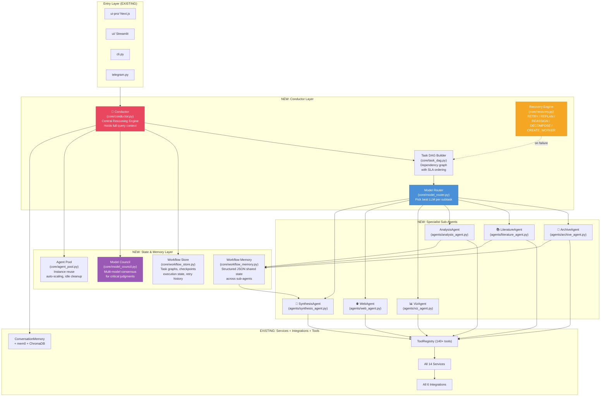

# Quasar Multi-Agent Workforce — Full Implementation Plan

> Evolve Quasar from single-agent monolith → **Conductor-based multi-agent workforce** inspired by CAMEL Workforce + Perplexity Computer architectures.

---

## Existing Asset Inventory

> [!IMPORTANT]
> Quasar already has a massive foundation. The plan below builds ON TOP of these — nothing gets deleted.

### Integrations Layer (Already Built ✅)

| File | Status | What It Does |
|---|---|---|
| [alminer_client.py](file:///c:/Users/adama/Desktop/Quasar-main/integrations/alminer_client.py) | ✅ **474 lines** | Parallel TAP + ALminer search, SIMBAD name resolution, catalog search, line coverage (CO/custom), downloads, sky/frequency/overview plots |
| [tap.py](file:///c:/Users/adama/Desktop/Quasar-main/integrations/tap.py) | ✅ **496 lines** | Full NRAO TAP client for VLA/VLBA/ALMA with cone search, name resolution, table auto-discovery |
| [ads_client.py](file:///c:/Users/adama/Desktop/Quasar-main/integrations/ads_client.py) | ✅ **21KB** | NASA ADS: paper search, author metrics, bibtex export, library management, method extraction |
| [casa.py](file:///c:/Users/adama/Desktop/Quasar-main/integrations/casa.py) | ✅ **20KB** | CASA software integration for calibration |
| [carta.py](file:///c:/Users/adama/Desktop/Quasar-main/integrations/carta.py) | ✅ **21KB** | CARTA visualization tool integration |
| [datalink.py](file:///c:/Users/adama/Desktop/Quasar-main/integrations/datalink.py) | ⚠️ **Stub (26 lines)** | Only has [download_observation()](file:///c:/Users/adama/Desktop/Quasar-main/integrations/datalink.py#16-27) placeholder — **needs upgrade** |

### Services Layer (Already Built ✅)

| File | Status | Tools It Powers |
|---|---|---|
| [search.py](file:///c:/Users/adama/Desktop/Quasar-main/services/search.py) | ✅ | [search_by_target](file:///c:/Users/adama/Desktop/Quasar-main/integrations/alminer_client.py#38-73), [search_by_position](file:///c:/Users/adama/Desktop/Quasar-main/integrations/alminer_client.py#136-183), [search_by_frequency](file:///c:/Users/adama/Desktop/Quasar-main/integrations/alminer_client.py#219-260), [search_catalog](file:///c:/Users/adama/Desktop/Quasar-main/services/search.py#140-142) |
| [ads_service.py](file:///c:/Users/adama/Desktop/Quasar-main/services/ads_service.py) | ✅ 29KB | [search_papers](file:///c:/Users/adama/Desktop/Quasar-main/core/agent.py#2370-2382), `get_author_papers`, `get_paper_metrics`, `export_bibtex`, [reproduce_paper_methods](file:///c:/Users/adama/Desktop/Quasar-main/core/agent.py#1528-1600) |
| [plotting.py](file:///c:/Users/adama/Desktop/Quasar-main/services/plotting.py) | ✅ 11KB | [plot_alma_results](file:///c:/Users/adama/Desktop/Quasar-main/services/search.py#75-88), `plot_sky_map`, `plot_spectrum` |
| [splatalogue.py](file:///c:/Users/adama/Desktop/Quasar-main/services/splatalogue.py) | ✅ 8KB | `identify_spectral_line`, `search_lines_by_molecule` |
| [multi_archive.py](file:///c:/Users/adama/Desktop/Quasar-main/services/multi_archive.py) | ✅ 7KB | `cross_match_source` (SIMBAD/NED/MAST/VizieR in parallel) |
| [casa_generator.py](file:///c:/Users/adama/Desktop/Quasar-main/services/casa_generator.py) | ✅ 11KB | `generate_casa_imaging_script`, `generate_casa_calibration_script` |
| [gcn_monitor.py](file:///c:/Users/adama/Desktop/Quasar-main/services/gcn_monitor.py) | ✅ 8KB | `get_latest_gw_events`, `search_gwtc_catalog`, `summarize_gcn_circular` |
| [browser.py](file:///c:/Users/adama/Desktop/Quasar-main/services/browser.py) | ✅ 8KB | [web_search](file:///c:/Users/adama/Desktop/Quasar-main/core/agent.py#1138-1182), `navigate_to_url`, `read_page`, `click_element` |
| [rag_service.py](file:///c:/Users/adama/Desktop/Quasar-main/services/rag_service.py) | ✅ 14KB | RAG over ALMA Technical Handbook via ChromaDB |
| [memory_service.py](file:///c:/Users/adama/Desktop/Quasar-main/services/memory_service.py) | ✅ 4KB | Long-term user memory via ChromaDB vectors |
| [fits_processing.py](file:///c:/Users/adama/Desktop/Quasar-main/services/fits_processing.py) | ✅ 132 lines | FITS metadata extraction + 2D/3D preview from **local bytes** |
| [notebook_gen.py](file:///c:/Users/adama/Desktop/Quasar-main/services/notebook_gen.py) | ✅ | `generate_jupyter_notebook` |
| [proposal_critic.py](file:///c:/Users/adama/Desktop/Quasar-main/services/proposal_critic.py) | ✅ 9KB | Proposal review/critique |
| [pdf_processing.py](file:///c:/Users/adama/Desktop/Quasar-main/services/pdf_processing.py) | ✅ 6KB | PDF upload processing |

### Core Layer (Already Built ✅)

| File | Status | What It Does |
|---|---|---|
| [agent.py](file:///c:/Users/adama/Desktop/Quasar-main/core/agent.py) | ✅ **2,382 lines** | Central orchestrator — 140+ tools (see [docs/TOOLS.md](TOOLS.md)), [stream_response_api()](file:///c:/Users/adama/Desktop/Quasar-main/core/agent.py#1985-2174) with 12-round tool loop, model routing, mem0 |
| [rlm.py](file:///c:/Users/adama/Desktop/Quasar-main/core/rlm.py) | ✅ **409 lines** | Complexity detection (heuristic + LLM), sequential decomposition, tool executor bridge |
| [rlm_environment.py](file:///c:/Users/adama/Desktop/Quasar-main/core/rlm_environment.py) | ✅ **564 lines** | Sandboxed REPL with [call_tool()](file:///c:/Users/adama/Desktop/Quasar-main/core/rlm_environment.py#379-386), [llm_query()](file:///c:/Users/adama/Desktop/Quasar-main/core/rlm_environment.py#376-378) (recursive child REPLs), persistent namespace |
| [memory.py](file:///c:/Users/adama/Desktop/Quasar-main/core/memory.py) | ✅ 6KB | Short-term conversation memory with topic detection |
| [tools.py](file:///c:/Users/adama/Desktop/Quasar-main/core/tools.py) | ✅ 2KB | ToolRegistry for OpenAI function-calling schemas |

### 140+ Registered Tools (Already Built ✅)

Archive (6) · Data Ops (5) · Visualization (3) · Spectral Lines (4) · Web Browsing (4) · Literature (10+) · Multi-Messenger (4) · Analysis (1) · Notebooks (1)

---

## Target Architecture



---

## Proposed Changes — Phase by Phase

---

### Phase 0: Fill Science Gaps (DataLink + Remote FITS)

> [!CAUTION]
> Without these, the multi-agent architecture gains nothing because the system literally **cannot access** file-level ALMA data.

#### [MODIFY] [datalink.py](file:///c:/Users/adama/Desktop/Quasar-main/integrations/datalink.py)

**Current:** 26-line stub with only [download_observation()](file:///c:/Users/adama/Desktop/Quasar-main/integrations/datalink.py#16-27) placeholder.

**Upgrade to full ALMA DataLink client:**
- `list_files(mous_uid, pattern=None)` — Query ALMA DataLink endpoint (`https://almascience.eso.org/datalink/sync?ID=<mous_uid>`) to get list of all deliverable files (filenames, sizes, access URLs)
- `list_files_for_project(project_code, pattern=None)` — Given project code, find MOUS UIDs from latest search results, then list files per MOUS
- `get_file_access_url(mous_uid, filename)` — Get direct download URL for a specific file
- Keep existing [download_observation()](file:///c:/Users/adama/Desktop/Quasar-main/integrations/datalink.py#16-27) but make it functional using the access URLs

#### [MODIFY] [fits_processing.py](file:///c:/Users/adama/Desktop/Quasar-main/services/fits_processing.py)

**Current:** Works only from local `bytes`. 

**Add remote header reading:**
- `extract_metadata_from_url(url)` — Use `astropy.io.fits.open(url, use_fsspec=True, lazy_load_hdus=True)` to read only the header over HTTP without downloading the full file
- Extract: `BMAJ`, `BMIN`, `BPA`, `RMS`/`DATARMS`/`NOISE`, `RESTFRQ`, `OBJECT`, `NAXIS1/2`, `CDELT1/2`
- Convert `BMAJ`/`BMIN` from degrees to arcsec for human readability

#### [MODIFY] [agent.py](file:///c:/Users/adama/Desktop/Quasar-main/core/agent.py)

Register 2 new tools:
- `list_alma_files(mous_uid, filename_pattern)` — wraps `DataLinkClient.list_files()`
- `inspect_fits_header(access_url)` — wraps `FITSProcessingService.extract_metadata_from_url()`

---

### Phase 1: DAG Executor + Conductor

#### [NEW] `core/task_dag.py`

**Purpose:** Replace the sequential subtask loop in [rlm.py](file:///c:/Users/adama/Desktop/Quasar-main/core/rlm.py) with a dependency-aware DAG.

**Key classes:**
```python
@dataclass
class TaskNode:
    id: str
    description: str
    depends_on: List[str]    # IDs of prerequisite tasks
    agent_type: str          # "archive", "literature", "analysis", "synthesis", "web"
    model_hint: str          # optional model preference
    sla_seconds: int         # max time allowed (from Perplexity)
    status: str              # "pending", "running", "completed", "failed"
    result: Optional[Any]

class TaskDAG:
    def build_from_subtasks(self, subtasks: List[dict]) -> nx.DiGraph
    def get_ready_tasks(self) -> List[TaskNode]       # tasks with all deps satisfied
    def mark_completed(self, task_id, result)
    def mark_failed(self, task_id, error)
    async def execute(self, executor_fn) -> Dict[str, Any]  # parallel execution
```

**Key behavior:** 
- `get_ready_tasks()` returns all tasks whose dependencies are fulfilled → these run in parallel via `asyncio.gather`
- After each batch completes, check again for newly-ready tasks
- This alone makes multi-source searches (Sz65 + 6 others) run 7× faster

#### [NEW] `core/conductor.py`

**Purpose:** Central reasoning engine (from Perplexity Computer). Single "brain" model that holds the full query context and orchestrates everything.

**Key class:**
```python
class Conductor:
    """Central orchestrator — replaces the RLM pathway for complex queries."""
    
    def __init__(self, client, model, tool_registry, services, model_router, recovery_engine):
        self.dag_builder = TaskDAG()
        self.model_router = model_router
        self.recovery = recovery_engine
        self.workflow_memory = WorkflowMemory()
    
    async def orchestrate(self, query: str, context: str = "") -> str:
        """Main entry point for complex queries."""
        # 1. Decompose query into DAG (with dependency + agent type annotations)
        # 2. Execute DAG (parallel where possible)
        # 3. Recovery on failures
        # 4. Synthesize final answer from all results
```

**Integration:** [agent.py](file:///c:/Users/adama/Desktop/Quasar-main/core/agent.py)'s [stream_response_api()](file:///c:/Users/adama/Desktop/Quasar-main/core/agent.py#1985-2174) checks complexity → if complex, delegates to `Conductor.orchestrate()` instead of the current RLM sequential path.

#### [MODIFY] [rlm.py](file:///c:/Users/adama/Desktop/Quasar-main/core/rlm.py)

**Changes:**
- [_execute_decompose()](file:///c:/Users/adama/Desktop/Quasar-main/core/rlm.py#239-304) now produces **structured JSON with dependencies** instead of flat list
- Decomposition prompt updated to output: `{"subtasks": [{"id": "t1", "description": "...", "depends_on": [], "agent_type": "archive"}, ...]}`
- The REPL mode ([rlm_environment.py](file:///c:/Users/adama/Desktop/Quasar-main/core/rlm_environment.py)) stays unchanged — it's still the right tool for beyond-context-window data processing

---

### Phase 2: Model Router + Specialist Sub-Agents

#### [NEW] `core/model_router.py`

**Purpose:** Route each subtask to the optimal LLM based on task type.

```python
class ModelRouter:
    ROUTING_TABLE = {
        "archive_search":       {"model": "gpt-4o",          "reason": "Best tool-calling accuracy"},
        "literature_review":    {"model": "gemini-2.0-pro",  "reason": "2M context for long papers"},
        "scientific_reasoning": {"model": "claude-sonnet",   "reason": "Strong multi-step reasoning"},
        "code_generation":      {"model": "gpt-4o",          "reason": "Best code generation"},
        "data_analysis":        {"model": "gpt-4o",          "reason": "Reliable structured output"},
        "synthesis":            {"model": "gemini-2.0-pro",  "reason": "Long context for aggregation"},
        "simple_qa":            {"model": "gpt-4o-mini",     "reason": "Fast + cheap"},
    }
    
    def route(self, task_node: TaskNode) -> str:
        """Returns the model ID best suited for this task."""
    
    def classify_task_type(self, description: str) -> str:
        """Classify a task description into one of the routing categories."""
```

**Leverages existing multi-model work:** The agent already has Claude/Gemini client instantiation from the "Fixing Claude Model Routing" conversation — this makes the routing *automatic*.

#### [NEW] `agents/` directory (6 specialist sub-agents)

Each sub-agent gets:
- Its own **system prompt** optimized for its domain
- Access to only **its subset** of the 140+ tools
- A [run(task, context, workflow_memory)](file:///c:/Users/adama/Desktop/Quasar-main/core/rlm_environment.py#361-510) method

| Agent | File | Tools It Uses (from existing registry) |
|---|---|---|
| **ArchiveAgent** | `agents/archive_agent.py` | [search_by_target](file:///c:/Users/adama/Desktop/Quasar-main/integrations/alminer_client.py#38-73), [search_by_position](file:///c:/Users/adama/Desktop/Quasar-main/integrations/alminer_client.py#136-183), [search_by_frequency](file:///c:/Users/adama/Desktop/Quasar-main/integrations/alminer_client.py#219-260), [search_alma_with_keywords](file:///c:/Users/adama/Desktop/Quasar-main/services/search.py#67-74), [advanced_search](file:///c:/Users/adama/Desktop/Quasar-main/services/search.py#59-66), [search_catalog](file:///c:/Users/adama/Desktop/Quasar-main/services/search.py#140-142), [resolve_target](file:///c:/Users/adama/Desktop/Quasar-main/core/agent.py#1678-1711), [filter_results](file:///c:/Users/adama/Desktop/Quasar-main/core/agent.py#1712-1783), `list_alma_files` (P0), [download_alma_data](file:///c:/Users/adama/Desktop/Quasar-main/services/search.py#89-92) |
| **LiteratureAgent** | `agents/literature_agent.py` | [search_papers](file:///c:/Users/adama/Desktop/Quasar-main/core/agent.py#2370-2382), `get_author_papers`, `get_paper_metrics`, `get_paper_abstract`, `export_bibtex`, [reproduce_paper_methods](file:///c:/Users/adama/Desktop/Quasar-main/core/agent.py#1528-1600), ADS library tools |
| **AnalysisAgent** | `agents/analysis_agent.py` | [check_line_coverage](file:///c:/Users/adama/Desktop/Quasar-main/services/search.py#107-133), [check_co_lines](file:///c:/Users/adama/Desktop/Quasar-main/core/agent.py#1634-1651), `identify_spectral_line`, `search_lines_by_molecule`, `inspect_fits_header` (P0), `generate_casa_imaging_script`, `generate_casa_calibration_script`, `cross_match_source`, [analyze_uv_coverage](file:///c:/Users/adama/Desktop/Quasar-main/core/agent.py#1420-1429) |
| **VizAgent** | `agents/viz_agent.py` | [plot_alma_results](file:///c:/Users/adama/Desktop/Quasar-main/services/search.py#75-88), `plot_sky_map`, `plot_spectrum`, `generate_jupyter_notebook` |
| **WebAgent** | `agents/web_agent.py` | [web_search](file:///c:/Users/adama/Desktop/Quasar-main/core/agent.py#1138-1182), `navigate_to_url`, `read_page`, `click_element` |
| **SynthesisAgent** | `agents/synthesis_agent.py` | Access to `WorkflowMemory` — reads all sub-agent results, builds final tables/comparisons/answers |

#### [NEW] `agents/__init__.py` + `agents/base_agent.py`

Base class with shared logic:
```python
class BaseSubAgent:
    def __init__(self, client, model, tool_registry, system_prompt):
        self.tools = [t for t in tool_registry.list_tools() if t.name in self.ALLOWED_TOOLS]
    
    async def run(self, task: str, context: str, workflow_memory: WorkflowMemory) -> SubTaskResult:
        """Execute task using only this agent's tools, write results to workflow_memory."""
```

---

### Phase 3: Recovery Engine + Workflow Store 

#### [NEW] `core/recovery.py`

**All 5 CAMEL recovery strategies:**

```python
class RecoveryEngine:
    async def execute_with_recovery(self, task_node, agent, max_retries=3):
        for attempt in range(max_retries):
            try:
                return await agent.run(task_node.description, ...)
            except EmptyResultError:
                task_node = await self._replan(task_node)      # LLM reformulates the task
            except ToolError as e:
                task_node = await self._reassign(task_node, e)  # Try different tool
            except TimeoutError:
                task_node = await self._decompose(task_node)    # Break into smaller pieces
        return await self._create_worker(task_node)             # Spin up a fresh specialized worker
```

| Strategy | When It Fires | Example |
|---|---|---|
| **RETRY** | Transient error (network timeout, API rate limit) | ALMA TAP query times out → retry with backoff |
| **REPLAN** | Empty results from valid query | [search_by_target("Sz65")](file:///c:/Users/adama/Desktop/Quasar-main/integrations/alminer_client.py#38-73) → empty → resolve coordinates → [search_by_position()](file:///c:/Users/adama/Desktop/Quasar-main/integrations/alminer_client.py#136-183) |
| **REASSIGN** | Tool fails entirely | ALminer down → fall back to pyVO TAP directly |
| **DECOMPOSE** | Task too broad to succeed | "Search all 7 sources" fails → decompose into 7 individual searches |
| **CREATE_WORKER** | No existing agent fits | Dynamically compose a sub-agent from available tools |

#### [NEW] `core/workflow_store.py`

**Persistent execution state — enables checkpoint/resume:**

```python
class WorkflowStore:
    """Persists task DAGs, execution state, and results for resumability."""
    
    def save_checkpoint(self, query_id: str, dag: TaskDAG, results: dict)
    def load_checkpoint(self, query_id: str) -> Tuple[TaskDAG, dict]
    def list_workflows(self, user_id: str) -> List[dict]
    
    # Also fulfills CAMEL's "Controls" layer:
    def pause(self, query_id)    # CAMEL: Pause
    def resume(self, query_id)   # CAMEL: Resume
    def snapshot(self, query_id) # CAMEL: Snapshot current state
```

**Storage:** SQLite (alongside existing `conversations.db`) or JSON files in `data/workflows/`.

#### [NEW] `core/workflow_memory.py` 

**Shared context across sub-agents** (CAMEL's "Workflow Memory / Context Sharing"):

```python
class WorkflowMemory:
    """Structured key-value store shared across all sub-agents during one query execution."""
    
    def write(self, agent_id: str, key: str, value: Any)
    def read(self, key: str) -> Any
    def read_all() -> dict
    def get_agent_contributions(self, agent_id: str) -> dict
```

Example flow: ArchiveAgent writes `search_results_sz65` → AnalysisAgent reads it → writes `beam_sizes` → SynthesisAgent reads all and builds the comparison table.

---

### Phase 4: Model Council + Agent Pool + Observability

#### [NEW] `core/model_council.py`

**Multi-model consensus for critical scientific judgments** (from Perplexity Computer):

```python
class ModelCouncil:
    """Ask 2-3 models the same question, synthesize the best answer."""
    
    async def deliberate(self, question: str, context: str, models: List[str] = None) -> str:
        """
        1. Send the same question to GPT-4o, Gemini, Claude in parallel
        2. Conductor model compares answers
        3. Returns synthesized best answer with confidence score
        """
```

**When to use:** Critical decisions like "which dataset has the best sensitivity vs. resolution trade-off?" or "is this spectral line identification correct?"

#### [NEW] `core/agent_pool.py`

**CAMEL Agent Pool — instance reuse, auto-scaling, idle cleanup:**

```python
class AgentPool:
    """Pool of initialized sub-agents for reuse across queries."""
    
    def get_agent(self, agent_type: str) -> BaseSubAgent  # reuse or create
    def release(self, agent: BaseSubAgent)                 # return to pool
    def cleanup_idle(self, max_idle_seconds=300)            # cleanup unused agents
```

**Benefit:** Currently every query re-initializes all services (SearchService, PlottingService, etc.). The pool keeps them warm.

#### [NEW] `core/observability.py`

**Structured trace IDs — fulfills CAMEL's Dashboard requirement:**

```python
class QueryTracer:
    def new_trace(self, query: str, user_id: str) -> str   # returns trace_id
    def log_step(self, trace_id, step_name, status, duration, metadata)
    def get_trace(self, trace_id) -> List[dict]            # full execution trace
    def export_metrics() -> dict                           # for dashboard
```

Every tool call, sub-agent execution, model routing decision, and recovery attempt gets logged with the trace_id.

---

## Sz65 Question — End-to-End Execution Trace

With the full architecture, the question *"Make a table of ALMA datasets for Sz65 with sensitivity, beamsize, download best, plot contours"* executes as:

```
1. Conductor receives query, scores complexity=0.85
2. Conductor builds DAG:
   t1: ArchiveAgent → search_by_target("Sz65")           [no deps]
   t2: ArchiveAgent → list_alma_files(mous_uids, "*pbcor*")  [depends: t1]
   t3: AnalysisAgent → inspect_fits_header(file_urls)    [depends: t2, PARALLEL per file]
   t4: SynthesisAgent → build_comparison_table()         [depends: t3]
   t5: ArchiveAgent → download_alma_data(best_file)      [depends: t4]
   t6: VizAgent → generate_contour_plot_notebook()       [depends: t5]

3. Execution:
   t1 runs → 15 observations found (ArchiveAgent uses search_by_target)
   t2 runs → 8 matching *pbcor.fits files across 3 MOUS UIDs
   t3 runs IN PARALLEL → 8 concurrent FITS header reads (BMAJ, BMIN, RMS)
   t4 runs → SynthesisAgent builds markdown table
   
   If t1 returned empty → Recovery: REPLAN → resolve_target("Sz65") → search_by_position()
   If t3 times out for one file → Recovery: RETRY with exponential backoff
   
   t5 runs → downloads best file
   t6 runs → generates Jupyter notebook with imshow + contours

4. Result: Table + download link + runnable notebook
```

---

## File Summary

### New Files to Create

| File | Phase | Purpose |
|---|---|---|
| `core/conductor.py` | P1 | Central reasoning engine |
| `core/task_dag.py` | P1 | DAG builder + parallel executor |
| `core/model_router.py` | P2 | Route subtasks to optimal LLM |
| `core/recovery.py` | P3 | 5 recovery strategies (RETRY/REPLAN/REASSIGN/DECOMPOSE/CREATE_WORKER) |
| `core/workflow_store.py` | P3 | Persistent task state, pause/resume/snapshot |
| `core/workflow_memory.py` | P3 | Shared context across sub-agents |
| `core/model_council.py` | P4 | Multi-model consensus for critical decisions |
| `core/agent_pool.py` | P4 | Sub-agent instance reuse |
| `core/observability.py` | P4 | Structured trace IDs and metrics |
| `agents/__init__.py` | P2 | Agent package |
| `agents/base_agent.py` | P2 | Base class for all sub-agents |
| `agents/archive_agent.py` | P2 | ALMA/VLA search specialist |
| `agents/literature_agent.py` | P2 | ADS/paper specialist |
| `agents/analysis_agent.py` | P2 | FITS/spectral/CASA specialist |
| `agents/viz_agent.py` | P2 | Plotting/notebook specialist |
| `agents/web_agent.py` | P2 | Web browsing specialist |
| `agents/synthesis_agent.py` | P2 | Final answer assembly |

### Existing Files to Modify

| File | Phase | Change |
|---|---|---|
| [integrations/datalink.py](file:///c:/Users/adama/Desktop/Quasar-main/integrations/datalink.py) | P0 | Upgrade from stub → full DataLink client with `list_files()` |
| [services/fits_processing.py](file:///c:/Users/adama/Desktop/Quasar-main/services/fits_processing.py) | P0 | Add `extract_metadata_from_url()` for remote FITS headers |
| [core/agent.py](file:///c:/Users/adama/Desktop/Quasar-main/core/agent.py) | P0+P1 | Register new tools, add Conductor pathway in [stream_response_api()](file:///c:/Users/adama/Desktop/Quasar-main/core/agent.py#1985-2174) |
| [core/rlm.py](file:///c:/Users/adama/Desktop/Quasar-main/core/rlm.py) | P1 | Update decomposition to output DAG-structured JSON |
| [core/prompts/__init__.py](file:///c:/Users/adama/Desktop/Quasar-main/core/prompts/__init__.py) | P1+P2 | Add decomposition prompt for DAG output, sub-agent system prompts |

---

## Verification Plan

### Existing Tests to Leverage

| Test File | What It Tests | Relevant Phase |
|---|---|---|
| [test_rlm_environment.py](file:///c:/Users/adama/Desktop/Quasar-main/tests/test_rlm_environment.py) | REPL sandbox, [call_tool()](file:///c:/Users/adama/Desktop/Quasar-main/core/rlm_environment.py#379-386), [llm_query()](file:///c:/Users/adama/Desktop/Quasar-main/core/rlm_environment.py#376-378) | P1 (verify REPL still works after DAG changes) |
| [test_rlm_integration.py](file:///c:/Users/adama/Desktop/Quasar-main/tests/test_rlm_integration.py) | End-to-end RLM execution | P1 (verify backward compatibility) |
| [test_alminer_advanced.py](file:///c:/Users/adama/Desktop/Quasar-main/tests/test_alminer_advanced.py) | ALminer search functions | P0 (verify DataLink doesn't break ALminer) |
| [test_quasar.py](file:///c:/Users/adama/Desktop/Quasar-main/tests/test_quasar.py) | Agent init, tool registration | P0-P2 (verify new tools register correctly) |
| [run_regression_suite.py](file:///c:/Users/adama/Desktop/Quasar-main/tests/run_regression_suite.py) | 12KB regression suite | All phases |

### New Tests to Write

| Test | Phase | How to Run |
|---|---|---|
| `tests/test_datalink.py` — Test `list_files()` with real MOUS UID | P0 | `python -m pytest tests/test_datalink.py -v` |
| `tests/test_fits_remote.py` — Test remote header extraction | P0 | `python -m pytest tests/test_fits_remote.py -v` |
| `tests/test_task_dag.py` — DAG building + parallel execution | P1 | `python -m pytest tests/test_task_dag.py -v` |
| `tests/test_conductor.py` — End-to-end Conductor with mock agents | P1 | `python -m pytest tests/test_conductor.py -v` |
| `tests/test_model_router.py` — Task classification + routing | P2 | `python -m pytest tests/test_model_router.py -v` |
| `tests/test_recovery.py` — All 5 recovery strategies with mock failures | P3 | `python -m pytest tests/test_recovery.py -v` |

### Manual Verification (Sz65 End-to-End)

After P0 + P1 are implemented, test the Sz65 question by:
1. Start the backend: `python -m uvicorn ui-pro.api.main:app --reload`
2. Open the UI at `http://localhost:3000`
3. Ask: *"Make a table of ALMA datasets for Sz65 with sensitivity and beamsize. Files matching *pbcor.fits."*
4. **Expected:** Table with Source, Project code, Filename, Band, Sensitivity (mJy/beam), Beamsize columns
5. Verify the Processing Pipeline UI shows parallel step execution (multiple "Calling tool" steps running concurrently)

> [!TIP]
> We should work phase-by-phase. Want me to start with **P0** (DataLink upgrade + remote FITS) since it's the foundation everything else depends on?
