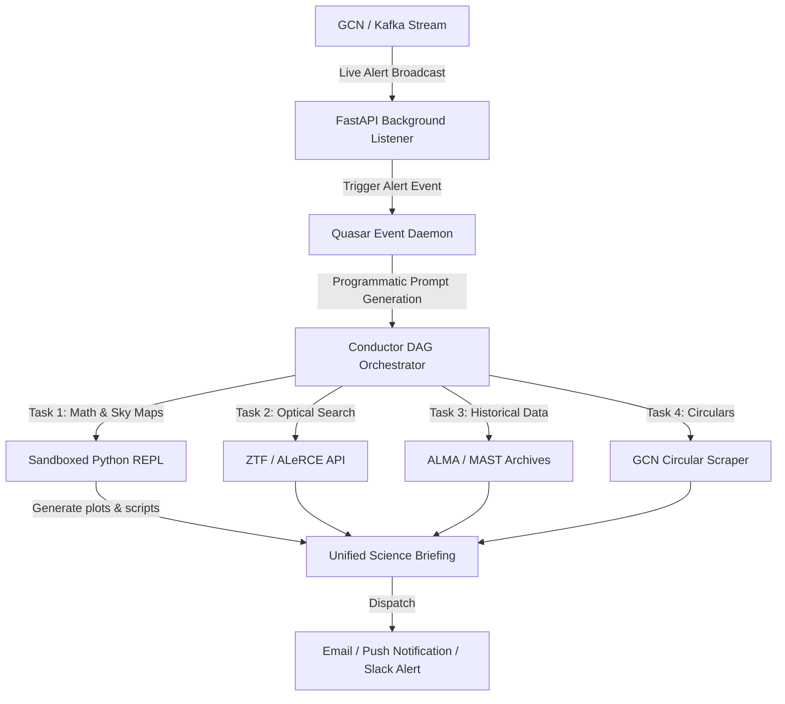

# Quasar Expansion Roadmap: Autonomous Multi-Messenger & Future Moats

This document serves as the strategic and technical roadmap for transforming **Quasar** from a passive, request-response ALMA archive search assistant into an active, event-driven **Autonomous Multi-Messenger Command Center**.

---

## 1. The Multi-Messenger Event-Driven Core

In the modern time-domain era, discoveries are made in seconds. Quasar's architecture is uniquely positioned to automate the high-pressure coordination that occurs immediately after extreme cosmic events.

### A. Real-Time Alert Types & Automated Pipelines

Besides Gravitational Waves (GW), several other cosmic triggers emit public real-time alerts (via Kafka and NASA GCN). Quasar can listen to these and trigger downstream automated workflows:

| Trigger Source | Alert Type | Quasar Automated Actions |
| :--- | :--- | :--- |
| **LIGO/Virgo/KAGRA** | Gravitational Waves (GW) | 1. Parse 3D sky map contours.<br>2. Query ZTF brokers for optical counterparts.<br>3. Plot Chirp Mass vs. Distance against the GWTC catalog in the REPL.<br>4. List active follow-ups from NASA GCN Circulars. |
| **IceCube / KM3NeT** | High-Energy Neutrinos | 1. Map the neutrino directional cone.<br>2. Search the **Fermi LAT 4FGL** catalog for known gamma-ray blazars.<br>3. Check ALMA archives for recent baseline/flaring measurements at those positions. |
| **Fermi / Swift** | Gamma-Ray Bursts (GRBs) | 1. Query **ZTF** and **Pan-STARRS** to search for rapid optical afterglow decay.<br>2. Compile a ready-to-run **CASA script** for ALMA target-of-opportunity (ToO) observations. |
| **CHIME / ASKAP** | Fast Radio Bursts (FRBs) | 1. Extract the **Dispersion Measure (DM)**.<br>2. Run a REPL script to calculate estimated distance/redshift ($z$).<br>3. Match coordinates with the NED and SIMBAD archives to identify the candidate host galaxy. |

---

## 2. Technical Architecture for GCN Daemon

To make this fully autonomous, Quasar would transition to a **reactive event-driven model** by implementing a background daemon within the FastAPI backend (`ui-pro/api/main.py`).



### Conceptual Implementation Steps

1. **GCN/Kafka Listener (`services/gcn_listener.py`):**
   A background process running within FastAPI that subscribes to GCN Kafka streams (`igwn.gwalert`, `nasa.gcn`):
   ```python
   # services/gcn_listener.py
   from gcn_kafka import Consumer
   
   async def start_listening():
       consumer = Consumer(client_id='quasar-client', client_secret='...')
       consumer.subscribe(['igwn.gwalert'])
       while True:
           for message in consumer.consume(timeout=1.0):
               alert = json.loads(message.value())
               await handle_alert(alert)
   ```

2. **Automated Conductor Dispatch:**
   The listener automatically triggers a `Conductor` workflow using a structured template:
   ```python
   async def handle_alert(alert):
       event_id = alert["superevent_id"]
       prompt = f"Automate follow-up for GW alert {event_id}. Match ZTF optical transients, plot chirp mass and distance in the REPL, and summarize GCN Circulars."
       # Dispatch directly to the QuasarAgent workflow loop
       await agent.execute_workflow(prompt)
   ```

3. **ZTF Coordinate Cross-Matching via ALeRCE / Lasair REST APIs:**
   You don't need heavy raw data files; you can run extremely fast coordinate queries against transient brokers:
   ```python
   # integrations/ztf_client.py
   import requests
   
   def search_ztf_transients(ra: float, dec: float, radius_arcsec: float = 360):
       url = "https://api.alerce.online/catshtm/v1/cone_search"
       params = {"ra": ra, "dec": dec, "radius": radius_arcsec, "catalog": "ztf"}
       return requests.get(url, params=params).json()
   ```

---

## 3. The 4 Core Feature Moats (Building What Lium Structurally Cannot)

These four ideas deepen Quasar’s open-source moat and leverage its biggest strengths: the **Sandboxed REPL**, **instrument-specific depth**, and **academic community lock-in**.

### Idea A: The "Rubin / LSST Alert Filter"
*   **The Context:** The Vera C. Rubin Observatory (LSST) will generate **10 million alerts every single night**. Astronomers are terrified of getting drowned in noise.
*   **The Feature:** A natural-language filter compiler.
*   **How it works:** An astronomer types: *"Alert me if a new transient is detected that is rising faster than 0.5 magnitudes per day, has a high BNS/NSBH probability, and lies within 100 Mpc."* Quasar parses this into a Python function, registers it with alert streams, filters incoming events, and emails a beautifully rendered PDF/Markdown briefing of target candidates.

### Idea B: "FITS-Agent" — Conversational FITS Cubes
*   **The Context:** Downloading 10GB raw ALMA/MAST data files just to check data quality or line coverage is painful and slow.
*   **The Feature:** Inspect and manipulate FITS cubes conversationally.
*   **How it works:** Point Quasar to a FITS file. Using `astropy.io.fits` inside the Sandboxed REPL, Quasar can inspect headers, extract slice statistics, and render custom plots:
    *   *User:* *"Plot the velocity profile of the CO(2-1) line from this cube."*
    *   *Quasar:* (Writes the python extraction script, slices the data cube, runs the calculations, and returns a high-resolution matplotlib spectral profile plot directly in the chat).

### Idea C: Classroom Notebook Generator (The Academic "Trojan Horse")
*   **The Context:** In academia, the tool taught to students in grad school always wins long-term (e.g., NumPy/Matplotlib replacing MATLAB).
*   **The Feature:** Automated generation of structured Jupyter Notebook lab assignments for university courses.
*   **How it works:** A professor types: *"Generate an undergraduate lab assignment on measuring the expansion rate of the Crab Nebula using archival ALMA data."* Quasar automatically generates a complete, runnable `.ipynb` file featuring introductory text, `astroquery` templates, placeholder plotting cells, and a hidden Solutions Manual for the professor.

### Idea D: The "Science Review Consensus" Agent
*   **The Context:** Reviewing past literature to compare parameters (e.g., dust-to-gas ratios or star-formation rates) is one of the most time-consuming parts of writing a paper.
*   **The Feature:** Automated literature extraction and synthesis.
*   **How it works:** The user asks: *"Build a comparison table of gas-to-dust ratios measured in the Taurus star-forming region from recent papers."* Quasar queries NASA ADS, fetches the full text of the top 10 papers (via the arXiv PDF extractor), parses their text/tables, and outputs a synthesized comparative matrix showing paper name, target stars, gas-to-dust ratios, methods, and points of agreement/conflict.

---

## 4. Immediate Development Roadmap for Quasar

To execute these features step-by-step, the development sequence will be structured as follows:

```
[Phase 1: GCN Daemon & ZTF] ──► [Phase 2: Conversational FITS] ──► [Phase 3: Classroom & Review Agents]
      (Weeks 1-2)                      (Weeks 3-4)                           (Weeks 5-6)
```

1.  **Phase 1: Real-time Multi-Messenger Triggers**
    *   Install `gcn-kafka` dependency.
    *   Implement `services/gcn_listener.py` and run it as an asynchronous background task in `ui-pro/api/main.py`.
    *   Build the ALeRCE/Lasair REST integration under `integrations/ztf_client.py`.
    *   Add a mathematical parameter parser (e.g. Chirp Mass calculators) to `services/gcn_monitor.py`.
2.  **Phase 2: Conversational FITS Slicing**
    *   Add a FITS coordinate parser tool to the core agent registry.
    *   Define REPL templates for loading and slicing remote FITS files using `astropy`.
3.  **Phase 3: The Academic Flywheel**
    *   Integrate structured Jupyter Notebook output formats to the export endpoint.
    *   Expand the RAG system to include university physics and astronomy course curricula to improve classroom notebook generation.
