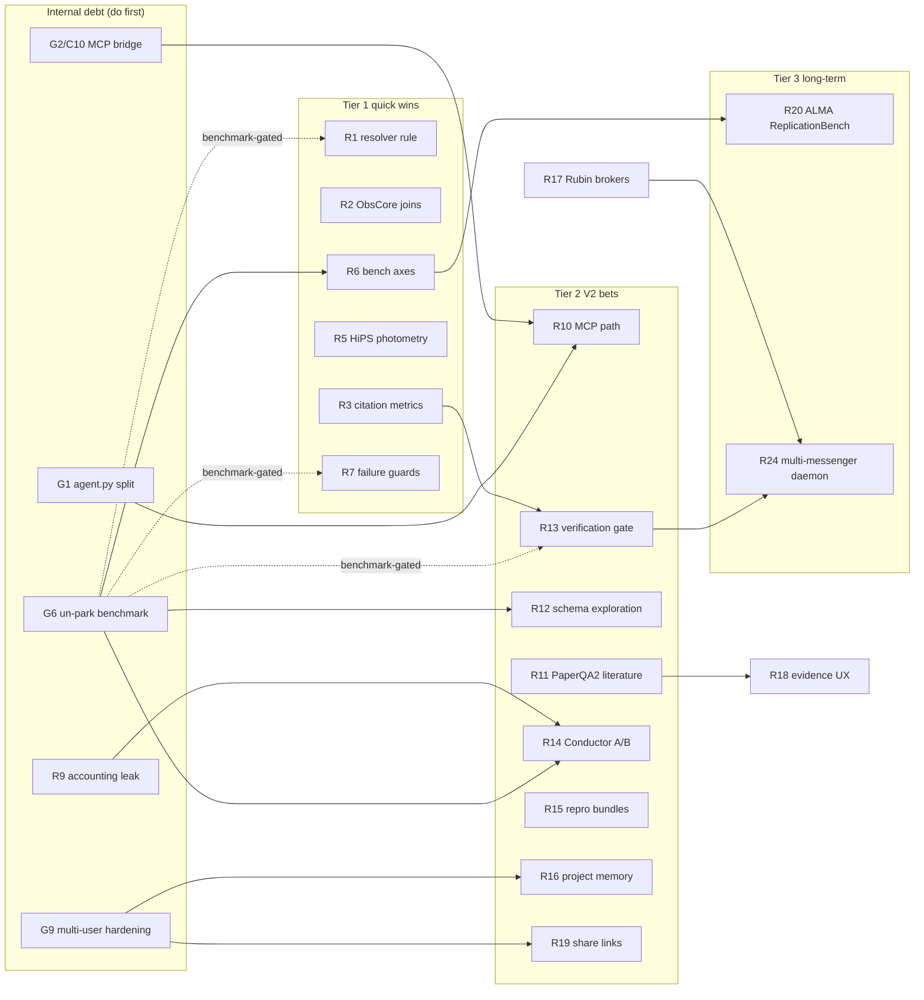
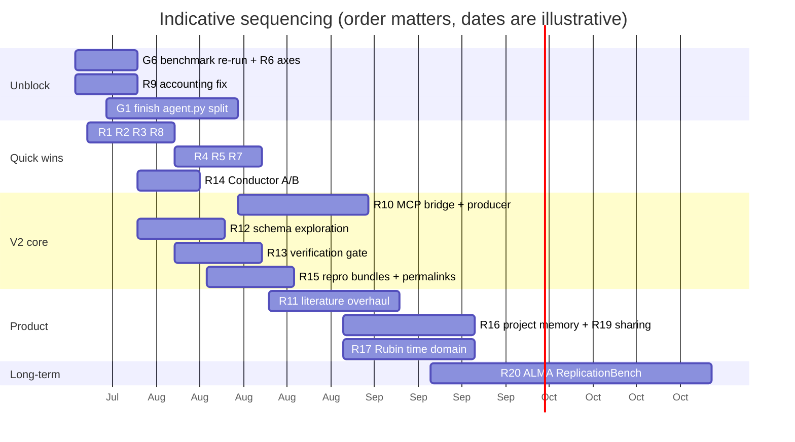

# Quasar Feature & Architecture Roadmap — Evidence-Backed Research Report

**Date:** 2026-07-18
**Scope:** Features, modifications, and architectural improvements for Quasar (AI research assistant for the ALMA science archive; Conductor/DAG multi-agent architecture; V2 redesign in progress; PAI26 paper).
**Method:** Three phases — (1) a full local audit of the working tree; (2) a deep-research pass over the external landscape (104 sub-agent fan-out: 5 search angles → 22 sources fetched → 105 claims extracted → top 25 adversarially verified by 3-vote panels, 23 confirmed / 2 refuted); (3) this synthesis.

**Evidence classes used throughout:**

| Tag | Meaning |
|---|---|
| **[V]** | Claim survived 3-vote adversarial verification against the primary source (highest confidence) |
| **[E]** | Extracted verbatim from a primary source during research, but not adversarially verified (verification budget) |
| **[W]** | Found via targeted web search this session; primary link given, not verified in depth |
| **[A]** | Local codebase/docs audit — file:line references in this repo |

Two claims were **refuted** during verification and must not be relied on: (a) the specific Rubin RSP SIA2/SODA endpoint URLs (`/api/sia/dp1/query`, `/api/cutout`) — 0-3 refuted, re-verify against primary docs before integrating anything beyond TAP; (b) CORE-Bench's original "21% on hardest level" baseline figure — superseded by the corrected CORE-Bench v1.1 ([arXiv:2606.26158](https://arxiv.org/abs/2606.26158)).

---

## Part 1 — Current-system audit

### 1.1 Capability inventory (what Quasar already does)

Authoritative tool count: **151 native tools** across 6 categories (analysis 26, archive 29, datalab 33, general 44, literature 16, mmu_hats 3) — `docs/TOOLS.md`, CI-checked against the registry. **[A]**

**Orchestration** (`core/conductor.py`, `core/task_dag.py`, `core/complexity.py`, `core/recovery.py`, `core/dag_cache.py`):
- Complexity gate (score > 0.7) routes to the Conductor; tiered decomposition budgets (moderate 3 / complex 6 / expert 10 subtasks, `conductor.py:262`).
- LLM decomposition → TaskDAG with cycle detection and adaptive SLA → parallel execution → WorkflowMemory → streaming synthesis → auto-generated Jupyter notebook.
- RecoveryEngine (RETRY/REPLAN/REASSIGN/DECOMPOSE) with predecessor-context root-cause analysis; DAGCache with target re-substitution; human-in-the-loop plan approval for large DAGs (`PlanReviewWidget`).
- Per-request `OrchestrationRun` state (C12 mitigation, `conductor.py:237`); 3-tier ModelRouter cost ladder with health-check failover (`core/model_router.py`).

**Archive & data reach:** ALMA (TAP/ADQL via templates + alminer, DataLink product listing, remote FITS-header triage, QA2 status), MAST/JWST/HST, ESO, IRSA, CADC, NOIRLab Astro Data Lab (33 tools: governed SQL, SIA cutouts/RGB, async jobs + My Tables with per-user namespacing, density/CMD/CCD one-shots, result store), SPARCL spectra (search/plot/**stack**), generic VO (registry discovery → tables → describe → guarded ADQL → cone), Splatalogue + vacuum line lists, SVO filters, ATNF pulsars, ALeRCE/ZTF alerts + stamps, TESS/Kepler light curves + period search, JPL Horizons, SkyBoT moving-object check, NED/SIMBAD resolution + NED SED/distances, Gaia Bailer-Jones distances, galactic extinction, MOC coverage/footprints, hips2fits multi-survey imagery, VLASS epochs + blink comparison, MMU/HATS (lsdb + HuggingFace), CDS xmatch. **[A]**

**Analysis:** FITS render/moment maps/spectrum extraction/Gaussian line fit, WCS-aligned overlays, photutils source detection + aperture photometry, region statistics, PV slices, RGB composites, radio SED + spectral-index fit, cube workbench, sensitivity/beam/redshift/coordinate calculators, sandboxed REPL (`core/sandbox.py`). **[A]**

**Literature:** ADS QueryBuilder (NL → ADS syntax), OpenAlex enrichment (h-index, FWCI, funding, OA PDFs), consensus evaluation across top-cited abstracts, literature-to-code, paper-detail extraction/reproduction, proposal red-team critic, citation verifier, observation↔paper graph UI. **[A]**

**Platform:** multi-provider LLM routing + BYOK (`services/provider_key_service.py`), cost accounting + usage quotas + admin rollups (`services/model_pricing.py`, `usage_quota_service.py`), **raw-query provenance surface** (Phase 0 landed: `core/provenance.py` `build_tool_request`/redaction/`persistable_trace`, `QueryProvenance.tsx`), Langfuse tracing, eval mode with per-block star ratings + export (`services/eval_export_service.py`), DataLabBench (15 questions, partial-credit rubrics, BENCH_VERSION 1.1), reproducible notebook export, gallery, Spectral Line Explorer, Aladin Lite sky view, Telegram/WhatsApp channels, Qdrant RAG over uploads (BM25+RRF hybrid, recency rank), mem0-style long-term memory (`services/memory_service.py`), background session summarizer (`core/session_memory.py`), standing ZTF sky-monitor watchlist, hardened auth (httpOnly cookie + CSRF middleware + rate limiting). **[A]**

### 1.2 Gaps list (from the audit — sharpened the research questions)

| # | Gap | Where / status |
|---|---|---|
| G1 | **V2 monolith split incomplete** — `core/agent.py` still 5,407 lines (gate < ~1,500); ~40 inline `function=self._*` registrations left (web/Tavily, MMU/HATS, live imaging, lightcurves, SPARCL, feature-rollout tools); `core/runner.py`/`core/router.py` extraction partial | `docs/v2/STATUS.md` P1 |
| G2 | **MCP path (P2) unstarted; client bridge broken** — new event loop per call (C10, `agent.py` ~505), per-user stdio spawns; no FastMCP producer adapter; MANNA consumption blocked on this + hosting (D8: Render 2 GB can't co-host) | `docs/v2/MCP_IMPLEMENTATION_PLAN.md` |
| G3 | **Conductor escapes cost accounting** — thread-local LLM context lost when `core/runner.py:948` / `conductor.py:980` spawn threads → complex turns bypass quota, BYOK routing, and token/cost recording (guard-review CX-01, waived-but-open) | `tmp/codex/memory.md` 2026-07-16 |
| G4 | Mixed priced/unpriced turns reported as fully priced; daily-cap check non-atomic (accepted as soft) | same review |
| G5 | **Provenance doesn't capture executed ADQL on the common ALMA paths** (position/target/frequency via `SearchService` don't update `alma_tap_provenance`); `service` string redaction still shallow (CX-02 contest) | guard review 2026-07-16 |
| G6 | **Benchmark parked** — baseline 65.5 @ `650c354`; every migration since is unit+boot-verified only; publication numbers need a re-run (BENCH_VERSION 1.1 broke comparability with pre-Jul-11 numbers) | `docs/v2/STATUS.md` |
| G7 | Whole-dir `pytest tests/unit/` not isolation-clean and never exits (CI-affecting); no Conductor complex-query smoke test | STATUS "Testing debt" |
| G8 | Open correctness issues: C14 (ALminer thread race), C18 (`all_sky` truthiness → unbounded scan on string "false"), C10 (above) | `docs/v2/OPEN_ISSUES_AND_TODOS.md` |
| G9 | **Multi-user is single-tenant at heart** — job/table ownership was only recently added; `memory_service` defaults `user_id="user"`; no team/sharing features at all | audit |
| G10 | Memory = per-fact vector recall + session summary; no project-level research memory, no temporal model | `services/memory_service.py` |
| G11 | CASA absent in deployment (`analyze_uv_coverage` → typed `casa_unavailable`); CARTA integration is a stub (`integrations/carta.py`) | audit |
| G12 | High-energy tier 0% built, GW 29%, per the (older) feature ledger; multi-messenger daemon is a design doc only | `docs/FEATURES.md`, `docs/multi_messenger_roadmap.md` |
| G13 | Session export = notebook export only; no query permalinks, no shareable read-only session links | audit |
| G14 | Eval mode/ratings just landed but with known wedge cases (failed-turn gate, CX-01/02 REOPEN) | guard review 2026-07-17 |

---

## Part 2 — External landscape: verified findings

### 2.1 Competitors & adjacent tools

- **No displacing competitor exists; each neighbor is an adoptable feature.** The verified landscape shows nothing that combines agentic archive querying with literature synthesis the way Quasar does. **[V]** (deep-research synthesis)
- **Pathfinder** (Iyer et al. 2024, ApJS 275, 38; [arXiv:2408.01556](https://arxiv.org/abs/2408.01556)): semantic literature search over 350k ADS papers; its directly adoptable feature is **explicit time-based and citation-based weighting** in retrieval to handle jargon/named-entity/recency issues. Also offers audience-adaptive reformatting and research-landscape visualization **[V]**; deployed live at pfdr.app **[E]**. A 2024 survey paper notes domain tools like AstroLLaMA/pathfinder train on **abstracts only** — full-text RAG is a differentiator Quasar already has for uploads **[E]**.
- **AstroSage-Llama-3.1-8B** ([arXiv:2411.09012](https://arxiv.org/abs/2411.09012); Sci. Rep. 15, 13751): 80.9% on AstroMLab-1, on par with GPT-4o (late-2024 reference), best-in-class at 8B, open weights — but **no tool use**. The gap is symmetric: they lack Quasar's agentic layer; Quasar lacks a cheap domain-specialized model tier. **[V]** (Caveat: benchmark authored by the same collaboration.)
- **PaperQA2** (FutureHouse, [arXiv:2409.13740](https://arxiv.org/abs/2409.13740)): the reference architecture for citation-grounded literature agents — agentic toolset (Paper Search; **Gather Evidence with LLM re-ranking + contextual summarization (RCS)**; Generate Answer; **Citation Traversal** over the citation graph). LitQA2: 85.2% precision vs 73.8% human annotators (p=0.0036) at matching accuracy. **[V]** Ablations: hard-coded action sequences and removing RCS both significantly hurt accuracy **[E]**. Also does at-scale **contradiction detection** (2.34/paper, 70% expert-validated) **[E]**. Caveats: self-evaluated on their own benchmark; Citation Traversal disabled by default in some releases.
- **ADS → SciX transition:** 2026 is the astronomy-community transition year to SciX, which is explicitly investing in AI/ML/LLM features over 20M+ records ([SciX what's-new](https://scixplorer.org/scixhelp/whats_new/); [ADS blog](https://ui.adsabs.harvard.edu/blog/scix)). Watch `integrations/ads_client.py` API compatibility. **[W]**
- **ALMA's own archive is moving up the stack:** the ASA team deployed **content-based morphological image-similarity search** in the archive UI (claimed first in any science archive; self-supervised contrastive embeddings; iterative multi-image refinement UX) and frames content-based search as the next frontier ([arXiv:2511.17061](https://arxiv.org/abs/2511.17061)). The archive milestone paper also ships text-similarity search, SIMBAD/NED object types, in-browser previews with tentative line ID, and notebook tutorials ([arXiv:2208.03275](https://arxiv.org/abs/2208.03275)). **[E]**
- **Astronomy MCP ecosystem exists now:** `astro_mcp` (DESI + 40+ astroquery services via natural language, [github.com/SandyYuan/astro_mcp](https://github.com/SandyYuan/astro_mcp)); an astrophysical-RAG MCP server with FAISS semantic search ([arXiv:2607.03946](https://arxiv.org/abs/2607.03946)); plus your own [ALMA_MCP](https://github.com/adamzacharia/ALMA_MCP). Validates the P2 MCP direction and the "mesh" topology in D3. **[W]**

### 2.2 Archive/data capabilities not yet exploited

- **ALMA TAP is the officially documented, ObsCore-conformant surface** (astroquery.alma `query()`/`query_tap()`), with a concrete schema-grounding rule to encode: **source-name queries must go through a name resolver, not string-match the PI-entered `target_name`** ("Only in very special occasions…" — official ALMA notebook nb8). **[V]** The ObsCore table exposes ~63 queryable columns incl. `sensitivity_10kms`, `science_keyword`, `pub_title`, `bib_reference` — enabling sensitivity-driven discovery and archive↔literature cross-linking **[E]**. astroquery.alma churns; pin versions **[E]**.
- **HiPS is science-grade, not just visualization:** Giordano et al. 2025 (A&A 703, A194; [arXiv:2510.09533](https://arxiv.org/abs/2510.09533)) ran automatic 10-band aperture photometry on 323 HRS galaxies from HiPS FITS maps and matched expert manual photometry to a few percent in 9/10 bands. **[V]** Hazards: PACS 100 µm map had a systematic (0.93–3.87× ratio) from mixed pixel scales; HiPS `properties` metadata often lacks units/PSF/filter identity, so calibration must be supplemented per survey and reliability validated **per map**. **[V/E]**
- **Rubin/LSST:** RSP exposes IVOA TAP for DP1 at `https://data.lsst.cloud/api/tap`, usable by any TAP client — but requires **per-user tokens tied to data-rights accounts** (BYOK-style), unlike anonymous ALMA/NOIRLab TAP. **[V]** **Seven full-stream alert brokers** (ALeRCE, AMPEL, ANTARES, Babamul, Fink, Lasair, Pitt-Google) receive the complete stream, live since Feb 2026; **Quasar's existing ALeRCE client is already one of the seven integration points**. Alerts are fully public, no proprietary period; ANTARES will serve ~20 Rubin-maintained curated filters. **[V/E]** ([rubinobservatory.org brokers page](https://rubinobservatory.org/for-scientists/data-products/alerts-and-brokers)) — the RSP protocol stack *beyond* TAP was refuted as stated; re-verify.
- **CARTA is scriptable but is infrastructure, not a library:** carta-python drives a running backend (`--enable_scripting`) that proxies to a browser-rendered frontend over websocket; documented headless-browser sessions can load cubes, act, and save output. Experimental, POSIX-only, low recent activity (last PyPI 1.3.3, 2023-12). **[V/E]** ([carta-python docs](https://carta-python.readthedocs.io/en/latest/introduction.html))
- **Archival demand is quantified:** ~40% of ALMA refereed publications used archival data by 2024; ~30% of observed projects remain unpublished (a discovery reservoir); 4,190 refereed pubs / 169,985 citations / >9,400 unique authors 2012–2024; ALMA publications carry the highest impact factor among major facilities. **[E]** ([arXiv:2601.16687](https://arxiv.org/abs/2601.16687)) The 2023 US Decadal + ESA analyses find archival publications now **outnumber** PI-team publications with comparable citation impact. **[E]**

### 2.3 Agentic techniques

- **ReplicationBench** ([arXiv:2510.24591](https://arxiv.org/abs/2510.24591)): first paper-scale expert-validated astrophysics research benchmark (111 expert tasks / 20 papers + 58 curated / 11 more). Best agent (Claude 4.5 Sonnet) ≈ **22%**; best-of-N 0.39 vs 0.22 single-pass. **Three dominant failure modes** — (1) premature give-up falsely citing compute limits, (2) conceptual/domain-knowledge omissions, (3) technical execution failures on domain deps + legacy astronomy formats. Scores on two axes: **faithfulness** and **correctness**, tasks co-developed with original authors. **[V]** Authors argue astrophysics is the ideal agent domain *because* it is archival-data-driven — Quasar's exact thesis. **[E]**
- **ScienceAgentBench** (ICLR 2025, [arXiv:2410.05080](https://arxiv.org/abs/2410.05080)): ~one-third ceiling holds (32.4% best independent; HAL leaderboard mid-2026 still ~30–33%). Most relevant single result for Quasar: **Claude-3.5-Sonnet with a simple self-debug loop solved 10.8 pp MORE tasks than the full OpenHands CodeAct framework at 17× lower API cost**; authors: "LLM-based agents do not always benefit from a large action space with complex tools." Analogical (CodeAct ≠ DAG orchestrator; no astronomy discipline in the four), but it demands measurement: does the Conductor earn its cost per task class? Also: hallucinated domain-API usage is a key failure mode → schema grounding + output verification. o1-preview self-debug hit 42.2% at >10× cost — a model-routing data point. **[V/E]**
- **CORE-Bench** ([arXiv:2409.11363](https://arxiv.org/abs/2409.11363)): 270 computational-reproducibility tasks; a third reusable eval template — **use corrected v1.1** ([arXiv:2606.26158](https://arxiv.org/abs/2606.26158); 15 task errors + ~20 shortcut-exploitable Hard tasks; Hard split has saturated). **[V]**
- **Text-to-SQL state of the art** — APEX-SQL (KDD '26, [arXiv:2602.16720](https://arxiv.org/abs/2602.16720)): replaces static schema prompting with **agentic exploration** (execute exploratory SQL against real data before final generation): +18.33 pp execution accuracy for DeepSeek-V3.2 over execution-guided refinement alone; gains scale with base-model strength; schema linking via hypothesis verbalization → dual-pathway pruning → parallel data profiling → join-path synthesis. Evidence that **self-refinement on errors alone is insufficient — active data inspection wins**. **[E]**
- **Memory systems:** Mem0 and Zep are memory *layers* (bolt onto the Conductor); Letta ships its own runtime (would compete). Mem0 supports **Qdrant** as a backend (already deployed in Quasar). Zep builds a temporal knowledge graph (Graphiti). Write latencies: Mem0 ~80–200 ms async / Zep ~300–800 ms graph extraction. Multi-user memory **must be namespaced per user/tenant** to prevent cross-user leakage. **[E]** (vendor-adjacent blog; treat numbers as indicative)

### 2.4 Product/UX patterns

- **Citations must be mechanically verified, not just attached:** human evaluation of four generative search engines found only **51.5% citation recall** (sentences fully supported) and **74.5% citation precision** (citations actually supporting their sentence); fluent answers create a "facade of trustworthiness." The paper's recall/precision pair is a ready-made audit framework. **[E]** ([arXiv:2304.09848](https://arxiv.org/abs/2304.09848))
- **Elicit's provenance UX:** every AI answer carries **supporting quotes + explanation** for verification against the source; five-stage decomposed review workflow, each stage independently re-runnable; CSV export per stage; "living reviews"; **shareable view-only links + real-time team collaboration** on paid tiers. **[E]** ([elicit.com blog](https://elicit.com/blog/systematic-review/))
- **PaperQA2's evidence-summary model** is the strongest verified trust pattern for AI science claims (per §2.1). **[V]**

### 2.5 What astronomers want

- **A 2024 study of 13 astronomers + survey data** ([arXiv:2409.20252](https://arxiv.org/abs/2409.20252)): 74% use LLMs at least several times weekly; dominant uses are **coding (92%) and writing (72%)**; **83% believe LLMs will become integral to science but only 42% think the influence is good and only 48% are satisfied** — demand paired with a trust gap. Hallucinated citations are the dominant failure (GPT-3.5 fabricated ~98%, GPT-4 ~20%). Core recommendation: **mandatory human-in-the-loop fact-checking**; explicit warning against delegating proposal review (GPT-4 rated all four test ESO proposals "excellent"). **[E]** — directly relevant to `services/proposal_critic.py` framing: keep it as red-team assistant, never as a grader.
- **Archive-first science is the growth mode** (§2.2 demand numbers) and ALMA archive development is explicitly steered by recurring user surveys ([arXiv:2208.03275](https://arxiv.org/abs/2208.03275)). **[E]** The detailed pain-point reports (ALMA user-survey full reports, ADASS XXXV proceedings) were not retrievable this pass — flagged as an open question.

---

## Part 3 — Roadmap

Legend: Effort **S** (≤ ~1 day), **M** (days–2 weeks), **L** (multi-week). Impact ★–★★★. Every item names the evidence and the concrete modules it touches.

### Tier 1 — Quick wins

#### R1. Encode the ALMA name-resolver rule into text-to-ADQL grounding — S ★★★
- **What:** Make "resolve names via SIMBAD/NED, never string-match `target_name`" an enforced rule in ALMA query paths and prompt/schema docs; add a `target_name`-match escape hatch flagged as such.
- **Evidence:** Official ALMA guidance, verified 3-0. **[V]**
- **Fit:** `capabilities/alma.py` already routes through `resolve_target`/`_resolve_target` in most paths — audit the stragglers (the *dead* positional fallback quirk pinned in the module docstring is exactly this bug class); add the rule to `services/archive_profiles/alma.py` so the schema projection teaches the model.
- **Risk:** none; behavior-preserving where resolution already happens. Fixing the dead fallback is a behavior change → benchmark-gate it (it's already logged).

#### R2. Sensitivity-driven ALMA discovery + archive↔literature cross-links — S/M ★★★
- **What:** Two tool upgrades: (a) expose `sensitivity_10kms`-constrained search ("find archival data sensitive enough to detect X"); (b) join `pub_title`/`bib_reference` ObsCore columns to the papers family — "which publications used this MOUS?" and inverse "which archived data did this paper use?".
- **Evidence:** ~63 ObsCore columns incl. these fields **[E]**; archival-reuse demand (~40% of ALMA pubs) **[E]**; the observation↔paper graph UI already exists to display it **[A]**.
- **Fit:** `capabilities/alma.py` `query_alma_science_archive` templates + `services/alma_science_queries.py`; papers side in `capabilities/papers.py` (`search_papers_by_observation_identifier` already exists — extend to the reverse direction with a TAP `bib_reference` lookup). Feed `ObservationPaperGraph.tsx`.
- **Risk:** column semantics need checking against the live ObsCore table (63-column claim is unverified detail).

#### R3. Citation recall/precision audit on Quasar's own answers — S/M ★★★
- **What:** Adopt the two-metric verifiability framework: for each synthesized answer, measure (a) fraction of claim-sentences supported by a tool result or citation (recall) and (b) fraction of attached citations that actually support their sentence (precision). Surface both in eval mode; add to DataLabBench scoring.
- **Evidence:** 51.5%/74.5% industry numbers **[E]**; astronomers' #1 LLM complaint is fabricated citations **[E]**; PaperQA2 shows precision is winnable **[V]**.
- **Fit:** `services/citation_verifier.py` + `services/evidence_quality.py` exist; wire into `core/runner.py` synthesis finalization (`_append_citation_warning` in `core/conductor.py` is the hook on the DAG path) and into `Benchmark/datalabbench` rubrics.
- **Risk:** LLM-judged support adds cost; sample or gate on eval mode.

#### R4. Pathfinder-style time/citation weighting in literature ranking — S/M ★★
- **What:** Add recency and citation-count weighting to RAG and ADS result ranking (configurable; default gentle).
- **Evidence:** Pathfinder's core retrieval feature, verified. **[V]**
- **Fit:** `services/rag_service.py` already has `_build_recency_rank` and RRF fusion — extend RRF with a citation-rank list built from OpenAlex `cited_by_count` (already fetched in enrichment, `integrations/openalex_client.py`); ADS-side, `ADSQueryBuilder` can emit `useful()`/`trending()` operators it already knows.
- **Risk:** recency bias vs. classic-paper recall; make the weight query-conditional (Pathfinder's approach).

#### R5. HiPS/hips2fits photometry with per-survey validation guard — M ★★★
- **What:** New tool `hips_aperture_photometry`: multi-band aperture photometry from HiPS FITS cutouts with uncertainty estimates, a **per-survey validation table** (start with the 9 Giordano-validated maps), a known-bad list (PACS 100 µm), and a hard "≲10% accuracy" caveat in every result.
- **Evidence:** Peer-reviewed few-percent agreement in 9/10 bands **[V]**; metadata insufficiency (units/PSF/filter) requires supplemented calibration **[E]**.
- **Fit:** composes three existing services: `services/hips_images.py` (FITS cutout fetch), `services/image_analysis.py` (photutils apertures), `services/plotting.py`. Register in `core/tool_registrations.py` as an analysis tool; provenance via the existing `build_tool_request` sidecar.
- **Risk:** hips2fits adds a reprojection step the paper didn't validate — say so in the result; validate against a few SDSS/2MASS reference fluxes before shipping.

#### R6. Adopt the faithfulness/correctness two-axis rubric in DataLabBench — S ★★
- **What:** Split each rubric score into faithfulness (did the agent do what was asked, the right way) and correctness (are the numbers right), matching ReplicationBench; add a fabrication penalty axis (already a P4 plan item).
- **Evidence:** ReplicationBench rubric design, verified **[V]**; your own P4 checklist **[A]**.
- **Fit:** `Benchmark/datalabbench/dlb_dataset_v1.py` rubric fields + `run_datalabbench.py` scorer. Do it **together with the pending benchmark re-run** (G6) so the new axes get a baseline in the same pass.
- **Risk:** breaks comparability again — you already took that hit at BENCH_VERSION 1.1; bundle as 1.2 once.

#### R7. Failure-mode guards from ReplicationBench in the RecoveryEngine — S/M ★★
- **What:** Target the three verified failure modes: (1) detect premature give-up ("cannot due to computational limits" style answers trigger a REPLAN with an explicit budget statement); (2) a domain-checklist prompt for synthesis (units, frames, cosmology params); (3) legacy-format robustness tests (old FITS conventions) in the tool test suite.
- **Evidence:** the three failure modes, verified 3-0. **[V]**
- **Fit:** `core/recovery.py` `_check_soft_failure` gains a give-up classifier; `core/prompts/` synthesis prompt gains the checklist; tests beside `tests/unit/test_image_analysis_tools.py`.
- **Risk:** false-positive give-up detection re-running expensive DAGs; cap at one retry (SLA machinery already exists).

#### R8. SciX API watch + compatibility shim — S ★
- **What:** Verify `integrations/ads_client.py` against the SciX API before the end-of-2026 astronomy transition; abstract the base URL/auth now.
- **Evidence:** 2026 transition year; AI features incoming. **[W]** ([scixplorer.org](https://scixplorer.org/scixhelp/whats_new/))
- **Risk:** none; an hour of insurance against a breaking migration.

#### R9. Close the Conductor cost-accounting leak — M ★★★ *(internal, but it gates the cost-transparency story)*
- **What:** Propagate the LLM request context into Conductor/executor threads (pass a context object explicitly into `_run_one`/executor submission instead of relying on `threading.local`), so complex turns hit quota, BYOK routing, and per-turn accounting like simple turns.
- **Evidence:** guard-review CX-01 (BLOCKER, twice-contested) **[A]**; cost transparency is a trust feature per the UX research (§2.4).
- **Fit:** `core/llm_client.py:347` `_record_usage`, `core/runner.py:948`, `core/conductor.py:980`; `contextvars` (which propagate into threads when copied explicitly) or a plumbed-through ctx dict.
- **Risk:** touchy concurrency surface — this is the kind of diff to `@cx-guard` with the unit gate from `test_cost_accounting.py`.

### Tier 2 — V2-aligned bets

#### R10. Finish the MCP path (consumer first), join the astronomy MCP mesh — M/L ★★★
- **What:** Exactly the existing P2 plan, now externally validated: fix the client bridge (one long-lived loop + `run_coroutine_threadsafe`, pooled sessions, `{server}__{tool}` namespacing), then the FastMCP producer over `capabilities/` (schemas derive from the same pydantic `InputModel`s — no drift). Consume MANNA when its URL exists; test against local `ALMA_MCP`.
- **Evidence:** ecosystem now real: `astro_mcp` (40+ astroquery services), astro-RAG MCP ([arXiv:2607.03946](https://arxiv.org/abs/2607.03946)), your ALMA_MCP **[W]**; internal plan + acceptance test already written **[A]** (`docs/v2/MCP_IMPLEMENTATION_PLAN.md`).
- **Fit:** designed for; the capabilities layer was built to be dual-mounted. Keep production on native tools (Render 2 GB, D8) — producer is for Claude Desktop/STABLE/partners, consumer is for MANNA + third-party servers like astro_mcp (instant access to astroquery modules Quasar hasn't wrapped).
- **Effort:** M for the bridge fix + local producer; L to production-host a server (Cloud Run/Modal per D8).
- **Risk:** double-implementation drift if capabilities aren't finished migrating first (G1) — sequence after the remaining ~40 inline registrations move.

#### R11. PaperQA2-ify the literature family — M/L ★★★
- **What:** Three upgrades to `capabilities/papers.py`: (a) **Gather-Evidence stage** — retrieve chunks, LLM re-rank + contextually summarize (RCS) before answering; (b) **Citation Traversal** — expand candidate sets through the ADS/OpenAlex citation graph (references + citations of top hits) as hierarchical indexing; (c) **contradiction detection** as an explicit tool ("find disagreements in the literature on X") — the consensus evaluator already collects per-paper stances, so this is an extension, not a rebuild.
- **Evidence:** PaperQA2 architecture + ablations (agentic loop and RCS each significantly beat their removal) **[V/E]**; contradiction detection 70% expert-validated **[E]**.
- **Fit:** `evaluate_consensus` (stance collection exists), `integrations/ads_client.py` (`reference`/`citations` endpoints), `integrations/openalex_client.py` (`referenced_works`). The Conductor gives the agentic loop for free — model it as a DAG template rather than a new agent framework.
- **Risk:** token cost of RCS on many chunks — reuse the ModelRouter's cheap tier for summarization (PaperQA2 does the same).

#### R12. Agentic schema exploration for text-to-ADQL/SQL — M ★★★
- **What:** Before final query generation on unfamiliar tables, let the agent run cheap exploratory probes (`SELECT TOP 5 …`, `COUNT(*)`, min/max of filter columns) against real data, then generate. Add a bounded "exploration budget" (e.g., 3 probes) to Data Lab and VO ADQL flows.
- **Evidence:** APEX-SQL: +18 pp over execution-guided refinement alone; "active data inspection" is the multiplier; gains scale with model strength **[E]**; ScienceAgentBench's hallucinated-API failure mode **[V]**.
- **Fit:** you're 80% there: `services/archive_profiles/` (schema projections with authored examples), `services/datalab_sql_policy.py` (guarded SELECT-only makes probes safe), `datalab_describe_table`/`vo_describe_table`. What's missing is the *loop*: a probe-then-generate pattern in the capability or a Conductor sub-DAG, plus prompt guidance that probing is expected. Log probes in provenance as `exploration` steps.
- **Risk:** latency (+2–3 round trips) — gate on "table not in registry / first use this session"; the registry cache means known catalogs skip it.

#### R13. Answer verification layer on the Conductor synthesis — M/L ★★★
- **What:** A post-synthesis verifier pass: extract numeric/citation claims from the answer, check each against the actual tool-trace results (numbers must appear in or derive from stored results; citations must resolve), flag or repair mismatches before streaming the final block. This operationalizes R3's metrics as a *gate*, not just a score.
- **Evidence:** ReplicationBench/ScienceAgentBench ceiling (~22–33%) argues single-pass output can't be trusted **[V]**; astronomers' trust gap (42% positive) **[E]**; best-of-N nearly doubles ReplicationBench scores (0.39 vs 0.22) — verification is the cheap sibling of best-of-N **[V]**.
- **Fit:** the tool trace already persists structured results (`core/provenance.py` `persistable_trace`, result store rows); `_finalize_answer` in `core/conductor.py` is the hook; simple-path hook in `core/runner.py`. Route the verifier to the cheap model tier.
- **Risk:** adds a synthesis-length LLM call per complex turn; make it tiered (always on Conductor turns, sampled on simple turns) and skip when no numeric claims are present.

#### R14. Measure whether the Conductor earns its cost (orchestration A/B) — M ★★★
- **What:** Instrument per-turn: path taken (Conductor vs simple), tokens, wall-clock, and DataLabBench score; then run the benchmark with the Conductor force-disabled vs enabled per question class. Publish the delta in the PAI26 follow-up — either the DAG wins (great paper claim) or you save money where it doesn't.
- **Evidence:** self-debug beat a full agentic framework by 10.8 pp at 17× lower cost (analogical but pointed) **[V]**; "large action spaces don't always help" **[V]**.
- **Fit:** `core/complexity.py` threshold is already an env-tunable gate; `Benchmark/datalabbench/run_datalabbench.py` needs a `--force-path` flag; telemetry lands in the existing usage tables (after R9, which it depends on for correct Conductor cost numbers).
- **Risk:** none technical; the risk is finding the DAG doesn't pay for moderate-tier queries — which is exactly what the tiered subtask caps were built to mitigate, and a publishable result either way.

#### R15. Session reproducibility: bundles + query permalinks — M ★★★
- **What:** (a) Extend `datalab_export_notebook` to **whole-session export**: every tool call's executed query (now captured by the provenance surface) → one runnable notebook + a `provenance.json` sidecar; (b) **query permalinks** — a signed URL that replays a stored result_id/table view read-only; (c) CSV per data card (partially exists).
- **Evidence:** Elicit's re-runnable stages + CSV-per-step + living reviews **[E]**; ALMA archive treats notebook tutorials as first-class **[E]**; reproducibility demand in archival science (§2.5).
- **Fit:** `services/notebook_gen.py` + `services/eval_export_service.py` + `services/datalab_result_store.py` (results survive restarts; TTL semantics known) + `ui-pro/api/routers/results.py`. The raw-query provenance work (Phase 0, just landed) is the enabler — this is its payoff feature.
- **Risk:** permalink auth design (result ownership is per-user — reuse the job-ownership pattern from S44).

#### R16. Cross-session project memory (Mem0-on-Qdrant or scoped rebuild) — M ★★
- **What:** Upgrade memory from per-fact recall to **project-scoped research memory**: named projects holding target lists, prior query results (result_ids), decisions, and paper sets; injected on session start; strictly namespaced per user.
- **Evidence:** Mem0/Zep are bolt-on layers, Mem0 backs onto Qdrant (already deployed) **[E]**; namespacing is the hard multi-user constraint **[E]**.
- **Fit:** `services/memory_service.py` (currently `user_id="user"` default — fix regardless), `core/session_memory.py` (summaries become project notes), `ui-pro/api/routers/personalization.py`. Vendor lock-in is avoidable: the Mem0 pattern (extract-facts → vector store) is what `memory_service.py` already half-implements; adopt the pattern, not necessarily the dependency.
- **Risk:** memory pollution across projects — require explicit project selection; latency figures in §2.3 are vendor-adjacent, re-measure.

#### R17. Rubin-era time domain: broker breadth + RSP TAP — M/L ★★
- **What:** (a) Point the existing ALeRCE flow at LSST-stream objects (ALeRCE is a full-stream broker — largely config/schema work); (b) add ANTARES's Rubin-maintained curated filters as a "what's interesting now" tool; (c) RSP DP1 TAP through the *existing* `vo_adql_query` with a per-user token slot in `services/provider_key_service.py` (BYOK infra exists).
- **Evidence:** seven full-stream brokers incl. ALeRCE, live Feb 2026 **[V]**; public alerts, curated filters **[E]**; RSP TAP + token auth **[V]**.
- **Fit:** `services/alerce_client.py`, `services/sky_monitor.py` (standing watchlist becomes Rubin-aware), provider-keys UI in `SettingsModal.tsx`.
- **Risk:** the refuted SIA2/SODA endpoint claim — do **not** build image cutouts against guessed RSP endpoints; TAP only until re-verified. Data-rights tokens are user-supplied by definition (matches BYOK posture).

#### R18. Evidence-quote provenance UX on answers — M ★★
- **What:** For literature-grounded claims, attach the supporting quote + one-line explanation (Elicit pattern) behind an expander on `PaperCard`/answer blocks; for archive-grounded claims, the executed query chip (already shipping in `QueryProvenance.tsx`) is the analogue — unify both under one "evidence" affordance per block.
- **Evidence:** Elicit UX **[E]**; PaperQA2 evidence summaries **[V]**; facade-of-trustworthiness finding **[E]**.
- **Fit:** RCS summaries from R11 produce exactly these quote+context pairs; serializer in `ui-pro/api/serializers/data_card.py`; components exist.
- **Risk:** none beyond R11 dependency for the literature half; ship the archive half first.

#### R19. Team/sharing features (view-only session links) — M/L ★★
- **What:** Shareable read-only conversation/report links (auth-scoped, revocable), as the first team feature; full collaborative workspaces deferred.
- **Evidence:** Elicit's shareable artifacts as the differentiating team pattern **[E]**; G9/G13 gaps **[A]**.
- **Fit:** conversations are already persisted server-side (`services/conversation_service.py`); needs a share-token table + a read-only render route in `ui-pro`. Ownership/404-indistinguishability patterns from the S44 job-scoping work apply directly.
- **Risk:** widens the attack surface on a freshly hardened auth layer — treat as a security-reviewed change (`@cx-guard` with `--spec`).

### Tier 3 — Long-term ideas

#### R20. ALMA ReplicationBench: an archive-science eval suite from real papers — L ★★★
- **What:** Build a ~20-task benchmark from published ALMA archival papers (tasks: reproduce a flux, a detection claim, a sample selection) scored on faithfulness+correctness — DataLabBench's big sibling and a publication in itself (fits the PAI26 line and the Codex-benchmarked publication plan).
- **Evidence:** ReplicationBench's method (tasks co-developed with original authors) **[V]**; CORE-Bench v1.1's error-audit lesson: budget for task QA **[V]**; no astronomy-archive agent benchmark exists — first-mover gap **[V]** (absence verified as of the research pass).
- **Fit:** `Benchmark/` harness generalizes (rubric JSON + SSE tool-trace scoring already exist); the ~30%-unpublished-projects reservoir supplies "fresh" tasks no model saw in training **[E]**.
- **Risk:** expert task-validation time is the real cost; the NRAO-astronomer author is uniquely positioned to do this credibly.

#### R21. CARTA as an optional visualization sidecar — L ★
- **What:** A separately-hosted CARTA backend that Quasar drives via carta-python for heavy-cube interactive sessions, embedded or deep-linked from cube results.
- **Evidence:** scriptable headless sessions documented **[V]**; but experimental, POSIX-only, dormant since 2023 **[E]**.
- **Fit:** conflicts with Render 2 GB (same constraint class as D8 — needs its own host); overlaps the in-house `services/cube_workbench.py`, which already covers the common cases.
- **Risk:** high integration cost against a low-activity dependency. **Recommendation: defer**; revisit if users explicitly ask for CARTA parity, and prefer deep-linking a user's own CARTA to files Quasar stages (DataLink URLs) over operating CARTA infrastructure.

#### R22. Domain-specialized cheap model tier (AstroSage-class) — L ★
- **What:** Add an open-weight astronomy model as a ModelRouter tier for knowledge-recall subtasks (definitions, background sections), keeping frontier models for tool orchestration.
- **Evidence:** 8B model ≈ GPT-4o on astronomy Q&A **[V]** (knowledge recall only; benchmark self-authored; late-2024 comparison point); ScienceAgentBench cost data motivates routing **[V]**.
- **Fit:** `core/model_router.py` tiers + `classify_task_type` already exist; the gpt-oss hardening work proved the harness can host open-weight models with care **[A]**.
- **Risk:** the local-LLM tool-calling reliability question is your own open D7; AstroSage would be for *non-tool* subtasks only. Hosting cost vs. marginal savings is unproven — pilot behind a flag.

#### R23. Content-based cutout similarity search — L ★★
- **What:** "Find archive images that look like this" over cutouts Quasar has already fetched/produced: embed (self-supervised or CLIP-class) into Qdrant, iterative multi-select refinement like the ASA UI.
- **Evidence:** ALMA archive shipped it and calls content-based search the next frontier **[E]** ([arXiv:2511.17061](https://arxiv.org/abs/2511.17061)); infrastructure (Qdrant, cutout pipeline) exists **[A]**.
- **Fit:** `services/vector_db.py` + image services; could also *wrap* the ASA's native similarity search if/when it's API-exposed — check that before building embeddings in-house.
- **Risk:** embedding quality on interferometric images is a research problem; the ASA precedent de-risks the concept but not your implementation.

#### R24. Multi-messenger event daemon — L ★★
- **What:** The existing `docs/multi_messenger_roadmap.md` design: GCN/Kafka listener → programmatic Conductor prompts → science briefings (GW skymap × ZTF/Rubin brokers × ALMA archival baselines).
- **Evidence:** internal design doc **[A]**; Rubin broker ecosystem now live supplies the trigger streams **[V]**; `services/gcn_monitor.py` + `sky_monitor.py` are the seeds **[A]**.
- **Fit:** needs the event-driven backend redesign the doc describes; sequencing-wise it should follow R9 (accounting), R13 (verification — autonomous outputs need it most), and R17 (broker breadth).
- **Risk:** unattended LLM spend; alert storms. Start with the existing polling watchlist upgraded to Rubin, not Kafka.

#### R25. Curated "archive intent" filter library — M/L ★
- **What:** Mirror the Rubin/ANTARES curated-filter pattern for ALMA: a maintained library of high-value parametrized archive queries ("all Band 6+7 disks at <0.1″ in nearby SFRs", "unpublished cubes covering CO in z-range") exposed as one-click tools and a gallery.
- **Evidence:** Rubin ships ~20 staff-maintained filters explicitly to lower the barrier to alert science **[E]** — same logic applies to archive mining; `query_alma_science_archive` templates are the start of exactly this **[A]**.
- **Fit:** extend the template registry; surface in the UI gallery; each filter is a provenance-carrying saved query (composes with R15 permalinks).

### Anti-features (evidence says don't)

1. **Don't grow the tool count as a KPI.** 151 tools is already a large action space; the verified ScienceAgentBench result cuts against "more tools = better agent." Prefer consolidating overlapping tools (P5's "one TAP engine, one ADS client" cleanup) and intent-based tool subsetting (P3 plan item) over net-new registrations. **[V/A]**
2. **Don't co-locate an MCP server on the Render instance** (OOM; already ruled in D8). **[A]**
3. **Don't ship HiPS photometry without the per-survey validation gate** (PACS-class systematics are silent). **[V]**
4. **Don't build against the refuted RSP SIA2/SODA endpoints** without primary re-verification. **[refuted 0-3]**
5. **Don't position the proposal critic as a grader.** GPT-4 rated all four test ESO proposals "excellent"; the study explicitly warns against LLM resource-allocation judgments. Keep it a red-team assistant. **[E]**
6. **Don't trust vendor memory-system benchmarks** (Mem0's 26%-recall claim is vendor-originated) — pilot with your own eval before adopting a dependency. **[E]**

### Suggested sequencing (dependency-aware)

```
Now (parallel):  R1 R2 R3 R6 R8 | R9 (accounting) | finish G1 (agent.py split)
Then:            R4 R5 R7 | R14 (needs R9 + benchmark un-parked, G6)
V2 core:         R10 (MCP, after G1) | R12 | R13 (uses R3) | R15 (uses provenance Phase 0)
Product:         R16 R17 R18 (uses R11) R19 | R11 (literature overhaul)
Long-term:       R20 (publication) R23 R24 R25 | R21/R22 only on demand signal
```

The single highest-leverage internal unlock is **un-parking the benchmark (G6)**: R1, R6, R7, R12, R13, R14, and the C18/dead-fallback fixes are all benchmark-gated behavior changes queued behind it.

---

## Part 3b — Task board & visual plan

### Outstanding internal engineering tasks (pre-existing debt, from the audit)

| ID | Task | Status | Blocks |
|---|---|---|---|
| G1 | Finish `agent.py` split — migrate ~40 inline registrations; finish `core/runner.py` / `core/router.py` extraction; gate < ~1,500 lines | In progress (5,407 lines) | R10 (MCP) |
| G2/C10 | Fix MCP client bridge (long-lived loop + `run_coroutine_threadsafe`, pooled sessions) | Not started | R10 |
| G3 | Conductor threads escape cost/quota/BYOK accounting (thread-local context lost) | FIXED (A2 scan campaign 2026-07-17; verified + test-gated by R9 2026-07-18) | ~~R9~~ ✅, R14 |
| G5 | Provenance: capture executed ADQL on common ALMA paths; deepen `service` redaction | Partially open | R15 (weakens it) |
| G6 | **Un-park DataLabBench** — re-run vs 65.5 baseline; publication numbers | Parked | R1, R6, R7, R12, R13, R14, C18 fix |
| G7 | Test-suite isolation (whole-dir pytest fails + hangs; CI-affecting); Conductor smoke test | Diagnosed, unfixed | CI trust |
| G8 | C14 ALminer thread race; C18 `all_sky` truthiness | Open (C18 benchmark-gated) | — |
| G9 | Multi-user hardening (memory `user_id` default; no sharing) | Partial | R16, R19 |
| G13 | Session export beyond notebooks (permalinks, bundles) | Not started | R15 covers |
| G14 | Eval-mode wedge cases (failed-turn gate CX-01/02 REOPEN) | Reopened | R3 metrics UI |

### Roadmap at a glance — Tier 1 IMPLEMENTED 2026-07-18 (uncommitted); Tiers 2–3 not started

**Tier 1 — Quick wins** *(all nine implemented 2026-07-18, working tree; unit-gated 433 tests + boot smoke; benchmark re-run still pending per G6)*

| ID | Feature | Effort | Impact | Depends on | Status |
|---|---|---|---|---|---|
| R1 | ALMA name-resolver rule in text-to-ADQL grounding | S | ★★★ | G6 (for the fallback fix) | DONE — rule in ALMA_TAP_SCHEMA + profile pitfall; dead fallback fixed behind `QUASAR_ALMA_POSITIONAL_FALLBACK` (default OFF, benchmark-gated) |
| R2 | Sensitivity-driven discovery + archive↔literature ObsCore joins | S/M | ★★★ | — | DONE — `sensitivity_search` + `data_publications` templates; bibcode→data reverse in `search_papers_by_observation_id`; ObsCore columns live-verified (73 cols) |
| R3 | Citation recall/precision audit on answers | S/M | ★★★ | — | DONE — mechanical_v1 metrics in `services/citation_metrics.py`, both synthesis hooks, run_meta/SSE surfacing, bench capture (informational) |
| R4 | Time/citation weighting in literature ranking | S/M | ★★ | — | DONE — doc_doi + OpenAlex cited_by_count at ingest; citation rank + query-conditional weights inside the bounded RRF tiebreak |
| R5 | HiPS aperture photometry + per-survey validation guard | M | ★★★ | — | DONE — `hips_aperture_photometry` tool; 9 Giordano-validated maps, PACS100 known-bad gate, mandatory ~10% caveat |
| R6 | Faithfulness/correctness axes in DataLabBench | S | ★★ | bundle with G6 | DONE — BENCH_VERSION 1.2, additive axes + fabrication axis; scoring unchanged; re-run pending (G6) |
| R7 | ReplicationBench failure-mode guards in RecoveryEngine | S/M | ★★ | G6 (to measure) | DONE — give-up classifier (cap 1 retry), synthesis domain checklist, legacy-FITS tests (+ memmap bug fixed) |
| R8 | SciX API watch + compatibility shim | S | ★ | — | DONE — provider shim (`ADS_API_PROVIDER`), SciX host live-verified identical |
| R9 | Close Conductor cost-accounting leak | M | ★★★ | — | DONE — A2 scan-campaign propagation verified end-to-end + gated by `test_conductor_accounting.py` (6 tests) + cost suite (77) |

**Tier 2 — V2-aligned bets**

| ID | Feature | Effort | Impact | Depends on |
|---|---|---|---|---|
| R10 | MCP path: bridge fix → FastMCP producer → consume MANNA/astro_mcp | M/L | ★★★ | G1, G2 |
| R11 | PaperQA2-ify literature (RCS, citation traversal, contradictions) | M/L | ★★★ | — |
| R12 | Agentic schema exploration for text-to-ADQL/SQL | M | ★★★ | G6 (to gate) |
| R13 | Answer-verification gate on synthesis | M/L | ★★★ | R3 |
| R14 | Conductor cost/benefit A/B measurement | M | ★★★ | R9, G6 |
| R15 | Session reproducibility: bundles + query permalinks | M | ★★★ | provenance Phase 0 ✅, G5 |
| R16 | Project-scoped cross-session memory (namespaced) | M | ★★ | G9 |
| R17 | Rubin time domain: ALeRCE-LSST + ANTARES filters + RSP TAP | M/L | ★★ | BYOK ✅; RSP re-verify |
| R18 | Evidence-quote provenance UX per block | M | ★★ | R11 (literature half) |
| R19 | View-only shareable session links | M/L | ★★ | G9 |

**Tier 3 — Long-term**

| ID | Feature | Effort | Impact | Note |
|---|---|---|---|---|
| R20 | ALMA ReplicationBench from real archival papers | L | ★★★ | publication-grade |
| R21 | CARTA sidecar | L | ★ | **deferred** — dormant dep, needs own host |
| R22 | Domain-model cheap tier (AstroSage-class) | L | ★ | pilot behind flag; non-tool subtasks only |
| R23 | Content-based cutout similarity search | L | ★★ | check ASA API first |
| R24 | Multi-messenger event daemon | L | ★★ | after R9, R13, R17 |
| R25 | Curated "archive intent" filter library | M/L | ★ | composes with R15 |

### Dependency graph



### Sequencing plan



## Part 4 — Open questions (not resolvable from this pass)

1. **Primary ALMA pain-point data:** the full ALMA user-survey reports (almascience.eso.org) and ADASS XXXV (2025) proceedings weren't retrievable this pass; they would confirm/deny the demand ranking for R2/R15/R25. (The Cycle 4 survey showed no acute dissatisfaction — but that's 2016.)
2. **SciX assistant capabilities:** SciX's AI feature set is announced but not yet specified — does it include agentic archive querying (would change Quasar's competitive position) or literature-only features (complementary)?
3. **RSP protocol stack beyond TAP** for DP1 (SIA2/SODA/DataLink/HiPS): the endpoint-level claim was refuted; needs primary verification at rsp.lsst.io before R17's image half.
4. **MANNA status** (D6 unchanged): is the NRAO MCP server public/hosted yet? First consumer target for R10.
5. **Astronomy-MCP production maturity:** astro_mcp and the astro-RAG MCP server exist, but their production readiness and maintenance cadence weren't assessed — evaluate before depending on them as consumed servers.

## Part 5 — Source list

**Adversarially verified (3-0 unless noted):**
- Iyer et al. 2024, *pathfinder*, ApJS 275, 38 — [arXiv:2408.01556](https://arxiv.org/abs/2408.01556)
- AstroSage-Llama-3.1-8B — [arXiv:2411.09012](https://arxiv.org/abs/2411.09012); Sci. Rep. 15, 13751 (2025); 70B follow-up [arXiv:2505.17592](https://arxiv.org/abs/2505.17592)
- Skarlinski et al. 2024, PaperQA2 — [arXiv:2409.13740](https://arxiv.org/abs/2409.13740); [github.com/Future-House/paper-qa](https://github.com/Future-House/paper-qa)
- ALMA astroquery notebook nb8 (name-resolver rule; ObsCore mapping) — [almascience.eso.org archive notebooks](https://almascience.eso.org/alma-data/archive/archive-notebooks/nb8_ALMA_Query_using_astroquery.html); [astroquery.alma docs](https://astroquery.readthedocs.io/en/latest/alma/alma.html)
- carta-python — [docs](https://carta-python.readthedocs.io/en/latest/introduction.html); [github.com/CARTAvis/carta-python](https://github.com/CARTAvis/carta-python)
- Rubin RSP TAP + token auth — [data.lsst.cloud/api-aspect](https://data.lsst.cloud/api-aspect); [rsp.lsst.io auth guide](https://rsp.lsst.io/guides/auth/using-topcat-outside-rsp.html)
- Rubin alert brokers (seven full-stream) — [rubinobservatory.org](https://rubinobservatory.org/for-scientists/data-products/alerts-and-brokers)
- Giordano et al. 2025, HiPS photometry, A&A 703, A194 — [arXiv:2510.09533](https://arxiv.org/abs/2510.09533) (one sub-claim 2-1)
- ReplicationBench — [arXiv:2510.24591](https://arxiv.org/abs/2510.24591)
- ScienceAgentBench, ICLR 2025 — [arXiv:2410.05080](https://arxiv.org/abs/2410.05080); [HAL leaderboard](https://hal.cs.princeton.edu/scienceagentbench)
- CORE-Bench — [arXiv:2409.11363](https://arxiv.org/abs/2409.11363); corrected v1.1 [arXiv:2606.26158](https://arxiv.org/abs/2606.26158)

**Extracted (primary source, not adversarially verified):**
- LLMs-in-astronomy user study — [arXiv:2409.20252](https://arxiv.org/abs/2409.20252)
- ALMA archive milestone — [arXiv:2208.03275](https://arxiv.org/abs/2208.03275)
- ALMA publication/impact statistics — [arXiv:2601.16687](https://arxiv.org/abs/2601.16687)
- ASA image-similarity search — [arXiv:2511.17061](https://arxiv.org/abs/2511.17061)
- APEX-SQL (KDD '26) — [arXiv:2602.16720](https://arxiv.org/abs/2602.16720)
- Generative-search citation verifiability (Liu et al.) — [arXiv:2304.09848](https://arxiv.org/abs/2304.09848)
- Elicit systematic-review workflow — [elicit.com/blog/systematic-review](https://elicit.com/blog/systematic-review/)
- Agent-memory comparison (Mem0/Letta/Zep) — [aiworkflowlab.dev](https://aiworkflowlab.dev/article/agent-memory-mem0-vs-letta-vs-zep-2026) *(blog; treat quantitative claims as indicative)*
- ADASS conference series — [adass.org](https://adass.org/)
- ESO/ALMA Cycle 4 user survey announcement — [eso.org ann1723](https://www.eso.org/sci/facilities/alma/news/announcements/alma-ann1723.html)

**Web-searched this session:**
- SciX transition — [scixplorer.org what's new](https://scixplorer.org/scixhelp/whats_new/); [ADS SciX blog](https://ui.adsabs.harvard.edu/blog/scix)
- astro_mcp — [github.com/SandyYuan/astro_mcp](https://github.com/SandyYuan/astro_mcp)
- Astro-RAG MCP server — [arXiv:2607.03946](https://arxiv.org/abs/2607.03946)
- ALMA_MCP — [github.com/adamzacharia/ALMA_MCP](https://github.com/adamzacharia/ALMA_MCP)

**Internal:** `docs/v2/STATUS.md`, `docs/v2/OPEN_ISSUES_AND_TODOS.md`, `docs/v2/MCP_IMPLEMENTATION_PLAN.md`, `docs/TOOLS.md`, `docs/CONDUCTOR_ARCHITECTURE.md`, `docs/FEATURES.md`, `docs/multi_messenger_roadmap.md`, `tmp/codex/memory.md` (guard-review ledgers), working-tree source as of 2026-07-18.
