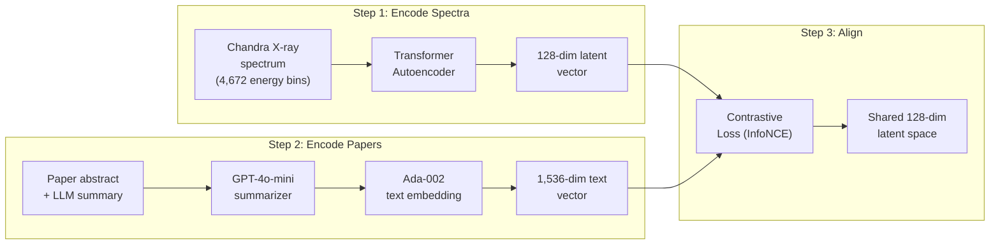
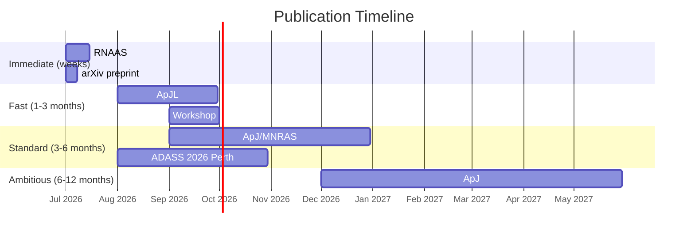

# The Paper, The Science, and How We Win

## The Paper

### 📄 "Augmenting representations with scientific papers"
- **arXiv:** [https://arxiv.org/abs/2603.04516](https://arxiv.org/abs/2603.04516)
- **PDF:** [https://arxiv.org/pdf/2603.04516](https://arxiv.org/pdf/2603.04516)
- **Published:** March 4, 2026
- **Also presented at:** ICLR 2025 Re-Align Workshop (shorter version)
- **License:** CC-BY 4.0 (we can build on it freely)

**Authors:**
- Nicolò Oreste Pinciroli Vago, Rocco Di Tella, Carolina Cuesta-Lázaro, Michael J. Smith
- **Cecilia Garraffo** (Lium Research Advisor, AstroAI Director @ Harvard CfA)
- **Rafael Martínez-Galarza** (Lium Research Advisor, Deputy Scientist @ Chandra)

**Funded by:** AstroMind, Inc. (= the company behind Lium.ai)

---

## What The Paper Actually Does (Plain English)

### The Problem They Solve
Astronomers have decades of Chandra X-ray observations AND thousands of papers analyzing those observations. But these two things live in completely separate worlds — the data is in archives, the knowledge is in PDFs. Nobody has connected them systematically.

### Their Solution — 3 Steps



**Step 1 — Compress the X-ray spectrum:**
Take a raw Chandra spectrum (4,672 energy bins = a histogram of photon counts at different energies). Feed it into a transformer autoencoder that compresses it to 128 dimensions. This compressed vector captures the essential physics (temperature, absorption, emission lines, etc.)

**Step 2 — Summarize and embed the paper:**
For each Chandra source, find its associated papers in ADS. Use GPT-4o-mini to generate a concise summary. Then embed that summary using OpenAI's Ada-002 text embedding model (1,536 dimensions).

**Step 3 — Align spectra with text:**
Train a contrastive loss (InfoNCE) that pushes the spectrum vector and its matching paper vector close together, while pushing non-matching pairs apart. Now spectra and text live in the same space.

### What They Achieve

| Result | Number |
|--------|--------|
| Recall@1% (retrieving correct text from spectrum) | **20%** |
| Improvement on physical variable estimation (20 variables) | **16–18%** over spectrum-only |
| Data compression | **97%** (4,672 → 128 dims) |
| Discovered rare objects via outlier detection | **Candidate pulsating ULX + gravitational lens** |

### The Key Innovation: Mixture of Experts (MoE)
They don't just use the shared space. They use a **MoE strategy** that combines:
- The unimodal spectrum representation (what the data alone says)
- The shared multimodal representation (what data + text together say)

This MoE approach outperforms either alone. That's the paper's strongest finding.

---

## How This Directly Improves Quasar

### Current Quasar RAG Pipeline
```
User asks question → search ALMA tech docs by text similarity → LLM answers
```
This is **text ↔ text**. The system has zero understanding of actual observational data.

### Upgraded Pipeline (After Applying Their Method)
```
User asks question → text similarity search (existing)
                   → BM25 keyword search (existing)  
                   → Physical embedding search (NEW)
                   → Fuse results → LLM answers with physical understanding
```

### Concrete Improvements

| Scenario | Current Quasar | With Physical Embeddings |
|----------|----------------|--------------------------|
| "Find observations similar to this HL Tau disk study" | Text search over docs, imprecise | Embed the observation metadata, find nearest neighbors in physics space |
| "What has been observed at 230 GHz with < 0.1" resolution?" | SQL-like filter only | Semantic search through observation space — finds related setups even with different exact parameters |
| "Is this observation unusual?" | Can't do this | Outlier detection in the latent space — flag anomalous observations automatically |
| "Which papers explain this data?" | ADS keyword search | Cross-modal retrieval: embed observation → retrieve aligned papers |
| "Find ALMA data relevant to this paper" | Must manually extract target names and search | Embed the paper abstract → retrieve aligned observations |

---

## Three Transformative Science Projects (Not Wrappers)

These are genuine research contributions that produce publishable papers, not just software features.

---

### Project 1: ALMA-CLIP — Physical Language Model for Radio Astronomy

**What it is:** Apply the exact AstroMind method to ALMA. Build a contrastive model that aligns ALMA observation metadata (frequency, resolution, bandwidth, integration time, array config) with paper abstracts and proposal text.

**Why it's transformative (not a wrapper):**
- Nobody has done this for radio astronomy data. The AstroMind paper only covers X-ray.
- ALMA has **~95,000 observations** with rich metadata linked to **~4,000 proposals** and **~15-25K papers**.
- Radio astronomy metadata is structurally very different from X-ray spectra — the encoding problem is novel.
- Enables **zero-shot observation recommendation** — "given your science goal, here are the most relevant archival observations" without keyword matching.

**Novel contribution:** The paper demonstrates the method works for X-ray. We demonstrate it **generalizes to radio**, which they explicitly suggest as future work:

> *"Importantly, this framework can be extended to other scientific domains where aligning observational data with existing literature is possible."*

We take them up on that — for the world's most powerful radio telescope.

**Publication speed:** ⚡ **Fast** — this is a direct methodological extension with clear results.

---

### Project 2: Automated Anomaly-Driven Discovery Engine

**What it is:** Use the ALMA-CLIP latent space to systematically scan the entire ALMA archive for anomalous observations — ones that don't match what the associated papers describe, or that sit in unusual regions of the embedding space.

**Why it's transformative:**
- The AstroMind paper found a **candidate pulsating ULX and a gravitational lens** through outlier detection. This was a 2-line result in their paper.
- We can make this a **full systematic survey**: scan all ~95K ALMA observations, identify the most anomalous, cross-reference with the literature, and flag candidates for follow-up.
- Potential to discover **mislabeled sources, rare transitions, unexpected emission features, or new science** hiding in the archive.
- This is real astrophysics, not software engineering. If we find even one interesting source, it's a discovery paper.

**Novel contribution:** First systematic anomaly survey of the ALMA archive using multimodal embeddings. This is exactly the kind of "accelerating scientific discovery" narrative that gets attention.

**Publication speed:** ⚡⚡ **Very fast** if anomalies are found — discovery papers are high-priority at ApJL.

---

### Project 3: Cross-Archive Source Unification via Multimodal Embeddings

**What it is:** Extend beyond ALMA. Train separate encoders for ALMA metadata, MAST/JWST metadata, Chandra metadata, and paper text. Align ALL of them into a single shared space using multi-way contrastive learning.

**Why it's transformative:**
- Currently, cross-matching archives requires exact coordinate matching (cone search). This misses observations of the same physical phenomenon taken at different wavelengths with different spatial offsets.
- A unified embedding space would let you ask: "Find all observations across ALL archives that are studying the same physics as this ALMA observation" — not by position, but by **physical similarity**.
- This creates a **knowledge graph of multi-wavelength astronomy** that doesn't exist anywhere.
- Nobody has attempted multi-archive contrastive alignment. AstroCLIP does image ↔ spectrum (same objects). AstroMind does X-ray ↔ text. We do **everything ↔ everything**.

**Novel contribution:** First cross-archive multimodal foundation model for astronomy. This is ambitious and would be a landmark paper if it works.

**Publication speed:** 🐢 **Slower** — 3-6 months of work. But this is ApJ/MNRAS main journal material.

---

## Publication Strategy — Where & How Fast

### Speed Tiers



### Venue Breakdown

| Paper | Best Venue | Turnaround | Page Limit | Notes |
|-------|-----------|------------|------------|-------|
| **ALMA-CLIP method note** | **RNAAS** (Research Notes of the AAS) | **3 days** after acceptance | 1,000 words | Establishes priority ASAP. Not peer-reviewed but citable. |
| **ALMA-CLIP full paper** | **ApJ** or **MNRAS** | 2-4 months | None | Full methodology + results. MNRAS = no page charges. |
| **Anomaly discovery** | **ApJL** (Letters) | 2-4 weeks | 6 pages | If we find interesting sources → high-impact, fast. |
| **Workshop paper** | **NeurIPS ML4PS** (deadline ~Sep) | Workshop review | 8 pages | ML audience, high visibility for the method. |
| **Quasar software paper** | **ADASS 2026 Proceedings** (deadline ~Aug) | Conference | 4 pages | Software audience, Perth Nov 2026. |
| **Cross-archive unification** | **ApJ** or **MNRAS** | 3-6 months | None | Flagship paper if successful. |

### Fastest Path to Publication

> [!TIP]
> **Week 1:** Submit an RNAAS note describing the ALMA-CLIP concept and preliminary results. 1,000 words, published in days. This **establishes priority** — proves we did it first.
> 
> **Week 2-3:** Post full preprint to arXiv. The community sees it immediately.
> 
> **Month 2-3:** Submit to ApJ or MNRAS for full peer review.

This is exactly how the AstroMind team played it — short workshop paper at ICLR Re-Align first (establishes priority), then full arxiv paper (2603.04516) for the details.

---

## How We Beat Them On Their Own Turf

### Their Turf = Contrastive Multimodal Alignment for Astronomy

| Dimension | AstroMind Paper | What We Build | Why Ours Wins |
|-----------|-----------------|---------------|---------------|
| **Wavelength** | X-ray (Chandra) | Radio (ALMA) | Larger community, richer metadata |
| **Data** | Chandra Source Catalog | ALMA Archive (95K obs) + ADS | More observations, more papers |
| **Spectra** | Raw X-ray photon counts (4,672 bins) | Observation metadata vector (structured) | More interpretable, easier to train |
| **Text encoder** | OpenAI Ada-002 (proprietary) | SciBERT or open-source (free) | No API dependency, reproducible |
| **LLM for summaries** | GPT-4o-mini (proprietary) | Can use any LLM | No vendor lock-in |
| **Downstream** | Source classification + outlier detection | Observation discovery + paper recommendation + anomaly survey + Quasar integration | More applications |
| **Availability** | Paper only, no public code/model | **Open-source model + weights + dataset** | Reproducible, citable, community-driven |
| **Integration** | Standalone research | **Integrated into a live tool (Quasar)** | Immediately useful to astronomers |

### The Kill Shot: Open Everything

AstroMind's paper uses **proprietary OpenAI models** (Ada-002, GPT-4o-mini) for their text processing. This means:
- Nobody can exactly reproduce their results without paying OpenAI
- The embeddings are locked to a specific API version
- If OpenAI changes the model, all embeddings need recomputation

**Our approach:** Use **open-source models** (SciBERT, Sentence-Transformers, or a fine-tuned LLaMA) for text encoding. Release:
- ✅ Trained model weights on HuggingFace
- ✅ Pre-computed embeddings for all 95K ALMA observations
- ✅ Training code and data pipeline
- ✅ Integration code for Quasar

This makes our work **the reference implementation** for the field. When people want to build on multimodal astronomy embeddings, they'll cite us because they can actually use our model.

---

## Summary: What To Do First

| Priority | Action | Timeline | Outcome |
|----------|--------|----------|---------|
| 🥇 | **Get TACC access** — apply for Startup Allocation | This week | GPU compute secured |
| 🥈 | **Write data harvesting scripts** — ALMA TAP + ADS bulk query | Week 1-2 | Training dataset ready |
| 🥉 | **Submit RNAAS method note** — 1,000 words, establish priority | Week 2 | Published in days, priority claimed |
| 4 | **Train ALMA-CLIP on TACC** — ~22 hours on 1 A100 node | Week 3-4 | Model trained |
| 5 | **Run anomaly scan** — find outliers in the archive | Week 4-5 | Potential discoveries |
| 6 | **Post arXiv preprint** — full paper | Week 5-6 | Community visibility |
| 7 | **Submit to ApJ/MNRAS** — peer review | Month 2-3 | Journal publication |
| 8 | **Integrate into Quasar** — third RAG channel | Month 2 | Live feature |
