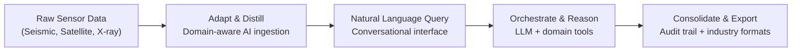

# Lium.ai Research Report — Implications for Quasar

## What Is Lium?

**Lium** (lium.ai) is an early-stage AI platform built by **AstroMind, Inc.** (© 2025).
Their tagline: *"Ask your instruments. Investigate at the speed of AI."*

They describe themselves as a **"sensor-to-sentence" platform** that transforms high-dimensional physical data (seismic, satellite, telescope) into **conversational investigations** — letting domain experts query complex datasets in natural language with auditable, evidence-backed answers.

> [!IMPORTANT]
> Lium is **pre-launch** — they're in early access with a select group of partners. No public product yet.

---

## Product & Capabilities

### Core Pipeline

### Three Vertical Domains (Demonstrated)

| Domain | Data Type | Use Case |
|--------|-----------|----------|
| **Subsurface / Geoscience** | Seismic volumes, well logs | Fault corridor review, geological hazard assessment, resource potential |
| **Earth Observation** | Multi-spectral satellite imagery | Change detection, environmental monitoring, regulatory compliance |
| **Space / Astrophysics** | Chandra X-ray Observatory data | Rare event discovery, X-ray source triage, UMAP embedding visualization |

### Key Value Propositions
- **Conversational investigation** of high-dimensional data (not just search — deep analysis)
- **Auditable evidence trails** for every result (reproducibility + compliance)
- **Bring-your-own-models** — plug in existing ML models, domain math, formulas
- **Deploy anywhere** — your cloud or theirs, no data duplication
- **Batch jobs + one-off queries** — both ad-hoc exploration and systematic processing

---

## Team & Advisors

### Executive Team

| Person | Role | Background |
|--------|------|------------|
| **Josh Knutson** | Co-founder & CEO | Founded and scaled Rhithm (acquired). VP Innovation & AI at Securly |
| **Ryan Thill** | Co-founder & President | Former CRO Americas at Linnworks. Enterprise GTM at Workday, Box, Procore |

### Research Advisors (Astrophysics)

| Person | Role | Affiliation |
|--------|------|-------------|
| **Cecilia Garraffo** | Founding Director, AstroAI | Harvard-Smithsonian Center for Astrophysics, Presidential Early Career Award |
| **Rafael Martinez** | Deputy Scientist, Chandra X-ray Observatory | Harvard IACS / CfA |

### Industry Advisors

| Person | Background |
|--------|------------|
| **Dave Kil** | Former Chief Data Scientist at Humana & Civitas |
| **Piers Wells** | Former COO Honeywell, Former CEO DigitalH2O |

### Investors
- **SJF Ventures**, **Wavemaker 360**, **GC&H (Cooley)**, **Reach Capital**
- Raised **$2.54M Seed** (November 2024, per PitchBook)

> [!NOTE]
> The Harvard CfA / AstroAI connection is significant — these are top-tier astrophysics AI researchers. Cecilia Garraffo leads the AstroAI initiative that builds foundation models for astronomy.

---

## Technical Approach — The Science

### "Physical Language Models" via Contrastive Learning

Their published research paper: **"Augmenting X-ray astronomical representations with scientific knowledge through contrastive learning"** (arXiv / OpenReview, funded by AstroMind, Inc.)

**What they did:**
- Built a **contrastive learning framework** that aligns **Chandra X-ray spectra** (raw photon data) with **scientific text** from astronomical literature
- Creates a **shared latent space** between spectral observations and textual descriptions
- Enables better physical parameter estimation (**16–20% improvement** over unimodal baselines)
- Achieves **97% data compression** while preserving scientific utility

**Why this matters:**
This is a fundamentally different approach from what Quasar does. Lium isn't just wrapping LLMs with tools — they're building **domain-specific embeddings** that understand the physics of the data itself. Their LLM doesn't just search archives; it can reason about spectral features, source classifications, and physical properties at the data level.

---

## Quasar vs Lium — Head-to-Head Comparison

| Dimension | **Quasar** | **Lium** |
|-----------|-----------|----------|
| **Core approach** | LLM + 35+ domain tools + DAG orchestration | Sensor-to-sentence platform with domain-specific embeddings |
| **Data interaction** | Search & retrieve from archives, inspect headers/metadata | Deep investigation of raw high-dimensional data |
| **Archives** | ALMA, MAST, ESO, IRSA, NRAO, ADS, NED, SIMBAD | Chandra X-ray (demonstrated), extensible |
| **LLM strategy** | Wrap any general-purpose LLM (GPT-4.1, etc.) | Custom "physical language models" + bring-your-own |
| **Orchestration** | Conductor DAG with complexity tiers | Unclear — likely agentic but not detailed publicly |
| **Reproducibility** | Jupyter notebook generation | Audit trail / evidence chain per investigation |
| **Target user** | Radio astronomers, multi-wavelength researchers | Cross-domain: geoscience, earth observation, astrophysics |
| **Deployment** | Open-source, self-hosted or Render | Enterprise SaaS, deploy-anywhere |
| **Stage** | Live at quasarassistant.com, 44% feature complete | Pre-launch, early access only |
| **Pricing** | Free / open-source | Enterprise (not disclosed) |

---

## What Quasar Can Learn From Lium

### 1. "Conversational Investigation" — Not Just Search

> [!TIP]
> Lium's framing as an "investigation" tool rather than a "search" tool is powerful. Quasar already does multi-step investigation via the Conductor DAG, but the marketing and UX could emphasize this more.

**Actionable:** Rebrand complex Conductor workflows as "investigations" in the UI. Show the evidence trail visually — which archives were queried, what data was cross-matched, what the reasoning chain was.

### 2. Domain-Specific Embeddings (Physical Language Models)

This is Lium's deepest technical moat. Their contrastive learning approach creates embeddings that understand X-ray spectra at a physical level.

**Actionable for Quasar:**
- Build **ALMA-specific embeddings** — train contrastive models that align radio spectra / visibility data with paper descriptions
- Use the existing **hybrid BM25 + semantic RAG** pipeline as the foundation
- Integrate with TACC GPU resources (from your earlier conversation) to train domain-specific models
- Start with a narrower scope: align ALMA proposal abstracts with observation metadata

### 3. Evidence Trails / Audit Chains

Lium emphasizes "trust every answer" with evidence trails. Quasar has Jupyter notebook generation, but a real-time evidence chain in the UI would be more powerful.

**Actionable:**
- Add a **"Sources & Evidence"** collapsible panel to each assistant response
- Show exactly which archive queries returned what, which papers were cited, what calculations were performed
- This is partially there via SSE task events, but could be made more explicit

### 4. Multi-Domain Expansion

Lium is cross-domain (subsurface, satellite, space). Quasar is currently ALMA-focused with partial multi-archive support.

**Actionable:**
- Accelerate **Tier 3 features** (H1-H3: Chandra/CIAO, Fermi) — directly competing in Lium's X-ray space
- The multi-archive cross-matcher (U2) is already built — lean into it harder
- Consider adding **earth observation** tools (Sentinel, Landsat) as a differentiator

### 5. "Bring Your Own Model" Philosophy

Lium lets users plug in their own ML models and domain math. Quasar's **Skills Plugin System (P4)** already enables this but could be more prominent.

**Actionable:**
- Build a **model registry** where users can register their own trained classifiers, fitting routines, or analysis pipelines
- Extend the MCP bridge to support custom model endpoints

---

## Competitive Positioning — Where Quasar Wins

### Quasar's Advantages Over Lium

1. **Open source** — Lium is proprietary enterprise. Quasar is MIT-licensed.
2. **Live today** — Quasar is deployed and functional. Lium is in early access.
3. **Deeper ALMA integration** — 35+ tools, DataLink, FITS inspection, CASA script generation, sensitivity calculators — Lium has none of this.
4. **DAG orchestration** — The Conductor with tiered complexity detection is a documented, tested system. Lium's orchestration is a black box.
5. **Reproducibility** — Jupyter notebooks are a stronger reproducibility artifact than a "evidence trail" for scientists.
6. **Community** — Open-source means community contributions, academic citations, and transparency.

### Where Lium Has the Edge

1. **Funded team** with Harvard CfA advisors — credibility in the space
2. **Custom embeddings** that understand physics at the data level
3. **Enterprise go-to-market** — Workday/Box/Procore sales experience
4. **Cross-domain** — not astronomy-only, wider market
5. **Data residency / compliance** — enterprise security features

---

## Strategic Opportunities

### Short-Term (Can Do Now)

| Action | Effort | Impact |
|--------|--------|--------|
| Add "Investigation" framing to Conductor workflows in UI | Low | Medium |
| Build Sources & Evidence panel for responses | Medium | High |
| Accelerate Chandra/CIAO tools (H1-H3) to compete in X-ray space | Medium | High |
| Highlight open-source + reproducibility as differentiators in README/paper | Low | Medium |

### Medium-Term (1–3 Months)

| Action | Effort | Impact |
|--------|--------|--------|
| Train ALMA-specific contrastive embeddings (spectra ↔ text) | High | Very High |
| Build model registry for user-contributed analysis pipelines | Medium | High |
| Add earth observation integrations (Sentinel/Landsat) | Medium | Medium |
| Implement real-time investigation dashboard with evidence chains | Medium | High |

### Long-Term (Research Direction)

| Action | Effort | Impact |
|--------|--------|--------|
| Physical language models for radio data (following Lium's X-ray approach) | Very High | Transformative |
| Multi-modal foundation model: spectra + images + text + metadata | Very High | Transformative |
| Partner with AstroAI/CfA or build competing academic collaborations | Variable | Strategic |

---

## Bottom Line

Lium is building something adjacent to Quasar but from a **fundamentally different angle** — they're going deep on **data-level AI** (custom embeddings that understand physics) while Quasar goes deep on **tool-level AI** (comprehensive archive integration + LLM orchestration). 

They're also targeting a much broader market (geoscience, earth observation, defense) with astronomy as one vertical, while Quasar owns the astronomy niche deeply.

> [!IMPORTANT]
> **The biggest idea worth stealing:** Their contrastive learning approach to build "physical language models." If Quasar could train ALMA-specific embeddings that align radio spectra/visibilities with scientific text, it would be a game-changer for the RAG pipeline — moving from keyword/semantic search over documentation to genuine physical understanding of the data itself. This could be a strong research contribution for the paper as well.

The competitive risk is low in the short term (they're pre-launch, enterprise-focused, and not deep in radio astronomy), but their Harvard CfA advisory board and funding mean they could move fast in the astronomy vertical if they choose to.
